# CardSat User Manual

A complete guide to operating **CardSat**, the amateur-radio satellite tracker and
multi-radio CAT Doppler controller for the M5Stack Cardputer ADV (Icom, Yaesu, Kenwood).

> **Status.** CardSat runs on the Cardputer ADV, with its core features (display,
> keyboard, GPS, pass prediction, tracking, alarms, logging, and the on-device data
> caches) confirmed on hardware. **Single-pin CI-V is confirmed working on an IC-821**
> (full bidirectional exchange over one wire). The remaining CAT paths — separate-pin CI-V,
> Yaesu and Kenwood encoders, the Icom LAN (RS-BA1) backend — and all of the rotator
> backends (GS-232, Easycomm I/II/III, and SPID over the I²C→UART bridge; the rotctld
> TCP client; PstRotator UDP; and the direct-Yaesu I²C interface) are host-tested but
> have not yet driven that specific hardware. Keep the serial monitor open and verify
> on the air before trusting CAT for
> a contact.

---

## Contents

1. [Overview](#1-overview)
2. [What you need](#2-what-you-need)
3. [Connecting your radio](#3-connecting-your-radio)
4. [Connecting a GPS (optional)](#4-connecting-a-gps-optional)
5. [Installing the firmware](#5-installing-the-firmware)
6. [The keyboard: how to navigate](#6-the-keyboard-how-to-navigate)
7. [First-time setup](#7-first-time-setup)
8. [Screen map and navigation](#8-screen-map-and-navigation)
9. [Doppler tuning and the One True Rule](#9-doppler-tuning-and-the-one-true-rule)
10. [Calibration](#10-calibration)
11. [Working a pass, step by step](#11-working-a-pass-step-by-step)
12. [AOS alarm and deep sleep](#12-aos-alarm-and-deep-sleep)
13. [Sun, Moon, weather, and reference tools](#13-sun-moon-weather-and-reference-tools)
14. [GP age and accuracy](#14-gp-age-and-accuracy)
15. [Working offline](#15-working-offline)
16. [Radio-specific notes](#16-radio-specific-notes)
17. [Antenna rotator (GS-232, rotctl, PstRotator, Yaesu direct, rotctld server)](#17-antenna-rotator-gs-232-rotctl-pstrotator-yaesu-direct-rotctld-server)
18. [Mobile web control](#18-mobile-web-control)
19. [Managing data and factory reset](#19-managing-data-and-factory-reset)
20. [Troubleshooting](#20-troubleshooting)
21. [Screen-by-screen reference](#21-screen-by-screen-reference)
22. [Key reference (cheat sheet)](#22-key-reference-cheat-sheet)
23. [Glossary](#23-glossary)
24. [Supporting AMSAT](#24-supporting-amsat)
25. [License](#25-license)

---

## 1. Overview

CardSat turns a pocket-sized Cardputer ADV into a standalone satellite station
controller. It:

- downloads GP (General Perturbations / OMM) orbital elements from AMSAT and transponder frequencies from
  the SatNOGS database, and caches both to flash for **fully offline** use;
- predicts passes with **SGP4** and shows live az/el/range, a polar sky plot, and
  per-pass elevation curves;
- drives an **Icom, Yaesu, or Kenwood** transceiver over **CAT** with continuous **Doppler
  correction**, keeping a constant frequency *at the satellite* (the AMSAT
  "One True Rule") so your signal stays put in a linear transponder's passband;
- lets you tune the passband from the device **or from the radio's own knob**;
- maintains a **favorites** list, a unified **Next Passes** schedule, an **AOS
  alarm**, a **deep-sleep-until-next-pass** power saver, and **sun/eclipse** status;
- helps you **observe** as well as work the birds — it flags **visually observable
  passes** (sunlit satellite, dark sky), predicts **Sun/Moon transits** (when a bird
  crosses the solar or lunar disc from your location), shows **decay/reentry** watch
  flags on declining orbits, and keeps a **per-satellite operating note** for each bird;
- points an **az/el antenna rotator** -- a wired **GS-232**, **Easycomm**, or **SPID**
  controller, a **Yaesu rotator driven directly** (no GS-232 box, via an I²C
  ADC + output expander), or a networked **Hamlib `rotctld`** / **PstRotator** server;
- **logs QSOs** on the device and **exports ADIF** for LoTW / eQSL or your main logger.

Everything runs on the device. WiFi is needed only to refresh GP/transponders
and to set the clock.

---

## 2. What you need

- **M5Stack Cardputer ADV** (ESP32-S3, 8 MB flash, 240×135 screen, 56-key
  keyboard, speaker, microSD, Grove port, 2×7 header).
- **A supported transceiver** in one of three CAT families:
  - **Icom CI-V** — IC-820, IC-821, IC-910, IC-970, IC-9100, IC-9700;
  - **Yaesu** — FT-847, FT-736R;
  - **Kenwood** — TS-790, TS-2000.
- **A CAT interface suited to that radio.** The ESP32-S3 pins are **not** 5 V
  tolerant — never connect CAT directly. **Icom:** a 3.3 V-safe CI-V interface
  (one-transistor circuit or a ready-made board). **Kenwood:** a **MAX3232** RS-232
  level shifter on the DB-9 COM port. **Yaesu:** a serial CAT interface (verify TTL
  vs RS-232 per the CAT manual).
- *(Optional)* a **GPS**: a NMEA receiver on the Grove port, or an **M5Stack Cap
  LoRa** (868 or 1262) module with onboard GNSS.
- *(Optional)* **WiFi** to fetch GP/transponders and sync the clock.

---

## 3. Connecting your radio

All three CAT families share **UART1**, **RX = G1 / TX = G2** by default, but the
**interface hardware differs** (see [§2](#2-what-you-need) and [§16](#16-radio-specific-notes)).

1. Wire the appropriate CAT interface between the radio's control jack (Icom
   **REMOTE**, Kenwood **COM** DB-9, Yaesu **CAT**) and **G1/G2**. **Never connect
   the radio directly to the GPIO pins** — the ESP32-S3 is not 5 V tolerant.
2. Note the radio's CAT settings: **baud** (all families) and, for **Icom**, the
   **CI-V address** (fixed on older rigs).
3. In CardSat, open **Settings**, choose your **radio model** (this auto-fills the
   defaults), then adjust **CAT baud** — and, for Icom, the **CI-V address** — to match.

CardSat drives two independent VFOs. By default **downlink = Sub/RX, uplink =
Main/TX**, but the **VFO Type** setting can swap the roles (*Main Dn/Sub Up*). On
**Icom** it manages MAIN/SUB and, by default, leaves the rig's satellite mode
**off**; the **Sat mode** setting commands it on/off when you engage radio control
(a no-op on rigs without one, such as the IC-820/821/910/970). On **Yaesu and
Kenwood** the rig's own satellite / full-duplex mode and the band pair are set up
**by you on the radio** — CAT can't switch bands on those rigs — and CardSat
Doppler-tunes within them. (See [§16](#16-radio-specific-notes).)

### Icom CI-V: separate-pin or single-wire

Icom's CI-V bus is electrically a **single half-duplex wire**, so CardSat offers two
ways to connect it, chosen with **CI-V wiring** in *Settings → Radio / CAT*:

- **Separate TX/RX (G2/G1)** — the default and most reliable path: G2 carries transmit,
  G1 carries receive, through your interface to the radio's single CI-V line. This is
  the recommended option.
- **Single-pin (1-pin G2** or **1-pin G1)** — the entire CI-V bus runs on **one shared
  GPIO**, matching CI-V's native single-wire wiring. This is **confirmed working on an
  IC-821** (full bidirectional exchange — frequency reads and ACKs — over a single
  wire), but because both directions share one pin it needs a proper **open-drain,
  level-correct** interface between the 3.3 V GPIO and the radio's CI-V line; get the
  5 V/3.3 V interfacing right before using it. See
  **[docs/interfaces/CIV_SINGLE_PIN.md](docs/interfaces/CIV_SINGLE_PIN.md)** for the
  interface detail and cautions. If in doubt, use separate TX/RX.

This choice applies to **wired Icom CI-V only**; Yaesu and Kenwood use their own serial
wiring, and Icom-over-LAN (below) needs no CI-V wire at all.

### Icom over the network (no CI-V wiring)

The **IC-9700** can be controlled over **WiFi/Ethernet** instead of the wired CI-V
bus — CardSat speaks the same RS-BA1 UDP protocol as Icom's own remote software. No
level shifter, no UART: the radio's CI-V/G1/G2 pins stay free.

> **Scope.** Icom LAN in CardSat is **intended for the IC-9700** — the one
> network-capable Icom in CardSat's radio list that is a full-duplex satellite rig.
> The LAN transport itself is **confirmed working**: CardSat has successfully
> controlled an **IC-705** over the network (with the correct CI-V address set),
> which proves the RS-BA1 connect/auth/CI-V path drives a real Icom radio. The IC-705
> isn't usable for live satellite work, though — it's a single-receiver radio, so its
> two VFOs just swap back and forth rather than offering the simultaneous MAIN/SUB
> downlink+uplink the IC-9700 provides. Other networked Icoms (IC-7610, IC-785x) speak
> the same protocol but likewise lack the satellite architecture. **The IC-9700 itself
> has not yet been tested** over LAN — the path should work given the IC-705 result,
> but confirm it before relying on it. Select **Icom LAN** with the **IC-9700** as the
> radio model.

On the radio (IC-9700: **MENU > SET > Network**): set **Network Control = ON**, set a
**Network User1** id + password, leave the **Control** port at **50001** (Serial =
50002, Audio = 50003 follow it), and turn **CI-V Transceive ON** so the radio reports
changes. Give the radio a stable IP (DHCP reservation or static).

In CardSat **Settings**: set **CAT type → Icom LAN**, **LAN host** to the radio's IP,
**LAN port** to 50001 (unless you changed it), and **LAN user / LAN pass** to the
Network User1 credentials. CardSat connects in the background; once the link is up the
radio behaves exactly like a wired IC-9700 (MAIN/SUB, Doppler, sat mode, CTCSS all
work the same). Only **CAT** is carried — CardSat does not open the audio stream. Keep
the credentials on a trusted LAN. (See [§16](#16-radio-specific-notes).)

### Driving a radio through Hamlib (rigctl over the network)

As a third option, CardSat can control **any radio Hamlib supports** by talking to a
**`rigctld`** server over the network instead of wiring the radio to CardSat. Set
**CAT type → rigctl (net)** and point **LAN host / LAN port** at the machine running
`rigctld` — set the port to the one your `rigctld` listens on (Hamlib's conventional
default is **4532**). CardSat is the client — the PC's `rigctld` holds the actual
serial/USB connection to the rig and CardSat sends it set/read commands, mapping VFO-A
to the downlink and VFO-B to the uplink. This is handy when the radio is already cabled
to a shack computer, or for a rig CardSat has no native backend for. It is
**host-tested only** — verify against your `rigctld` before a pass.

---

## 4. Connecting a GPS (optional)

GPS runs on **UART2**, independent of CAT. On the **Location** screen press `s`
to cycle the source:

| Source | Pins | Baud | Notes |
|---|---|---|---|
| **Grove 9600** | G1/G2 | 9600 | ⚠️ same pins as CAT — don't use both at once |
| **Grove 115200** | G1/G2 | 115200 | ⚠️ same pins as CAT — don't use both at once |
| **Cap LoRa868** | G15/G13 | 115200 | M5Stack Cap LoRa (868) onboard AT6668 GNSS |
| **Cap LoRa1262** | G15/G13 | 115200 | M5Stack Cap LoRa (1262) onboard AT6668 GNSS |

Both Cap LoRa modules use identical GPS settings (115200 8N1 on G15/G13). For a
Grove-port receiver, pick the baud that matches it.

Press `p` on the Location screen to enable/disable GPS use. With a fix, your
latitude, longitude, altitude, and grid update automatically, and the clock is
set from GPS time. The Location screen also refreshes on its own the moment a
fix is gained or lost or the satellite count changes.

> If you use the **Grove** GPS option you cannot use CAT on G1/G2 at the same
> time. The two **Cap LoRa** options use G15/G13 and coexist with CAT.

---

## 5. Installing the firmware

There are two ways to get CardSat onto the device: flash a **prebuilt binary**
(no toolchain needed — easiest), or **build from source** with the Arduino IDE or
PlatformIO. Two binaries are published with each release:

| File | Use it with | Notes |
|---|---|---|
| `CardSat.bin` | **Launcher** (bmorcelli/Launcher) | App-only image; Launcher writes the partition table and bootloader, so this file is **only** usable through Launcher — it cannot be flashed on its own. |
| `CardSat_Merged.bin` | **M5Burner**, or a **direct flash** (esptool / web flasher) | Complete standalone image (bootloader + partition table + app + empty filesystem), written at offset `0x0`. |

### Install with Launcher (`CardSat.bin`)

[Launcher](https://github.com/bmorcelli/Launcher) by bmorcelli is a firmware
launcher for the Cardputer (and many other ESP32 boards) that installs and runs
binaries from a microSD card, over-the-air, or through its WebUI — and builds the
right partition layout for each app automatically. It must already be installed on
the device (see its repository for how to flash Launcher itself).

1. Copy **`CardSat.bin`** to the Launcher binaries folder on the device's microSD
   card (or push it via Launcher's WebUI / OTA favorites).
2. On the device, start **Launcher**, browse to **CardSat**, and install/run it.
   Launcher writes the appropriate partition scheme and the app for you.
3. `CardSat.bin` is an app-only image with no standalone bootloader or partition
   table, so it works **only** through Launcher. To flash without Launcher, use the
   merged image below.

### Install with M5Burner, or direct flash (`CardSat_Merged.bin`)

`CardSat_Merged.bin` is a **complete image** — bootloader, partition table,
application, and the empty LittleFS filesystem combined, written at offset `0x0`.
Use it with **M5Burner** (add it as a custom firmware and burn), for a fresh
device, to recover one in an unknown state, or whenever you are not using Launcher.

To flash it directly with **esptool** (replace the port with yours):

```
esptool.py --chip esp32s3 --port /dev/ttyACM0 --baud 921600 \
  write_flash 0x0 CardSat_Merged.bin
```

Or with the web **ESP Tool** (<https://espressif.github.io/esptool-js/>): connect
the Cardputer over USB, set chip to **ESP32-S3**, add `CardSat_Merged.bin` at
address **`0x0`**, and flash.

Hold the device's reset/boot as your tool instructs if it does not enter download
mode automatically. After flashing, the device reboots into CardSat. (The merged
image starts with an **empty** filesystem; run **Update** once on first boot to
download GP elements — see [§7](#7-first-time-setup).)

### Build from source — Arduino IDE (single file)

1. Install libraries: **M5Cardputer**, **ArduinoJson** (v7), **TinyGPSPlus**,
   **RadioLib** (by Jan Gromes), and **ESP_SSLClient** (by Mobizt) from the Library
   Manager, and the Hopperpop **Sgp4** library via *Sketch → Include Library → Add .ZIP
   Library* (from <https://github.com/Hopperpop/Sgp4-Library>). **ESP_SSLClient is
   required** — all HTTPS runs on its BearSSL stack and the build will not compile without
   it.
2. Open `CardSat.ino`. Under **Tools**, set:
   - **Board:** ESP32S3 Dev Module (or M5StampS3)
   - **Flash Size:** 8MB
   - **Partition Scheme:** **Huge APP (3MB No OTA/1MB SPIFFS)** — *required*
   - **PSRAM:** Disabled · **USB CDC On Boot:** Enabled
3. Upload. Open the Serial Monitor at **115200** baud for diagnostics.

### Build from source — PlatformIO

`pio run` to build, `pio run -t upload` to flash, `pio device monitor` to watch
the log. The `cardputer_adv` env pins the libraries and the 8 MB partition layout.

### Upgrading an existing install

Updating to a newer CardSat version uses the same tools as a first install. The one
thing to understand is **what each method does to your saved data** — your station
settings, radio/rotator calibration, per-satellite operating notes and CTCSS
overrides, favorites, and the cached GP/AMSAT data.

**Where your data lives.** CardSat **prefers a microSD card** for all storage. When a
FAT32 card is inserted, everything is saved to the card (under `/CardSat`), and the
device's internal flash (LittleFS) is used only as a fallback when no card is present.
Flashing firmware only writes the **internal flash** and never touches the SD card — so
**if you keep an SD card in the device, your configuration survives any upgrade,
including a full merged flash.** A factory reset likewise leaves the SD card's contents
in place. The table below describes the **no-SD-card** case, where data is stored
internally in LittleFS.

| Method (no SD card) | File | Effect on internal saved data |
|---|---|---|
| **Launcher** (recommended for upgrades) | `CardSat.bin` | **Preserved.** Launcher replaces only the application partition, leaving the LittleFS filesystem intact, so settings, notes, favorites, and cached elements survive the update. |
| **M5Burner / direct flash at `0x0`** | `CardSat_Merged.bin` | **Erased.** The merged image carries a fresh empty filesystem, so flashing it at `0x0` overwrites internally-stored data. You'll reconfigure and run **Update** again. |

In short, your settings carry over if **either** an **SD card** is present (regardless
of how you flash) **or** you upgrade with **Launcher** (`CardSat.bin`). Data is only
lost when it was stored **internally** *and* you do a full `CardSat_Merged.bin` flash.

If you do land on a clean slate, plan to set up again: re-enter your **location/grid**,
your **radio (CAT) and rotator** settings, any **calibration**, then run **Update** once
to refetch GP elements (see [§7](#7-first-time-setup)). Advanced users without an SD
card who still want to keep internal data across a binary update can flash only the
application partition (point esptool at the app offset instead of `0x0`, leaving the
filesystem partition untouched), but Launcher does this automatically and is less
error-prone.

After upgrading, confirm the running version on the **About** screen (Main menu →
**About**). A power cycle after flashing is good practice to clear any stale state.

---

## 6. The keyboard: how to navigate

CardSat uses the arrow legends printed on the Cardputer keys:

| Key | Action |
|---|---|
| `;` | up |
| `.` | down |
| `,` | left |
| `/` | right |
| **ENTER** | select / confirm |
| `` ` `` or **DEL** | back / cancel |
| `{` `}` | page up / page down (lists) |
| **Fn** + key | a modifier used by the Notes editor for cursor movement and save, so the `;` `.` `,` `/` keys stay typeable as punctuation (see [§8 → Notes](#notes-free-form-text-editor)) |
| `h` | open **Help** (global; exceptions below) |
| `b` | save a screenshot to the SD card (see §18) |

Other letter keys are screen-specific actions and are shown in the **footer** at
the bottom of each screen. When in doubt, read the footer. Two global exceptions
are deliberately not shown in footers: **`h`** opens Help and **`b`** saves a
screenshot. Both work on any screen *except* where letters are themselves input —
the text editors, the Tools list's first-letter jump, and the DXCC / character
lookups' type-to-search.

---

## 7. First-time setup

1. **Settings** (`;`/`.` to move, `,`/`/` to change a value, ENTER to edit text):
   - **Radio** — select your model; CAT baud (and, for Icom, the CI-V address) auto-fill.
   - **CAT baud** — set to match the radio's CAT menu (applies to every CAT family).
   - **CI-V addr** — set to match the radio; **Icom only**.
   - **CI-V wiring** — *(Icom wired CI-V only)* choose **TX/RX (G2/G1)** — the normal,
     recommended separate-wire path — or a **single-pin** mode (**1-pin G2** or
     **1-pin G1**) that drives the whole CI-V bus over one shared open-drain GPIO.
     Single-pin is confirmed working on hardware (verified on an IC-821) but still
     needs correct 5 V/3.3 V level interfacing; the separate TX/RX path is simplest.
     See `docs/interfaces/CIV_SINGLE_PIN.md` and mind the level cautions before wiring.
   - **CAT serial monitor** — opens a live diagnostic that shows raw CAT traffic
     (TX in cyan, RX in green) as hex, for any wired protocol (CI-V, Yaesu, Kenwood).
     While open it **actively polls the rig** (~once per 700 ms) by reading the
     downlink frequency, so you always see live traffic — your read request as TX and
     the radio's reply as RX — making it a real bench check of the CAT link with no
     satellite pass required. Press **`p`** to toggle polling off for a purely passive
     view; **`s`** to type a raw frame in hex (e.g. `FE FE 4C E0 03 FD`) and transmit
     it; `;`/`.` scroll back through the log; `` ` `` exits. Polling pauses
     automatically while Doppler tracking is engaged so the two don't collide. If you
     see "(no traffic yet)" with polling on, check the CAT wiring, baud, and (for
     Icom) the CI-V address. **Caution:** sending raw frames transmits arbitrary bytes
     to the radio — a malformed or wrong-address frame can mis-set the rig.
   - **Min pass el** — passes whose **peak elevation** never reaches this value are
     hidden from the pass lists and schedule (default 5°).
   - **Visible passes** — when on, the schedule flags passes that are **visually
     observable** (satellite sunlit, sky dark at your location, and the bird high
     enough) with a yellow `*`, and the pass-detail screen shows a verdict
     ("Visible: YES", or the reason it isn't — daylight, satellite in shadow, or too
     low). **Sky-dark gate** chooses how dark the sky must be — civil (Sun −6°),
     nautical (−12°), or astronomical (−18°) — and **Visible min el** is the minimum
     peak elevation to count (default 10°). This turns the schedule into a "what can
     I go outside and watch" tool; the ISS and other bright objects light up `*` on a
     good evening pass.
   - **WiFi SSID / WiFi pass** — enter your network, then **Save & test WiFi**.
     On the **WiFi SSID** row you can instead press **`s`** to **scan** for nearby
     networks, pick one from the list (strongest first; `*` = secured), and then
     enter its password (open networks skip the password step).
   - **WiFi 2 SSID / WiFi 2 pass** — an **optional second network**. If the primary
     network can't be joined, CardSat automatically falls back to this one. Handy
     in the field: keep your home router as the primary and a **phone hotspot** (or
     a portable travel router) as the second, and the device connects to whichever
     is present. Leave it blank to disable.
   - **AOS alarm** — on/off for the pre-pass beeps.
   - **VFO Type** — which physical VFO carries each leg: *Main Up/Sub Dn* (default)
     or *Main Dn/Sub Up*.
   - **Beacon/RX-only DL** — which VFO carries the downlink for receive-only entries
     (beacons, telemetry, SSTV, CW — anything with a downlink but no uplink). *Follow
     VFO* (default) puts it on the same VFO as a normal transponder downlink, per VFO
     Type; *Main* or *Sub* force it to that VFO. Use *Follow VFO* if swapping to a
     beacon mid-pass moves your receive to the wrong VFO; force *Main* only if your
     rig reads that VFO back more reliably for receive-only.
   - **Sat mode** — command the rig's own satellite mode on/off when you engage CAT
     (a no-op on rigs without CAT sat mode, including the IC-820/821/970 — engage
     SAT on those from the front panel).
   - **CAT rate** — how often Doppler/CAT updates are sent to the radio (default
     **500 ms**, adjustable in 10 ms steps). A soft floor keeps the *effective*
     rate no faster than the CAT baud can service one update; the row shows
     `(min N)` when your setting is being clamped.
   - **CAT delay** — how long to pause *after each CAT command* before sending the
     next one to the radio (default **70 ms**, 0–200 ms in 2 ms steps). Raise it if
     an older or slow radio drops or mis-handles back-to-back commands; lower it
     toward 0 for the fastest tuning on a radio that keeps up. CI-V (Icom) only at
     present.
2. **Location** — set your position one of three ways:
   - `e` latitude, `o` longitude, `a` altitude; or
   - `g` Maidenhead grid (uppercased as you type — hold shift for lowercase
     subsquares — as on the log and mutual-pass grid fields); or
   - `p` enable GPS (and `s` to pick the GPS source).
   - If you have no network or GPS, press `c` to set the **UTC clock** manually
     (`YYYY-MM-DD HH:MM:SS`).
3. **Update** — press `k` (or ENTER) to download GP data; this also syncs the clock
   over NTP if WiFi is configured. Optionally press `a` to cache **all**
   transponders for offline use.
4. You're ready: **Satellites** to pick birds, **Next Passes** to see what's up.

> **At every power-on**, if a WiFi network is configured CardSat connects
> automatically and sets the clock over **NTP** before loading data — so a
> network-connected unit boots with the correct time and no key presses. If WiFi
> is unavailable it carries on with GPS or the cached/manual clock; the attempt is
> best-effort and non-fatal (it can add a few seconds to boot while it tries). If
> the clock is set and even the freshest cached element set is **over a week old**,
> CardSat also refreshes GP automatically at boot. The display blanks its backlight
> after the **Screen sleep** idle time (never while tracking or alarming); any key
> wakes it.

---

## 8. Screen map and navigation

CardSat is a simple state machine. From **Home** you reach every screen; `` ` ``
or **DEL** always steps back. Backing out **returns you to the screen you came
from** — so opening **Passes** from the Home menu backs to Home, while opening it
from the **Satellites** list backs to the list; the same applies to **Track**,
which returns to Passes, Next Passes, or Home depending on where you launched it.

One deliberate exception: leaving the **Track** screen does **not** stop tracking.
If the radio and/or rotator are engaged they keep running in the background (CAT
Doppler and rotator pointing are serviced regardless of the current screen), and a
green **RAD** / **ROT** / **R+R** tag appears in the header so you know the rig may
still be transmitting. Stop with `r` (radio) or `o` (rotator) — see
[§8 → Track](#track).

### Home

A menu: **Satellites · Next Passes (favs) · Passes (sel) · Track (sel) ·
World Map · Sun / Moon · Space Wx · Weather · Activations · Overhead now · Grid dist/bearing ·
QRZ Lookup · Location · Update · Settings · Log · Messages · About / diagnostics · Charge / Sleep.** The
currently selected satellite is shown at the bottom right. `;`/`.` move, ENTER selects.

### About

Author credit (**Paul Stoetzer, N8HM**), firmware version and build date, storage
backend (microSD or internal flash), GP catalog size and freshest element age,
WiFi/IP, battery level, free heap, and uptime. The heap line shows two numbers —
total free memory and the **largest single free block** ("max blk"). On this
no-PSRAM board the second is the one that matters for network uploads: a TLS
connection needs one big *contiguous* chunk, not just scattered free bytes, so if
uploads ever misbehave this is the number to glance at first. Both figures dip
while features run and recover afterward; that's normal. Press **`l`** for a **License &
credits** screen — license pointer, no-warranty and hardware disclaimers, credit
for the outside data sources, and a recommendation to support AMSAT. `` ` `` or
ENTER returns home.

### Charge / Sleep

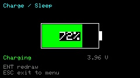

The last item on the home menu is a minimal low-power mode for charging or
parking the device. Selecting it **blanks the backlight and stops radio/rotator
output**, and goes further to cut power: it **powers the WiFi radio fully off**
(WiFi is the single largest consumer) and **drops the CPU clock from 240 MHz to
80 MHz**, and the main loop skips all network and radio services while parked — so
the device idles at a fraction of its normal draw. **Any key wakes the screen** to
show battery status — a large gauge, charging state, and the cell voltage — then it
auto-blanks again after about 5 seconds; the keyboard is still polled even in the
low-power state, so a keypress responds instantly. **ESC/back** returns to the home
menu and **restores full speed and reconnects WiFi**.

The battery percentage here is derived from the cell **voltage** against a LiPo
discharge curve (3.30 V ≈ 0 %, 4.20 V ≈ 100 %), which is more accurate in the flat
middle of the discharge than the PMIC's raw level; it falls back to the raw level
if voltage isn't available. Charging state comes from the Cardputer ADV's PMIC.
The favorites **AOS alarm keeps running** while parked (it's pure computation, no
WiFi), so you still get pass-countdown beeps on the charger.

Pressing **H** in this mode triggers an **on-demand heap reset**: on a long
session, repeated HTTPS/TLS handshakes can fragment the (no-PSRAM) heap until the
largest free block is too small for a new TLS context and fetches start failing,
even though total free heap still looks healthy. The reset restores full speed,
reconnects WiFi/TLS to free and coalesce those transient allocations, and reports
the before/after largest contiguous block.

This manual reset is rarely needed: CardSat does the same coalescing **automatically** just before a handshake that would otherwise fail (it
briefly cycles WiFi to return the fragmented buffers, then proceeds or declines
gracefully), and the firmware keeps more contiguous heap free in the first place.
The `H` key remains as a manual override.

### Logging QSOs (Log)

There are two ways to start an entry:

- **From a pass** — press `l` on the **Track** or **Polar** screen to log the
  contact you're working; radio control keeps running while you type. CardSat
  snapshots the UTC time, satellite, mode and the live **Doppler-corrected**
  uplink/downlink frequencies, plus your grid and callsign (from **My callsign**
  in Settings). The form opens with the **Call** field already selected, so you can
  press ENTER and type the callsign straight away.
- **After the fact** — choose **New QSO entry** from the **Log** menu when you're
  *not* working a pass. The entry opens with the time set to now and everything
  ready to edit, so you can log a contact you made earlier or on another rig.

Every field is editable on the entry screen — `;`/`.` move, ENTER edits the
selected field:

- **Date / Time** — UTC, entered as `YYYY-MM-DD` and `HH:MM:SS`.
- **Sat** — ENTER opens the satellite list; pick a bird and CardSat fills the
  **Sat**, **Mode** and frequency fields with its defaults — the **non-Doppler
  center** of a linear transponder's passband, or the **nominal** downlink/uplink
  for an FM or single-channel satellite.
- **DL MHz / UL MHz** — downlink and uplink in MHz (e.g. `145.960`).
- **Call** — the station worked (required to save). Letters default to **uppercase**
  (hold shift for lowercase).
- **Mode** — on a **linear** transponder, ENTER toggles **SSB ↔ CW** for this
  contact; on an FM bird the mode is fixed.
- **RST S / RST R** — report sent and received (default `59`).
- **Grid** — the other station's grid, **uppercase** by default (optional, but
  grids are the point of sat ops).
- **Notes** — free text.

When you are **editing an existing logged QSO** (via **View / edit log**), two more rows
appear at the bottom:

- **LoTW / Cloudlog** — whether this QSO is marked as already uploaded to each service.
  ENTER toggles the flag. Editing any of the fields above **automatically clears both
  flags** so the corrected QSO is re-sent on your next upload; these rows let you override
  that — for example, after fixing a typo in **Notes** you can mark the QSO back as already
  uploaded so it isn't sent again — or simply flip a flag on its own. The rows always show
  the state that will be saved. (They don't appear when logging a brand-new QSO, which
  starts as not-yet-uploaded.)

`s` saves, `` ` `` cancels. QSOs are appended to **`/CardSat/qso_log.csv`** (one row
each; `notes` is the last column, so commas there are fine).

The **Log** item on the main menu offers **New QSO entry**, **View / edit log**,
**Export to ADIF** (writes `/CardSat/qso_log.adi`, including `STATION_CALLSIGN`
from My callsign, for upload to LoTW/eQSL or import into your main logger),
**Sign & upload to LoTW** (see [LoTW upload](#logbook-of-the-world-lotw-direct-upload) below),
**Upload to Cloudlog** (see [Cloudlog upload](#cloudlog--wavelog-upload) below),
**Voice Memos** (the on-device voice-memo browser described above),
and **Notes** (a free-form text editor, see [Notes](#notes-free-form-text-editor) below),
and **Awards** (a summary of your worked totals, see [Awards](#awards-log--awards) below).
The two upload options sit together: uploading to Cloudlog can itself forward your QSOs
to LoTW (if your Cloudlog instance is configured for that), so for most operators they're
alternatives rather than things to do separately. The core logging functions are listed
first and the menu scrolls; the non-core **Voice Memos** and **Notes** tools are grouped
together at the bottom.

LoTW limits the `SAT_NAME` field to six characters and uses its own names, so on
export CardSat translates each satellite via **`/CardSat/lotw_sats.csv`** (rows of
`SAT_NAME,AMSAT_NAME`; a built-in table covers the common cases if the file is
absent). If a logged satellite has no match, CardSat prompts you for its `SAT_NAME`
(entry capped at six characters, uppercased) and saves it back to the CSV, so it's
only asked once. Update that CSV on the card as new satellites appear.

### Logbook of the World (LoTW) direct upload

**Sign & upload to LoTW** (on the **Log** menu) signs your un-uploaded satellite
QSOs into a `.tq8` file and sends them straight to ARRL's Logbook of the World over
WiFi — no PC, no TQSL, no separate upload step. CardSat builds the same
cryptographically-signed file TQSL would, signs each QSO with your callsign
certificate's private key, and posts it to LoTW's self-authenticating upload
service (the signed payload authenticates itself, so no login is needed).

> **!  This feature requires a microSD card, and your LoTW private key lives on
> it.** Read this whole section before using it. The key is your amateur-radio
> identity credential. Treat the card like you'd treat that key: keep it in your
> possession, and don't use a shared or disposable card. CardSat loads the key only
> when you run an upload, keeps it in RAM only, and never copies or transmits it
> anywhere except as the signature inside the `.tq8`. **Use this at your own risk.**

**This is an upload feature, not enrollment.** ARRL issues first-time certificates
only through TQSL plus a postcard mailed to your FCC address — that can't happen on
a handheld. You enroll once on a computer the normal way, then copy your existing
credential to the card.

**One-time setup (on your computer):**

1. In TQSL, you already have your callsign certificate. Export it to a `.p12`
   file (TQSL: *Callsign Certificates → right-click your call → Save Callsign
   Certificate*, choosing the `.p12`/PKCS#12 format with a password).
2. Convert the `.p12` into the two PEM files CardSat reads. The easy way is the
   **bundled converter**: open **`tools/lotw_cert_converter.html`** in any web
   browser, choose your `.p12` file, enter the export password, and click
   **Convert** — it produces **`lotw_key.pem`** and **`lotw_cert.pem`** for you. It
   runs entirely in the browser (it even works with your network disconnected), and
   your private key and password never leave your computer.

   If you'd rather use the command line, OpenSSL does the same thing:

   ```
   openssl pkcs12 -in CALL.p12 -nocerts -nodes | openssl rsa -out lotw_key.pem
   openssl pkcs12 -in CALL.p12 -clcerts -nokeys -out lotw_cert.pem
   ```

   (The converter writes an unencrypted key, which is what CardSat expects. With the
   OpenSSL route you can instead keep the key encrypted on the card by dropping
   `-nodes` and setting a password; CardSat will ask for it at upload time.)
3. Copy **`lotw_key.pem`** and **`lotw_cert.pem`** into the **`/CardSat/`** folder
   on the microSD card.
4. In **Settings → Station / logging**, set your LoTW station location. The fields
   form a chain — each one narrows the next:
   - **LoTW DXCC** — press ENTER to pick your entity from the full DXCC list. The
     entities that have a subdivision (United States, Canada, Japan, the Russias,
     China, Australia, Finland/Åland/Market Reef) are grouped at the **top** of the
     list, marked with a `>`; everything else follows alphabetically. Start typing to
     filter the list (e.g. "japan" or "unit"). The list is long, so the typeahead is
     the fast way in.
   - **LoTW CQ zone** and **LoTW ITU zone** — your zones.
   - **LoTW (primary)** — the row is labeled with your entity's actual subdivision
     name: **state** (US), **province** (Canada/China), **oblast** (Russia),
     **prefecture** (Japan), **state** (Australia), or **kunta** (Finland). Press
     ENTER to pick from the valid list for your DXCC; type to filter. If your entity
     has no subdivision the row shows **(n/a)** and you can skip it. (US/AK/HI **must**
     set a state — LoTW rejects uploads from those entities without one.)
   - **LoTW (secondary)** — only two entities have a second level: the **United
     States** (county, which lets your contacts earn county awards) and **Japan**
     (city/gun/ku). The row is gated by your primary choice — pick the state first and
     the county list follows; pick the prefecture first and the city list follows.
     Other entities show **(n/a)**.
   - **LoTW IOTA** — optional, any entity: enter your island reference (e.g. `NA-005`)
     if you're operating from a qualifying island.

   This is the same flow for everyone — the US is just the DXCC "United States" with
   "state" and "county" as its two levels, exactly like Japan's "prefecture" and
   "city". Your callsign and grid come from **My callsign** and your location, which
   CardSat already has. (Inside any picker: `;`/`.` move, ENTER selects, typing
   filters, and `` ` `` clears the filter or backs out.)

**Uploading:** open **Log → Sign & upload to LoTW**. The screen shows whether the
card, the key/cert, and the station fields are present, and how many QSOs haven't
been uploaded yet. Press **`u`** to sign and send; if your key is password-protected
you'll be asked for the password (leave it blank if you exported with `-nodes`).
CardSat signs each pending QSO, posts the `.tq8`, shows how many were accepted, and
flags those QSOs so they're never sent twice. (LoTW rejects duplicate uploads, and
CardSat tracks what it has sent in a new `uploaded` column in `qso_log.csv`.)

**Large uploads are automatic.** A full log is uploaded in **batches of 6 QSOs**, each
small enough to clear a fixed limit in the ESP32's network stack (a larger single upload
would stall part-way through — see
[docs/design/UPLOAD_AND_AUDIO_TLS_POSTMORTEM.md](docs/design/UPLOAD_AND_AUDIO_TLS_POSTMORTEM.md)).
When more QSOs remain after a batch, CardSat **continues on its own in the same session**,
and you **enter your key password only once** for the whole run. The upload screen shows the
progress ("Batch sent; N left…"). This works for both **`u` upload (un-uploaded only)** and
**upload ALL** (re-send) — a 14-QSO upload, for instance, goes up as 6 + 6 + 2 across three
batches and stops by itself, with no interruption. The log is split into small batches only
to keep each `.tq8` file small; earlier firmware rebooted between batches, but as of v0.9.43
the whole run completes in one session on the BearSSL TLS stack. Your key password is held
only in volatile memory during the run and is erased when it finishes or fails; it is never
written to the card or flash.

If a connection is refused outright (rare now — a genuine transport failure, e.g. very weak
WiFi), CardSat offers a **reboot-and-upload** recovery — **ENTER** to reboot and finish from
a clean start, **`` ` ``** to cancel. This is a user-confirmed failsafe, not part of the
normal flow.

The satellite `SAT_NAME` translation described above applies here too — the same
`/CardSat/lotw_sats.csv` map is used, so make sure each bird you've worked has a
LoTW name before uploading.

**View / edit log** is a scrollable list of recent contacts (`;`/`.` to move),
**ordered newest-first** — the most recent QSO is at the top, and the list opens
there. Open one with ENTER to correct **any field — including the date, time, satellite
and frequencies** — then `s` to save, or press `x` twice to delete it; changes are
written straight back to the CSV. The most recent **60**
QSOs are available on the device — the complete log always lives in
`/CardSat/qso_log.csv`, which you can also read or edit on a computer.

### Cloudlog / Wavelog upload

CardSat can upload your satellite QSOs to a self-hosted **Cloudlog** (or the compatible
**Wavelog**) online logbook over WiFi. Because a Cloudlog instance can itself be set up to
forward QSOs on to LoTW, eQSL, and others, for most operators this is an **alternative** to
the on-device LoTW upload, not something to do in addition. CardSat tracks the two
independently, so a QSO uploaded to Cloudlog is not marked as sent to LoTW, and vice-versa.

**Setup** (all under *Settings → Station / logging*):

- **Cloudlog URL** — the base address of your Cloudlog instance, e.g.
  `https://log.example.com`. Both `https://` and `http://` (for a LAN instance) are
  accepted. A trailing slash is trimmed automatically; CardSat appends the API path for
  you.
- **Cloudlog API key** — generate a **read-write** key in your Cloudlog account's API page
  and enter it here. (A read-only key is rejected for uploads.)
- **Cloudlog station ID** — the numeric *station profile id* the QSOs should be filed
  under, shown in your Cloudlog station-profile settings. Cloudlog verifies that this
  profile belongs to your key and that its callsign matches each QSO's station callsign, so
  make sure your **My callsign** setting matches the profile.

**Uploading:** open **Log → Upload to Cloudlog**. The screen shows your server, whether the
key and station ID are set, and the count of QSOs not yet sent to Cloudlog. Press `u` to
upload (CardSat connects to WiFi if needed). To re-send contacts that are already marked
uploaded — for instance after fixing a setting — press `a` to toggle re-send mode, then
`u`. On success the screen reports how many QSOs Cloudlog imported. If the **server**
rejects the upload it shows the reason (a wrong key, insufficient key rights, or a
station-ID/callsign mismatch are the usual causes). Your API key is treated as a secret and
is never written to the serial log.

**Large uploads are batched automatically**, the same way as LoTW: Cloudlog uploads in
**15-QSO batches** (Cloudlog's records are smaller than a signed `.tq8`), all **in one
session**. Cloudlog authenticates with your API key rather than a passphrase, so the
continuation is fully automatic — nothing to re-enter.

If instead the upload can't even **connect** (rare now — a genuine transport failure such as
very weak WiFi), CardSat offers a failsafe: it asks whether to **reboot and upload** — press
**ENTER** to reboot and complete the upload from a clean start, or **`` ` ``** to cancel and
leave the QSOs pending. (This only appears for a true connection failure; a server rejection,
which a reboot wouldn't fix, is just reported.)

### Notes (free-form text editor)

**Notes** on the **Log** menu is a simple multi-page text editor for jotting things
down on the device — a sked frequency, a grid you still need, antenna settings, a
reminder for the next pass. Each note is a plain `.txt` file stored under
**`/CardSat/notes/`** (on the microSD card if one is fitted, otherwise in internal
flash, so notes work with or without a card), which means you can also read or edit
them on a computer.

The **browser** lists your notes newest-first, each with the date and time it was
last saved (UTC, like every other time on the device). Press **`n`** to start a new
note, **ENTER** to open the highlighted one, and **`d`** then **ENTER** to delete it
(a confirmation step guards against an accidental press). **`` ` ``** returns to the
Log menu.

The **editor** is a full multi-line editor: just type, with **ENTER** for a new line
and the **delete** key for backspace. Because the Cardputer's `;` `.` `,` `/` keys
are needed as ordinary punctuation in your text, the editor's commands all use the
**Fn** modifier, so every plain key types literally:

- **Fn + `,`** and **Fn + `/`** move the cursor **left** and **right**.
- **Fn + `;`** and **Fn + `.`** move the cursor **up** and **down**.
- **Fn + `s`** **saves** (the first time, you're asked for a name; allowed
  characters are letters, numbers, spaces, `-` and `_`, capped at 31 characters).
- **`` ` ``** **exits** to the browser. If you have unsaved changes, a named note is
  saved automatically; an unnamed note prompts you for a name first (or press
  **`` ` ``** again at that prompt to discard it).

Notes are limited to 4 KB each, which is several pages of text — ample for operating
notes.

### Awards (Log → Awards)


**Awards** on the **Log** menu summarises what you've worked, read straight from
`/CardSat/qso_log.csv`. The top of the screen shows the **all-satellites totals**:
total **QSOs**, unique **grid squares**, the number of distinct **satellites** in
your log, unique US **states** (out of 51, counting DC), and unique **DXCC entities**.
Below that is a scrollable list of every satellite you've worked and how many contacts
you've made through each.

From either the all-satellites view or a per-satellite view you can open a
**scrollable list of the actual worked grids, states, or DXCC entities**: press
**`g`** for grids, **`s`** for states, or **`d`** for DXCC. The list shows the
decoded entries in pages (`;`/`.` scroll a line, `{`/`}` page); press **`g`/`s`/`d`**
again to switch between the three lists, and **`` ` ``** to step back. Press **ENTER**
on a satellite in the all-sats list first to scope these lists to **that satellite's**
worked grids/states/entities; the per-satellite screen also shows that bird's own QSO,
grid, state and DXCC counts.

> **How states and DXCC are counted.** CardSat does **not** store a state or DXCC
> field per QSO. It **derives** both from each contact's **grid square** by the same
> geographic point-in-polygon calculation the workable-states and workable-DXCC
> footprint screens use (with the island/micro-entity entities matched to the nearest
> reference point from a bundled `cty.dat`-derived table). This has two consequences:
> a QSO logged **without a grid** counts toward your QSO, satellite and band totals
> but **cannot** be placed in a state or entity; and a grid that sits very close to a
> border, or a rare entity not in the built-in table, may occasionally be attributed
> differently than an official award check would. Treat the state and DXCC numbers as
> a **good working estimate for your own tracking**, not as an authoritative award
> credit. The QSO, grid, satellite and band counts are exact (grids are taken directly
> from the log).

Awards are computed each time you open the screen, so they always reflect the current
log, including QSOs you've just added or imported.

### Importing an existing ADIF log (`tools/adif2csv.py`)

If you already have a satellite log in another program, you can seed CardSat's log
with it. The bundled **`tools/adif2csv.py`** converts a standard **ADIF** export into
the CSV format CardSat stores on the device:

```
python3 tools/adif2csv.py mylog.adi              # writes qso_log.csv next to it
python3 tools/adif2csv.py mylog.adi out.csv      # explicit output name
```

It keeps **only satellite QSOs** — records whose ADIF `PROP_MODE` is `SAT` (if a
record has no `PROP_MODE` but does carry a `SAT_NAME`, it's treated as a satellite
contact) — and **drops everything else**, so your terrestrial HF/VHF contacts are left
out. Only the fields CardSat uses are carried across (callsign, satellite, mode,
up/downlink frequency, RST sent/received, your grid and the worked grid, your
callsign, and a comment); anything else in the ADIF is ignored. Callsigns and grids
are upper-cased to match CardSat's own entry rule, and frequencies are converted from
MHz to Hz. Copy the resulting **`qso_log.csv`** onto the card at
**`/CardSat/qso_log.csv`** (see below for transferring files).

> The same caveat as the Awards screen applies: the converter does not read or write
> any state or DXCC field — CardSat derives those from the grid square — so make sure
> your ADIF records include `GRIDSQUARE` if you want imported QSOs to count toward
> states and DXCC. Records without a grid still import fine; they just won't be placed
> in a state or entity.

### Satellites

The catalog (up to 150 sats held from the GP data, plus any you add manually; if a
source carries more than 150 — some CelesTrak groups do — your **favorites are loaded
first**, the rest fill in file order, and the status line reports "Loaded X of Y").

- `;`/`.` move, `{`/`}` jump 10 rows.
- `f` — toggle **favorite** (favorites are marked with `*`).
- `v` — toggle **favorites-only** filter.
- `n` — add a **manual GP satellite**: enter the name, NORAD ID, epoch, then each
  orbital element in turn (see **Edit** under [§8](#8-screen-map-and-navigation)). If your
  elements are only in TLE form, convert them first with `tools/tle2gp.py` (see
  [§8](#8-screen-map-and-navigation)).
- `x` — **delete** the selected satellite, but *only if it was added manually*
  (one you entered with `n`). Press `x` once to arm, `x` again to confirm. This
  removes it from `/CardSat/mgp.json` and from your favorites; cached GP
  satellites from the network can't be deleted this way (they'd just return on the
  next Update). To **edit** a manual satellite, delete it and re-add it with `n`.
- `e` — open the **EQX table** (equatorial crossings) for the selected satellite,
  for use with an OSCARLOCATOR (see [Transponder/EQX screens in §8](#8-screen-map-and-navigation)).
- `2` — open the **sat-to-sat visibility finder**: the windows when this satellite
  and a second one (chosen from your favorites) are **both above your horizon at
  once** over the next few days (see below).
- **ENTER** — load the satellite's transponders and open its **Passes**.
- `` ` `` — back to Home.

At the right edge each row may show an **AMSAT activity mark**: a **filled dot**
means the satellite has been reported **heard** (active) recently, a **filled
square** means it has only been reported **telemetry only** (a beacon/telemetry
is alive but no transponder or voice contact was logged), a **hollow ring** means
it has only been reported **not heard** recently, and **no mark** means there are
no recent reports. When a satellite has a mix of reports the strongest wins
(heard > telemetry > not heard). The marks come from the [AMSAT OSCAR Status
page](https://www.amsat.org/status/) and are refreshed whenever you run
**Update** (see [§GP source](#14-gp-age-and-accuracy)). Matching is by base
designator, so it works for AMSAT-named birds; satellites loaded from CelesTrak
categories usually won't match and simply show no mark.

**"Recently" is a setting.** The status window defaults to the last **24 hours** and
can be changed to **3, 6, 12, 24, 48, or 72 h** in *Settings → AMSAT status window*
(re-run Update to re-fetch with the new window). A shorter window is a sharper "is it
workable right now" signal; a longer one catches rarely-reported birds.

**AMSAT status screen.** For a full view of what's on the air, open the dedicated
**AMSAT status** screen — press **`s`** from the Satellites list, or pick **AMSAT
status** from the main menu. It lists every bird with a report in the window, **sorted
most-active-and-most-recent first**, and for each shows the status word (colored),
**how long ago** the most recent report came in (e.g. "45m", "3h", "2d" — for heard,
telemetry, *and* not-heard alike, since "not heard 1h ago" tells you someone tried
recently), and how many stations reported. **ENTER** adopts a bird as the active
satellite and jumps to Track; **`u`** re-fetches in place; **`` ` ``** goes back. (The
"N ago" ages need the clock set; the feed buckets to about half-hour resolution, so
they're coarse beyond the first hour.)

Each row may also show a small **down-arrow** to the left of the activity mark — a
**decay flag** for orbits that are dropping. It's colored by severity: **yellow**
(watch), **orange** (decaying), or **red** (reentry imminent), derived from the
satellite's perigee altitude and the lifetime estimate (see the **Perigee** line on
the Orbital-analysis screen). It's an at-a-glance "this bird is on its way down" cue
— useful for working a satellite before it's gone, and for spotting objects nearing
reentry. The level is an order-of-magnitude estimate from the elements, **not** a
precise reentry prediction; for that, consult CelesTrak or Space-Track.

### Orbital analysis (`o`)

Opened with `o` from **Satellites**. Ten pages, paged with `,`/`/`, `r` to
recompute, `` ` `` to leave.

#### Theory of operation — how these numbers are produced

A short primer, because the pages below assume some of this:

**The elements.** Each satellite is described by a set of **mean orbital elements**
(the modern GP/OMM form of the classic two-line element set, TLE). The six that fix
the orbit's size, shape and orientation are: **semi-major axis** *a* (orbit size,
here derived from mean motion), **eccentricity** *e* (how elliptical, 0 = circle),
**inclination** *i* (tilt of the orbit plane to the equator), **right ascension of
the ascending node** Ω/RAAN (where the orbit plane cuts the equator going north,
measured around the equator), **argument of perigee** ω (where the low point sits
within the orbit plane), and **mean anomaly** *M* (where the satellite is along the
orbit at the element epoch). **Mean motion** *n* (revolutions/day) stands in for *a*,
and **B\*** carries atmospheric drag. "Mean" means small periodic wobbles have been
averaged out; the propagator puts them back.

**The propagator.** CardSat predicts position with **SGP4** — the same Simplified
General Perturbations model the elements were built for. SGP4 is not a plain Kepler
solver: it folds in the dominant perturbations (Earth's oblateness through the **J2**
harmonic, plus atmospheric drag via B\*) so that a near-Earth satellite's real motion
is reproduced to roughly a kilometer near epoch. Every live read-out — az/el, range,
range-rate, sub-point — comes from propagating the elements to the current instant and
converting the resulting position/velocity vectors. **Accuracy decays with element
age**, which is why the Info and Orbit-position pages show how old the set is and
CardSat nudges you to refresh GP. For the full theory of GP/OMM elements, what SGP4
is and isn't, the coordinate frames involved, and where prediction error comes from,
see [§14](#14-gp-age-and-accuracy).

**Range rate and Doppler.** The radial velocity (range-rate) is taken straight from
the SGP4 velocity vector — the component along the station→satellite line. Doppler
shift is then `Δf = −(range-rate ÷ c) · f`: positive range-rate (receding) lowers the
received frequency, and the shift scales with frequency, so a 70 cm downlink swings
roughly three times as far as a 2 m one. This is the same quantity the Track screen
uses to tune the radio (see [§9](#9-doppler-tuning-and-the-one-true-rule)).

**J2 and why pass times drift.** A spherical Earth would hold the orbit plane fixed in
space; the real Earth's equatorial bulge (the J2 term) makes the plane **precess**.
The two secular rates CardSat reports come directly from J2: the node regresses at
`Ω̇ = −1.5 n J2 (Re/p)² cos i` (°/day) and perigee rotates at
`ω̇ = 0.75 n J2 (Re/p)² (5cos²i − 1)` (°/day), where *p* = *a*(1−*e*²). Node regression
is what walks a Sun-relative orbit's pass times earlier each day, and when it happens
to equal the Earth's ~0.986°/day motion around the Sun the orbit is **sun-synchronous**
(it keeps a fixed local solar time — the **LTAN**). Apsidal precession turns ω, moving
where perigee sits; it goes to zero at the **critical inclination** of 63.4°
(where 5cos²i−1 = 0), the trick Molniya orbits use to keep perigee parked.

**Beta angle and eclipses.** The **solar beta angle** β is the angle between the Sun
and the orbit *plane* (CardSat computes it as 90° minus the angle between the orbit-
normal vector and the Sun vector). It governs lighting: at low β the satellite dips
into Earth's shadow once per revolution; past a threshold **β\*** = arccos(Re/(Re+h))
the orbit rides above the shadow and is in **continuous sunlight**. CardSat tests
shadow with a **cylindrical-umbra** model (Earth casts a parallel-sided shadow tube,
no penumbra) — simple, and good to about a minute for power-budget purposes. As the
node precesses (above), β cycles over weeks, producing **eclipse seasons** and
full-sun seasons; the Sun/Beta and Illumination screens visualize this.

**Footprint geometry.** The ground footprint is the cap of Earth from which the
satellite is above the horizon. Its diameter is `2·Re·acos(Re/(Re+h))`, set purely by
altitude *h* — higher means a wider circle and a longer maximum possible contact. For
an elliptical orbit the footprint breathes between its apogee (largest) and perigee
(smallest) values, both of which the Info page lists.

The pages:

- **Info** — NORAD, current altitude, **footprint** diameter, period, apogee/
  perigee altitudes, the **footprint diameters at apogee and perigee**,
  inclination/eccentricity, semi-major axis, B\* with a rough drag-decay
  estimate, element age/revolution, and the next ascending-node longitude/time.
  The decay estimate integrates B\* through an exponential-atmosphere model with
  a **King-Hele** treatment that lets an eccentric orbit circularize (drag at
  perigee lowers apogee fastest), down to a ~120 km reentry. The physics: drag
  acts hardest where the air is densest, which is at **perigee**, and a velocity
  loss there pulls down the *opposite* side of the orbit — so an elliptical orbit
  rounds off (apogee drops toward perigee) before the whole thing spirals in. B\*
  scales how much atmosphere the satellite "feels" (ballistic coefficient × a
  reference density), and the model decrements energy each revolution until the
  perigee reaches the ~120 km reentry floor. Because
  thermospheric density swings about a factor of ten over the solar cycle - the
  single biggest driver of lifetime - a second **"Decay rng"** line shows the
  bracket from **solar maximum (shortest)** to **solar minimum (longest)**, with
  the assumed level (`mean`/`min`/`max`/`auto`, set in *Settings -> Station /
  display -> Decay solar*) in parentheses. In **`auto`** the density scale is
  derived from the live **F10.7 solar flux**, downloaded with the GP elements and
  cached (the setting row shows the current value); without a cached flux it
  falls back to mean. Treat all of this as **order-of-magnitude**: it
  ignores attitude, lift, and short-term space weather, and B\* itself is often
  a fitted fudge term, so the chart is a "should I worry about this object" cue,
  not a reentry prediction.
  The **footprint** is the diameter of the visibility circle on the ground
  (`2·Re·acos(Re/(Re+h))`) — the widest separation between two stations that can
  both see the bird at once, i.e. the **longest theoretically possible QSO**
  through it. It grows with altitude, so for an elliptical orbit the apogee
  figure is the best case and perigee the worst.
- **Live** — az/el, range, range-rate, Doppler at 145.8/435 MHz, sub-point,
  mean anomaly/phase, the sunlit/eclipse flag, and the **eclipse depth** — the
  PREDICT-style angle (degrees) by which the satellite is inside Earth's umbral
  shadow (positive when eclipsed, negative as a sunlight margin), so you can see
  not just *whether* it's in shadow but *how deeply*. The depth is the angular
  gap between the satellite's anti-solar position and the edge of the shadow
  cylinder: it climbs as the bird moves toward the center of the shadow and
  crosses zero exactly at the **terminator** (entry/exit), which is why a value
  near 0° means a sunrise/sunset is imminent — useful for spin-stabilised or
  solar-powered birds whose behavior changes at the shadow boundary.
- **Next pass** — AOS countdown, duration, max elevation, AOS/LOS azimuths,
  sunlit fraction, eclipse entry/exit, the **peak eclipse depth** if the bird
  transits shadow during the pass, the optical-visibility flag, the **slant
  range at AOS/TCA/LOS** and the **one-way path delay** at closest approach
  (range ÷ c).
- **Ground track** — the next two orbits projected on an equirectangular map.
- **Doppler** — the Doppler curve across the next pass, computed at a
  **user-settable beacon frequency** (press `f` to change it; default 145.8 MHz).
  Below the plot it shows the peak Doppler shift and the maximum range-rate of
  the pass.
- **Nodal** — orbit-plane dynamics from the J2 secular model: revolutions per
  day; **node drift** (RAAN regression, °/day) and **perigee drift** (apsidal
  precession, °/day); a **sun-synchronous** flag (node drift ≈ +0.986°/day); the
  **LTAN** (local solar time of the ascending node); an approximate **repeat
  ground-track** cycle (revs/days, ≤30 days); and the **longest possible pass**
  (an overhead pass at apogee). The repeat cycle looks for a small whole number of
  days in which the satellite completes a whole number of revolutions, so its
  track over the ground closes back on itself — when it exists, the same passes
  recur on that period (a 3-day repeat means today's geometry returns in three
  days). These are first-order estimates — handy for understanding why pass times
  march earlier each day, whether a bird is sun-synchronous, and how long the very
  best passes can run — not a precision propagator.
- **Sun / Beta** — the orbit's lighting geometry. The **solar beta angle** (the
  angle between the Sun and the orbit plane) now, the analytic **β\*** threshold
  beyond which the orbit is in continuous sunlight, and whether the bird is
  currently in a **full-sun orbit** or **eclipsed every revolution** — the verdict
  and the **eclipse fraction / minutes per orbit** come from sampling a full orbit
  with the same geometric shadow test the Illumination screen uses, so the two
  never disagree. A final line scans ahead to the **next transition** (the date the
  orbit next crosses into full sun, or back into eclipse, with a day countdown).
  Useful for solar-powered birds and for anticipating eclipse-season power
  behavior.
- **Pass outlook** — a planning summary over the next 7 days: the total number of
  passes above your mask, how many clear 30°, the longest pass, and the mean gap
  between passes — plus the **best upcoming pass** (its peak elevation, the
  date/time it occurs, the countdown to it, and its duration). This answers "when
  this week is worth operating this bird" at a glance.
- **Orbit position** — where the satellite is in its orbit right now: mean
  anomaly, true anomaly, and **argument of latitude**, the **time to the next
  perigee and apogee**, plus argument of perigee, RAAN, the current revolution
  number, and the element-set age. The three angles describe position three ways:
  **mean anomaly** advances at a constant rate (it's the orbit clock, uniform in
  time); **true anomaly** is the real geometric angle from perigee (it runs ahead
  near perigee where the bird moves fast, behind near apogee — the two are equal
  only for a circular orbit); and **argument of latitude** (ω + true anomaly) is
  the angle up from the equator, which tells you how far through the
  north/south part of the orbit it is. For eccentric orbits the perigee/apogee
  timing shows when the bird is moving slowest and sitting highest — i.e. when the
  longest-dwell passes occur.
- **Phys** — physical and identity data. The satellite's **instantaneous orbital
  velocity** (from the vis-viva equation, so it is correctly faster near perigee and
  slower near apogee), with the apogee/perigee velocity spread; and the **launch year,
  launch number, and time in orbit**, derived from the COSPAR International Designator
  (e.g. `1974-089B` → launched 1974). The launch figure is year-granular — the
  designator carries no launch day — but it's a nice bit of context when you're working
  a decades-old satellite. The page also shows the **element-set number** (which elset
  revision you are propagating) and the **launch siblings** — the other cataloged
  objects that shared the same COSPAR launch, listed by name (AO-7 rode up with
  companions, for example), wrapped across lines and clipped with "..." if a very
  large batch would reach the footer.

### Next Passes (schedule)

One merged list of the next pass for **every favorite**, soonest first. Each row
shows the countdown to AOS (or **NOW** if the bird is already up), the satellite
name, maximum elevation, and pass length. A red **`!`** flags a satellite whose
elements are stale (see [§14](#14-gp-age-and-accuracy)). A yellow **`*`** marks a
**visually observable** pass (satellite sunlit, sky dark, high enough) when visible-pass
prediction is enabled in Settings — see [§7 → Visible passes](#7-first-time-setup).

- `;`/`.` move.
- **ENTER** — jump straight to **Track** for that satellite.
- `m` — open the live **World map** (all footprints; see [World map](#world-map)).
- `t` — open **Sky at a glance**, a horizontal timeline of upcoming passes (below).
- `r` — recompute the schedule.
- `z` — **deep-sleep** until ~60 s before the next AOS (see [§12](#12-aos-alarm-and-deep-sleep)).
- `` ` `` — back.

**Sky at a glance (`t`).** A horizontal timeline of the **next few hours** for all
your favorites: time runs left to right across the top (hour ticks, with a green
"now" line at the left edge), and each favorite that has a pass in the window gets a
row with one bar per pass. Bars are colored by **peak elevation** — **green** for a
high pass (≥ 30°) and **yellow** for a lower one — the same convention as the
**Overhead now** screen, and a white tick on a bar marks an **optically visible**
pass. It's the fastest way to see which birds are coming up and when they overlap.
**`r`** recomputes; **`;`/`.`** or **`` ` ``** return to the list.

### Passes

Upcoming passes for the selected satellite, in UTC: **AOS time, duration, max
elevation, LOS time.** The element-set age is shown top-right, color-graded. A
yellow **`*`** to the right of a pass marks it as **optically visible** — the
satellite is sunlit while your sky is dark and the pass clears the visibility
elevation gate (see Settings → Visible passes).

- `;`/`.` — select a pass.
- `d` — open the **pass-detail plot** (below).
- `t` or **ENTER** — go to **Track**.
- `n` — add a **manual transponder** for this satellite (see below).
- `r` — recompute the pass list.
- `x` — **mutual window**: enter a remote grid to find co-visibility passes (below).
- `v` — **10-day pass overview** (InstantTrack-style visibility chart; below).
- `V` — **visible-pass list**: every optically-visible pass for this satellite over
  the next 10 days, as a scrollable list (below).
- `i` — **illumination** (60-day Sun/eclipse raster; below).
- `` ` `` — back to where you came from (Satellites, or Home if you opened Passes
  from the Home menu).

### Visible-pass list (`V` from Passes)

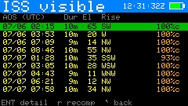

A scrollable list of every **optically-visible** pass for the selected satellite
over the next 10 days — filtered to passes where the satellite is **sunlit**, your
**sky is dark** (Sun below the configured gate), and the **peak elevation** clears
the visibility minimum. Each row shows AOS time, duration, peak elevation, and the
**rise compass direction** (where on the horizon to look as it comes up). `;`/`.`
scroll; **ENTER** opens the **pass-detail plot** for the highlighted pass (and
returns here when you back out); `r` recomputes; `` ` `` returns to Passes. This
complements the **10-day chart** (`v`), which shows *all* passes graphically — the
`V` list is just the ones you could actually see. Requires the **UTC clock** and
your **location** to be set.

### Pass detail

An **elevation-vs-time curve** for the selected pass. The curve is drawn
**yellow where the satellite is sunlit** and **blue where it is in eclipse**. A
cyan vertical line marks "now" if the pass is in progress. Below the plot:
AOS time and azimuth, LOS time and azimuth, maximum elevation, pass duration, and
the percentage of the pass spent in sunlight. Press **`p`** for a **polar view of
this pass** — its ground track across the sky with **A**/**L** (AOS/LOS) markers
and an arrow showing the direction of travel; `p` toggles back to the curve.
`` ` `` or ENTER returns to Passes.

### Mutual windows (co-visibility)

From **Passes**, press **`x`** and enter a remote station's **Maidenhead grid**
(4 or 6 characters, e.g. `IO91` or `JN58td`). CardSat scans the selected
satellite's upcoming passes **over the next 10 days** and lists every window
where **both you and that station have the satellite above your horizons at the
same time** — the periods
you could actually make a contact through the bird. Each row shows the **start
time (UTC)**, the **duration** (m:ss), and the **maximum elevation at each end**
— yours (`me`) and theirs (`dx`) — so you can judge how workable the window is.
`;`/`.` scroll; **`d`** opens the **DX Doppler table** for the highlighted
window (below); `` ` `` returns to Passes.

> Co-visibility is computed to the **0° horizon** for both stations; a window
> with very low max elevations may be hard to use in practice. The remote grid
> is assumed at sea level.

#### DX Doppler table (`d` from a mutual window)

For a short window, the hard part of a coordinated contact is that **the dial
frequencies are different at each end** — your Doppler and the DX station's
Doppler aren't the same, because you're moving relative to the satellite by
different amounts. This table solves that. It lists, **every 30 seconds across the
window**, the predicted **RX (downlink)** and **TX (uplink)** dial frequencies for
**both your station and the DX station**, for the selected transponder. Each
30-second step shows two lines — your dials (green, "me") and the DX station's
(cyan, "DX") — so the four frequencies never run together. Press **`t`** to cycle
which transponder is used (the same selection you can also make with `t` on the
Satellites screen).

Three tracking modes, cycled with **`m`**:

- **True rule** — the operating point is held fixed *in the satellite's
  passband*; every dial Doppler-tracks, each station with its own geometry. Both
  of you stay on the same transponder channel the whole pass.
- **Fixed downlink** — the **anchor** station holds its **receive dial constant**
  in real RF (the knob they don't touch). The passband operating point drifts to
  absorb that station's downlink Doppler, and the other three dials are computed to
  follow.
- **Fixed uplink** — the anchor station holds its **transmit dial constant**; the
  other three dials follow.

Press **`a`** to cycle which dial is the **anchor** (my RX, my TX, DX RX, or DX
TX). For a **linear** transponder you also choose **where in the passband** to
operate: the table **opens at the center of the passband** (and re-centers when you
switch transponders with **`t`**). The header shows the operating point **relative
to the center of the passband's downlink** — `ctr` at center, or a signed offset
like `+7.5k` / `-12.5k` — so you always know how far off-center you are.

How the **`,`/`/`** keys step depends on the mode:

- In a **fixed** mode (fixed downlink or fixed uplink), `,`/`/` step the **anchored
  dial** to the next **round 1 kHz**, grid-aligned to the center of the passband.
  This is what lets you park your fixed RX or TX on a clean, easy-to-call number:
  cycle the anchor to the dial you care about (say *my TX*), and each press lands
  that transmit dial on 145.949, 145.950, 145.951 MHz — never 145.9502. CardSat
  nudges the passband so the anchored dial sits exactly on the kHz, then recomputes
  the rest of the table around it.
- In **true rule** mode (nothing anchored), `,`/`/` simply nudge the passband
  operating point by 1 kHz, as before.

RX values are shown in green, TX in yellow. **`;`/`.`** scroll through the
30-second steps; `` ` `` returns to the mutual window list.

> Frequencies include your station calibration offsets. The DX station is assumed
> at sea level with no local calibration. For an SSB contact, treat the numbers as
> the center of where to listen/transmit and fine-tune by ear.

---

### 10-day pass overview (`v`)

From **Passes**, press **`v`** for an at-a-glance chart of the selected
satellite's passes over the **next 10 days**, modeled on InstantTrack's
"Multiple Days for Single Satellite" visibility screen. Each row is one day
(today at the top), drawn as a 24-hour timeline (00–24 h UTC, left to right) with
faint gridlines at 06/12/18 h. The window is aligned to UTC midnight and spans
ten **full** days, so every row is filled edge to edge — the chart is not cut off
partway through the last day at the time you opened it. Every pass is a colored
bar from AOS to LOS, shaded by peak elevation — **dim green** below 15°,
**green** to 40°, **yellow** above — so high passes stand out. A red tick on the
top row marks the current time. **`;`/`.` scroll one day at a time** — the oldest
day falls off the top and a new day appears at the bottom (you can scroll forward
indefinitely, but not before today). `r` recomputes; `` ` `` returns to Passes.

---

### Illumination (`i`)

From **Passes**, press **`i`** for a **60-day solar-illumination raster** in the
style of DK3WN's *illum*. The horizontal axis is date (today at the left edge,
**+60 d** at the right); the vertical axis is one **orbital period** (its length
in minutes is printed at the right). Each cell is shaded **yellow when the
satellite is in sunlight** and left **dark when it is in Earth's shadow
(eclipse)**, so the eclipse band — and the "sunline" at its edge — stands out,
widening and narrowing as the orbit plane precesses relative to the Sun and
vanishing entirely during **full-sun seasons** (handy for judging solar-panel
charging). Below the raster a live readout shows the **current status**
(`SUN`/`SHADOW`), the **eclipse minutes per orbit** and percentage for the
current orbit, and the time to the next Sun↔shadow transition. **`,`/`/` scroll
one day at a time** through the 60-day window (forward indefinitely, not before
today). `r` recomputes; `` ` `` returns to Passes.

> Eclipse uses a cylindrical-shadow model (no penumbra) and the raster is
> sampled, so the band edges and transition times are good to about a minute.

---

### Track

The main operating screen. Top to bottom it shows: **azimuth / elevation** (and
GP age), **range / range-rate** (and an orange **ECL** flag in eclipse), the
selected **transponder**, the **downlink (DN) and Doppler-corrected receive (RX)**
frequencies, the **uplink (UP) and transmit (TX)** frequencies, the **passband**
position line, the **calibration** line, and the **radio status**. On an FM bird
that needs a subaudible **PL/CTCSS tone**, a **`PL nn.n Hz`** line appears (orange
when the radio is on and the rig supports CAT tone, gray otherwise, or
`PL nn.n Hz (rig n/a)` if the selected rig can't set tone over CAT).

Controls:

- `m` — switch between **TUNE** and **CAL** modes.
- `d` — cycle the **Doppler tune mode** (linear birds): FULL One True Rule →
  downlink-only → uplink-only → hold-both. The passband line shows the active mode.
- `l` — **Log QSO** (also on the Polar screen): capture the contact you're working.
  Radio control keeps running while you fill in the entry.
- `t` — cycle to the next transponder.
- `n` — **jump to the beacon**: select the satellite's beacon (a downlink-only
  entry, or one whose description names a beacon) so the radio tunes straight to
  it with Doppler correction. Useful for finding a bird by its telemetry/CW beacon
  before working it. Also available on the **Big readout** screen. If the satellite
  has no beacon listed, a status note says so. On an Icom rig a receive-only
  transponder like this turns the rig's **satellite mode off** and tunes the
  downlink on the **MAIN** band (which also reads back more reliably), matching how
  OscarWatch and the SDR-Control apps handle receive-only birds.
- `c` — set the **CTCSS/PL tone** for this satellite (numeric entry: a tone in
  Hz, `0` to force it off, or blank to revert to the built-in default).
- `N` — edit a **per-satellite operating note**: a short free-text reminder that
  travels with the bird (active modes, schedule, "PL 67.0, use high passes," your
  own observations). It's stored by NORAD and shown on the Track screen — a `*`
  appears next to the satellite name in the header and the note text on its own
  line. Leave it blank to clear. Notes persist across reboots and reflashes (in
  `notes.txt`).
- `k` — on a **linear (SSB/CW) transponder**, toggle **CW mode on both legs** so
  you can work CW through the bird instead of SSB. CardSat sets CW on the uplink
  and downlink; on an inverting transponder the sideband flips but CW is CW on both
  ends, so you just zero-beat your downlink. The choice is **per channel** (it
  resets when you change satellite or transponder), shows a `CW` tag on the Track
  and large-font screens, and applies live whether the radio is already engaged or
  you turn it on afterward. On an FM bird the key is a no-op ("CW: linear birds
  only"). Available on both the Track and large-font screens.
- `r` — turn radio output **on/off** (sets modes and begins Doppler service).
- `o` — turn **rotator** pointing **on/off** (if a rotator is configured; sends
  live az/el to the selected backend, parks on stop). See [§17](#17-antenna-rotator-gs-232-rotctl-pstrotator-yaesu-direct-rotctld-server).
- `p` — open the **Polar** plot.
- `z` — open the **large-font readout** (see below). A quick way to read RX/TX,
  az/el and the AOS/LOS countdown at arm's length; radio and rotator keep running.
- `y` — toggle **tilt tuning** on/off on the fly (only if the board has the sensor
  and the feature is otherwise available; see Settings). Lets you flip accelerometer
  tuning on for a tricky stretch and back off without opening Settings.
- `v` — start/stop a **voice memo** (recorded to the microSD card via the ADV's
  built-in mic); radio and rotator tracking keep running while you record.
- `g` / `w` / `e` — show the **workable grids / US states / DXCC** reachable under
  the footprint **right now**, refreshing live; radio and rotator control keep
  running while you look. (The same three lists are also available per-pass from
  the Passes screen.)
- `f` — open **Manual mode** (frequency calculator; see below). Useful when you
  have no CAT-controlled radio and are tuning by hand.
- **ENTER** — save the current calibration **for this satellite**.
- `` ` `` — leave the Track screen, **returning to the screen you came from**
  (Passes, Next Passes, or Home). If the radio and/or rotator are engaged, they
  **keep tracking in the background** — the loop's Doppler and rotator service runs
  regardless of which screen you're on, so you can browse passes, log a QSO, check
  the map, etc. while the rig stays Doppler-corrected and the antenna stays pointed.
  A green **RAD** / **ROT** / **R+R** tag in the header on those other screens shows
  tracking is still live (and that the rig may be transmitting). Use **`r`** to stop
  the radio and **`o`** to stop (and park) the rotator. When neither is engaged, `` ` ``
  is just a plain exit. Background tracking stays locked to the satellite it was
  started on: if you **select a different satellite** while it's running (for example
  by opening another bird from the Satellites list), tracking **stops and the rotator
  parks** rather than silently retargeting the rig — re-engage with `r`/`o` once
  you've opened the new satellite's Track screen.

TUNE-mode keys: `,`/`/` tune down/up the passband, `s` cycle step
(100/1000/5000 Hz), `x` recenter. CAL-mode keys: `,`/`/` trim downlink, `;`/`.`
trim uplink, `s` cycle step (10/100/1000 Hz), `x` zero. See
[§9](#9-doppler-tuning-and-the-one-true-rule) and [§10](#10-calibration). When
**Tilt tuning** is enabled (see Settings), in TUNE mode on a linear bird you can
also roll the Cardputer left/right to move through the passband — a small **TLT**
marker on the passband line shows it's armed.

### Large-font readout (`z` from Track)

A stripped-down, glanceable view for operating a pass without squinting: the
**RX** and **TX** frequencies in the largest digits that fit, with **Az/El** and
the active **Doppler tune mode** below them. Small badges show **RAD**/**ROT**
(radio and rotator on/off), **TILT** if tilt tuning is armed, and the transponder
index. The bottom line echoes the tune mode (**FULL / DL / UL / TUNE / CAL**) and,
on a linear bird, the passband position — so the big view follows whatever Doppler
tuning option you selected on the Track screen.

The radio, rotator and Doppler tracking keep running exactly as on Track — this is
just an alternate view of the same live session. All the in-place Track controls
work here too: `,`/`/` tune through the passband, `s`/`x` step/recenter, `m`
TUNE/CAL, `d` cycle tune mode, `t` next transponder, `r` radio, `o` rotator, `y`
tilt, and `l` to log a QSO. Press `z` or `` ` `` to return to Track.

(The earlier AOS/LOS countdown was removed from this view to give the frequencies
more room; the countdowns remain on the regular Track and Passes screens.)

### Manual mode (`f` from Track)

**Manual mode** is for operating without a CAT-controlled radio: it shows the
same live data as Track but **never commands a radio or rotator**. Instead, you
fix one leg — the frequency you'll hold on your own rig — and it shows the
**Doppler-corrected frequency to tune the other leg to**, updated live, with your
saved calibration applied.

The two frequency rows are marked **HOLD** (the leg you park on your radio, shown
at its nominal value without Doppler) and **TUNE>** (the leg you must follow,
shown Doppler-corrected). Press **`u`** to toggle which leg is fixed:

- **Linear birds** — fixing the downlink shows the uplink to transmit (and vice
  versa). `,`/`/` move the fixed frequency through the passband, `s` cycles the
  step, `x` recenters. The HOLD leg's parked value stays put; the TUNE> leg
  follows with Doppler. Because the goal is to keep hearing *yourself* on the
  fixed leg, the TUNE> leg is corrected for the **round-trip** Doppler — it
  cancels both the uplink and downlink shift, in **either** direction (hold the
  downlink and tune the uplink, or hold the uplink and tune the downlink), since
  where your own signal lands depends on where the bird heard your transmission.
  (Fixing a single satellite-passband point instead — the convention used when
  CardSat drives a real radio on the Track screen — lets the downlink drift on the
  ground; here the goal is the opposite, a stationary fixed leg you can park on.)
- **FM birds** — pick which leg is fixed with `u` (typically the **VHF** leg,
  which has little Doppler and is the one you park). The other (UHF) leg shows
  the Doppler-corrected frequency to chase. FM legs are independent channels, so
  no round-trip correction applies. A hint line notes which leg is fixed and
  whether it's VHF.
- **Downlink-only birds** — just the computed downlink to tune your receiver to.

`m` toggles **CAL** (trim the same per-satellite calibration as Track), `t`
cycles transponder, `l` logs a QSO, `p` opens the polar plot, `g` opens live
workable grids — and **the log, polar, and grid screens all return here** rather
than to Track. **ENTER** saves calibration for this satellite. `` ` `` or `f`
returns to Track.

Press **`z`** for a **large-font version of the Manual calculator** — the HOLD and
TUNE legs in big digits, with the fixed/derived leg labeled, for reading at arm's
length in the field. The in-place keys (`u` swap leg, `m` CAL, `,`/`/` tune, `s`/`x`,
`t`) work the same there; `z` or `` ` `` returns to the normal Manual view. If the
board has the motion sensor and **Tilt tuning** is on, you can roll the device to
move through the passband in Manual mode too, exactly as on Track.

### Polar

A sky plot centered on the zenith: N/E/S/W cardinal labels, elevation rings at
30°/60°, the horizon as the outer ring. A green dot marks the satellite; a yellow
glyph marks the **Sun** (when it's above the horizon). The satellite's **path
across the sky for the current pass** is drawn as a cyan arc with **A** (AOS) and
**L** (LOS) markers and a white arrowhead showing the **direction of travel**.
When the bird is below the horizon the arc shows the **next** pass instead, and
the readout gives that pass's AOS time. The right-hand readout also shows az/el,
range, range-rate, **Sun az/el**, and whether the satellite is **SUNLIT** or in
**ECLIPSE**. `l` logs a QSO and `v` starts/stops a **voice memo** (microSD, ADV)
without leaving the plot. `p`, ENTER, or `` ` `` return to Track.

### OSCARLOCATOR (`k` from Satellites)

A live **azimuthal-equidistant** plotting board — the classic OSCARLOCATOR view —
reached with `k` on the **Satellites** screen. Unlike the **Polar** screen (which
plots a single pass in az/el over your sky), this plots the satellite's
**sub-point on the Earth** in real time, the way a paper OSCARLOCATOR dial does.
It complements the tabular **EQX table** (`e`): the EQX table lists the
equator-crossing times and longitudes, and this view shows the resulting geometry.

Two modes, toggled with **`m`** (the view **opens in polar mode** by default):

- **Polar** (default) — a pole sits at the center and the satellite is plotted by
  latitude (distance from the pole) and longitude (angle). CardSat **automatically
  chooses the North or South polar sheet** from the satellite's current hemisphere
  and **flips between them live** as the bird crosses the equator, so the satellite
  always stays on the visible chart.
- **QTH-centered** — your station sits at the center, with range/elevation rings
  around it. The satellite is drawn at its true bearing and great-circle distance
  from you, so you can see at a glance where it is relative to your horizon and
  how far away it is.

Both modes draw a coarse coastline, a lat/lon graticule, the satellite marker
(yellow when sunlit, cyan in eclipse) and its **ground footprint** circle. They
also draw a **QTH range ring** as a dashed amber circle — the satellite's footprint
radius at the bird's mean altitude, centered on your station, so anything the
satellite's sub-point reaches inside that ring is a workable pass (dashed so it
stays distinct from the same-size instantaneous footprint) — and the **ground-track
arc** in blue: the satellite's full sub-point track across the disc — a complete
orbit's worth of ground track centered on the current time, so it sweeps the whole
projection like a real OSCARLOCATOR (portions outside the plotted radius are
clipped). Green and orange markers show where the current pass's **AOS** and **LOS**
fall along that track, and a white arrowhead at the satellite shows the direction
of travel. The right-hand readout
shows the sub-satellite lat/lon, az/el, slant range, altitude, and sunlit/eclipse
state; an **(off chart)** note appears when the satellite is outside the plotted
area (e.g. below the horizon in QTH mode, or in the other hemisphere in polar mode
just before the view flips). `m` toggles the mode; `` ` `` returns to Satellites.

### 3D Globe (`3` from Satellites)

A three-dimensional wireframe Earth, reached with `3` on the **Satellites** screen.
Where the world map is a flat projection and the OSCARLOCATOR is a flat azimuthal
disc, this is an **orthographic globe** — the Earth as a sphere you're looking at
from space. Only the near hemisphere is drawn; anything on the far side of the
Earth is hidden behind the curve, just as it would be in real life.

The globe **auto-follows the selected satellite**: it rotates continuously so that
satellite's sub-point stays at the center of the disc. Drawn on it:

- a **graticule** (meridians and parallels every 30°) and a coarse **coastline**,
  both clipped at the limb so only the visible hemisphere shows;
- a **day/night terminator** in yellow — the line dividing the sunlit and dark
  halves of the Earth, computed from the Sun's current sub-point;
- your **QTH** as a white cross;
- **all your favorites** as small dim-green dots (those on the near hemisphere),
  with the **selected satellite** drawn larger and centered (yellow when sunlit,
  cyan in eclipse);
- the selected satellite's **ground footprint** as a green circle, which wraps
  around the limb of the globe naturally as the bird nears the horizon;
- the selected satellite's **ground-track trail** in blue — a full orbit's worth of
  sub-points projected onto the sphere, so you can see where the bird came from and
  where it's heading;
- optionally a **second (DX) location**: press **`g`** and enter a Maidenhead grid
  square (e.g. `IO91`). The DX station is drawn as an orange box with its own
  footprint ring at the selected satellite's altitude; where that ring overlaps the
  satellite's own footprint is the **live mutual-visibility region** for that bird —
  the area from which both you and the DX station could work it at once. Press
  **`G`** (shift-g) to clear the DX location.

The right-hand readout shows the selected satellite's sub-lat/lon, az/el, altitude,
sunlit/eclipse state, the view mode (**follow** or **free**), and either the DX grid
(when set) or the favorite count. **Arrow keys** turn the globe by hand — this
drops into **free-look** so you can inspect any part of the Earth; **ENTER**
re-snaps to auto-follow. `` ` `` returns to Satellites.

### Sat-to-sat visibility (`2` from Satellites)

Press **`2`** to find the windows when the selected satellite **and a second
satellite** are **both above your horizon at the same time** over the next five
days — for cross-satellite relay experiments, or simply to plan back-to-back
working of two birds on one outing. The second satellite is taken from your
**favorites** list.

You first land on a **pick screen** that shows the currently-selected second
satellite and its position in your favorites (e.g. "3 of 7"). Press **`n`** /
**`p`** to step forward/back through favorites — this is **instant**, because no
search runs while you are choosing. When you have the satellite you want, press
**ENTER** (or **`r`**) to run the window search. After results appear, `n`/`p`
return you to the pick screen to choose a different second satellite, so you never
sit through a calculation just to scroll past a bird you didn't want.

Each row is one overlap window, showing its **start time (UTC)**, **duration**,
and the **peak elevation of each satellite** during the window (the first in
green, the second in cyan) so you can judge how usable it is. `;`/`.` scroll;
`` ` `` returns to Satellites.

The search runs in the background with a **progress bar** while it scans, so the
screen stays responsive (the back key works throughout) and always finishes.

> Both satellites are evaluated to your **0° horizon**. A window with very low
> peak elevations on either bird may be hard to use. The search looks three days
> ahead and lists up to sixteen windows.

### Voice memo (`v`, SD card required)

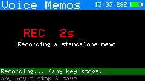

Press `v` on the **Track**, **Manual**, **large-font readout** (Track or Manual),
or **Polar** screen to record a short spoken note — for example "worked W1ABC, good
signal" during a pass — without leaving the screen. A red **REC** badge with a
countdown appears top-right while recording, and **radio, rotator, and web control
keep running** throughout (the memo is captured one small block at a time between
the normal tracking updates). Press `v` again to stop, or it stops automatically at
the 30-second cap.

Starting a memo from an operating screen also appends a **log stub** — time, your
call and grid, the satellite, mode, and the live frequencies, with the callsign left
blank and a note naming the memo file — so the contact can be completed after LOS
instead of typed mid-pass. Unwanted stubs delete like any entry (`x` twice).

Memos are saved as 16 kHz mono WAV files under **`/CardSat/audio/`** on the SD card,
named by UTC timestamp and (when a satellite is selected) the bird being tracked,
e.g. `memo_20260617_203145_AO-91.wav`. **An SD card is required** — with no card,
`v` reports "Memo: SD card required" and does nothing.

**Voice Memos browser (Log → Voice Memos).** Memos can be reviewed on-device from
the **Log** menu's **Voice Memos** entry. The browser lists every memo on the card
**newest first**, showing each one's date, time, the **satellite** it was recorded
on (or `-` for a standalone memo), and its length. Keys:

- **ENTER** — play the selected memo through the speaker. Playback streams from the
  SD card a block at a time; **any key stops** it early.
- **`n`** — record a **new standalone memo** right from the browser, not attached to
  any satellite. A `REC` timer shows while it records; **any key stops and saves**.
- **`d`** — delete the selected memo (with a confirm prompt).
- **`r`** — refresh the list; **`` ` ``** returns to the Log menu.

You can still copy the WAV files off the card on a computer as well.

> **Cardputer ADV — voice memo requires building against ESP-IDF 5.4.x.** The ADV
> captures through an ES8311 codec (the original Cardputer used a PDM mic), and the
> codec's record clock is only driven correctly when CardSat is built against the
> **ESP-IDF 5.4.x** toolchain. In practice that means the **Espressif "esp32" Arduino
> core 3.2.x** (which bundles IDF 5.4.2). On the newer 3.3.x core / IDF 5.5.x the
> mic path produces a constant (silent) signal — an upstream regression, not a
> CardSat bug (see
> [espressif/esp-idf#18621](https://github.com/espressif/esp-idf/issues/18621)).
> Everything else in CardSat builds and runs on either toolchain; only voice memo is
> affected. To confirm your build is correct, the boot log should report an IDF
> 5.4.x SDK version. Recording uses M5Unified's `M5.Mic`, so an up-to-date M5Unified
> is recommended.

### Workable grids (`g`)

The 4-character Maidenhead grid squares currently inside the satellite's
footprint — every grid from which a station could work the bird at the same
time you can. Reached two ways:

- `g` from **Passes** — the **union** of grids covered across the selected pass
  (sampled about once a minute from AOS to LOS), computed once on entry.
- `g` from **Track** — the grids under the footprint **right now**, refreshed
  about every 3 s. Radio and rotator tracking keep running while you view it.

Grids are listed six per row in alphabetical order. The **workable count** is
shown on its own cyan line at the top of the list (the header had no room for
it), and when the list spills past one page that line also shows the visible
window, e.g. `1370 workable  (1-48)`. `;`/`.` scroll a row at a time and `{`/`}`
page. Coverage is computed with a per-grid bitset, so there is **no cap** on the
number of grids — it works for any amateur satellite, including high orbits (a
~2500 km bird floods roughly 4500 grids). `` ` `` returns to whichever screen
opened it.

Press **`f`** to set a **prefix filter** that narrows the list to grids beginning
with what you type: `EM` shows every workable EM grid, `EM2` narrows to EM2x, and
`EM21` shows just EM21 if it's workable. The filter is entered in upper case (the
same capitalization rule as all grid entry — lower case is accepted and converted),
and only well-formed Maidenhead characters are kept (two field letters A–R, then two
digits 0–9). With a filter active the count line shows it, e.g. `EM2: 9 of 1370`, and
**`c`** clears it. The filter persists as you move between passes until you clear it.

### Workable US states (`w`)

The US states (and DC) currently inside the satellite's footprint — the state
equivalent of the workable-grids screen, reached the same ways and in the same
modes:

- `w` from **Passes** — the **union** of states covered across the selected
  pass, computed once on entry.
- `w` from **Track** (or **Manual**) — the states under the footprint **right
  now**, refreshed about every 3 s, with radio and rotator tracking still
  running.

States are listed by their two-letter USPS code, six per row, alphabetically,
with the same cyan workable-count line and `;`/`.` · `{`/`}` scrolling as the
grids screen. Membership is decided by a point-in-polygon test against bundled
**simplified** state boundaries (about 0.1°/11 km resolution), so a footprint
grazing a state line may briefly claim both neighbors — fine at footprint
scale, where both are in fact workable. AK, HI and DC are included. `` ` ``
returns to whichever screen opened it.

### Workable DXCC (`e`)

The DXCC entities currently inside the footprint — the same idea again, for
**DXCC chasing**, reached the same ways (`e` from Passes for the per-pass union,
or from Track / Manual for live now). Entities are listed by common prefix
(e.g. `DL`, `JA`, `VK`, `9V`), five per row, with the same workable-count line
and scrolling.

**Coverage and accuracy.** All **340 current DXCC entities** are included, via a
hybrid model: the major countries use simplified boundary polygons (so the right
country is picked from the footprint geometry), while the long tail of islands and
micro-entities is represented by each entity's reference coordinate from `cty.dat`
and counted as workable when that point falls within the footprint (plus a small
claim radius). Country borders are coarse, so a footprint near a border may list a
neighbor too, and a single-point entity is claimed as a unit rather than by exact
shape. Treat this as **chasing guidance** — which entities are reachable on the
pass — and confirm the actual entity worked from your own log. `` ` `` returns to
whichever screen opened it.

### Location

- `e` / `o` / `a` — edit latitude / longitude / altitude.
- `g` — set position from a **Maidenhead grid** square.
- `p` — enable/disable **GPS**.
- `s` — cycle the **GPS source** (Grove 9600, Grove 115200, Cap LoRa868, Cap LoRa1262).
- `c` — set the **UTC clock** manually (`YYYY-MM-DD HH:MM:SS`).
- `v` — open the **live GPS position** screen (below).
- **ENTER** — open the **GPS sky plot** (GNSS satellites in view).
- `` ` `` — back (applies the position to the predictor).

#### Live GPS position (`v`)

A full-precision readout of where you are, for rovers, portable ops, and grid-line
activations. It shows your **latitude and longitude in degrees-minutes-seconds**
to 0.001″ (about 3 cm — finer than the fix itself), the same coordinates in
**decimal degrees** to six places, your **altitude**, your **Maidenhead grid**,
and — from a live fix — your **ground speed** (km/h and knots) and **course over
ground** (degrees true with a cardinal label). The top line shows the fix status,
the number of satellites used, and the HDOP. The grid recomputes live as you move,
so you can watch it flip as you cross a grid boundary. `` ` `` returns to Location.

### LoRa Messages (Home → Messages)

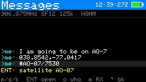

CardSat-to-CardSat **text messaging** over LoRa, using the M5Stack **Cap LoRa
(SX1262)** module. It is a **broadcast group chat**: every CardSat tuned to the
same frequency, spreading factor and bandwidth sees every message — there is no
addressing or routing, which keeps it simple and reliable for a group on an
outing, a club net, or a SOTA/portable activation.

> **Hardware-verified.** Two-way LoRa text messaging is confirmed working on the M5Stack
> Cap LoRa (SX1262), tested against a LilyGo T-LoRa unit running the companion CardSat
> Pager firmware. It's built into the standard binaries (RadioLib is a required build
> dependency). **Know your band's rules** — pick the **LoRa region** preset that matches
> where you operate (see Settings below):
>
> - **US (default)** — the **33 cm amateur band (902–928 MHz)**. The US 70 cm band
>   is held to ~100 kHz occupied bandwidth, which is tight for 125 kHz LoRa, so
>   33 cm is the home for amateur LoRa here. Default **906.875 MHz**, clear of the
>   busy 915 MHz ISM center.
> - **EU** — the **70 cm amateur band (430–440 MHz)**. Default **433.775 MHz**, the
>   LoRa-APRS standard, at 125 kHz.
> - **Japan** — the **430 MHz amateur band (430–440 MHz)**. Default **431.000 MHz**.
>   (Japan's 920 MHz band is ISM, with certification rules — not amateur — so
>   amateur LoRa belongs on 430 MHz.)
>
> These are starting points within each band, not the only legal frequencies; you
> can still set any carrier 150–960 MHz by hand, and you remain responsible for
> operating within your license and local regulations.

**Using it.** Set your callsign (Settings → Station, or the QRZ screen), enable
**LoRa msg** in Settings → Network/data, pick your **LoRa region**, then fine-tune
the frequency/SF/bandwidth to match the other stations. Open **Messages** from the
Home menu. Press `n` to write a message on the full keyboard and **ENTER** to send;
`;`/`.` scroll back through history. Your own messages show in cyan as `>me`;
received messages show in green by the sender's callsign. A message too long to fit on
one line wraps onto a second, indented line so nothing is cut off. The top line shows
the current frequency, SF, bandwidth and your callsign. History holds the most recent
24 messages (a fixed ring — no SD card needed, lost on reboot).

**Selecting a message.** Scroll with `;`/`.` to move the selection through the list. The
**newest message always sits on the bottom line** (chat style — older messages scroll up
off the top), and the selected message is highlighted. When a message is selected, **ENTER
acts on it** (see the next section); if it contains no actionable content, ENTER simply
reports that.

**Actionable messages (position, satellite, sked).** A message is still plain text on the
air — the wire format is unchanged, so this interoperates with any other CardSat — but
CardSat recognises three markers anywhere in a message's text and turns a selected message
into an action with **ENTER**:

- **`@lat,lon`** (e.g. `@38.8542,-77.0417`) — a **position**. ENTER opens a **bearing
  compass**: a north-up dial with an arrow to the sender, plus the great-circle
  **distance and bearing** and the message's age. The Cardputer ADV has no magnetometer,
  so this is a *computed bearing* (degrees from true north) for you to orient by, not a
  live magnetic compass.
- **`#SAT`** (e.g. `#SO-50/27607`) — a **satellite**. ENTER opens a **satellite detail**
  screen with the NORAD ID and the **next pass** for your location. CardSat appends the
  satellite's **NORAD catalog number** after the name (`name/norad`) so the far end can
  resolve the right bird even if its list uses a different display name — a satellite that
  one station calls `RS95S` and another calls `QMR-KWT2` shares the same NORAD number, so
  the reference still lands. A message with just a name (no `/norad`) still works by name.
- **`!SAT YYYY-MM-DD HH:MM`** (e.g. `!AO-91/43017 2026-07-04 18:30`) — a **schedule
  proposal**. ENTER opens the **sked editor pre-filled** with the satellite (resolved by
  NORAD, so it maps to your name for it), date and start time (and the sender's callsign),
  so you can review and save it.

When the selected message carries one of these, a **yellow hint** on the line above the
footer shows exactly what ENTER will open.

**Sending an actionable message.** Three keys on the Messages screen compose and send
these markers for the **currently selected satellite** (from the Satellites screen) and
**your own location**:

- **`p`** — send your **position** as `@lat,lon` (from your set location or GPS).
- **`s`** — send the current **satellite** as `#name`.
- **`k`** — propose a **sked**: you're prompted for a date, then a time, and CardSat sends
  `!SAT date time`. The date field is pre-filled with today (UTC) as a starting point.

These compose from your own state, so they work even on an empty message list. The other
station simply receives the text; if they're running CardSat, their copy decodes it the
same way yours does.

**Station roster (`o` key).** Press **`o`** on the Messages screen to open the **roster** —
a list of every station heard reporting a position, newest first. Each entry shows the
**callsign**, its **Maidenhead grid**, the **distance and bearing** from your location (when
you have a fix), the last **signal** (RSSI), and how long ago it was heard. Scroll with
`;`/`.`, press **ENTER** to open the **bearing compass** to the selected station, or press
**`p`** to send your own position (a presence ping) so others can add you to theirs. The
roster is built from ordinary `@lat,lon` messages — no special packet — so pressing `p` on
any CardSat both announces you and populates everyone else's roster; the grid is computed
locally from the shared lat/lon, so the on-air format is unchanged. (The roster is held in
memory and clears on reboot.)

**Sharing satellite elements over LoRa (`L` key).** From the **Satellites** screen, press
**`L`** to broadcast the selected satellite's **GP orbital elements** to any nearby CardSat
over LoRa — handy in the field for pushing a freshly-fitted set (e.g. a pre-launch state
vector from the *State vector → GP* tool, which also offers `L` on its result screen) to a
rove group without WiFi. The element set is split into a few small chunks with a checksum
and sent one frame at a time; the on-air status shows the progress. On the receiving unit,
CardSat reassembles the object, verifies the checksum, and shows an **"Import satellite?"**
prompt with the sender, name, NORAD, and key elements — press **`y`** to add or update it in
your GP data, or **`n`** to decline. Nothing is imported without your confirmation, and a
corrupted transfer is rejected rather than accepted (ask the sender to resend). This rides
on the **untested** LoRa path — treat it as experimental, and confirm any imported orbit
against a known pass before relying on it. Requires LoRa enabled on both units on the same
frequency/spreading-factor.

**Automatic position reply.** With **Auto position reply** on (Settings → Network/data,
**off by default**), CardSat answers a received position report with its own `@lat,lon`
automatically — handy for a net where everyone wants to see who's where without each
operator pressing `p`. Because it broadcasts your location, it is opt-in. Two safeguards keep
it well-behaved: a short random delay before replying (so simultaneous listeners don't all
transmit at once), and loop guards — CardSat won't auto-reply to the same station more than
once every few minutes, and never more than once every 30 seconds overall — so two
auto-replying units can't ping-pong endlessly.

**Settings.** In Settings → Network/data: **LoRa msg** on/off (turning it on
brings the radio up); **LoRa region** (US 33cm / EU 70cm / JP 430 — selecting one
seeds a legal default frequency + 125 kHz bandwidth for that band); **LoRa freq**
(arrow-adjust in 100 kHz steps, or ENTER to type an exact MHz value, 150–960 MHz);
**LoRa SF** (7–12; 12 = maximum range and sensitivity, the default; lower = faster
but shorter range); **LoRa BW** (62.5 / 125 / 250 kHz); **LoRa TX pwr** (0–22 dBm);
**Msg notify** (off / banner / banner+beep, described below); and **Auto position
reply** (off / on, described above). Both ends must use the same frequency, SF and BW
to hear each other.

**Notifications.** CardSat listens for messages continuously in the background (the
receiver is left on whenever LoRa is enabled), so a message can arrive while you're
on any screen. When one does, an **envelope badge with an unread count** appears in
the header (top, just left of the battery) on every screen, and — depending on the
**Msg notify** setting (Settings → Network/data) — a brief banner shows the
sender's callsign, optionally with a short beep. Opening **Messages** clears the
badge. **Msg notify** options: *off* (silent badge only), *banner* (the default,
a cross-screen banner on arrival), or *banner+beep* (adds an audible chirp — handy
when the screen is parked, but off by default so it can't surprise you mid-pass).
In the Charge / Sleep screen the badge updates silently and no banner or beep
fires, keeping that mode minimal.

**The build.** LoRa is a **standard, always-built feature** — official binaries ship
with it compiled in (`CARDSAT_HAS_LORA` defaults to `1`), so **RadioLib is a required
build dependency**: install it via the Arduino Library Manager (search "RadioLib" by
Jan Gromes) before compiling. The `#if CARDSAT_HAS_LORA` guards remain in the source
only so the tree still compiles if you deliberately override the define to `0` in your
own build flags; you should not need to.

> **If the single-file `CardSat.ino` fails to link** showing `dangerous relocation:
> l32r: literal target out of range`, that is an Xtensa toolchain limit: the very large
> single translation unit pushes RadioLib's code out of the reach of the `l32r`
> instruction's literal pool. CardSat mitigates this by constructing the SX1262 on the
> heap (a pointer, not a static global) so its destructor/vtable stay out of the
> sketch's static-init code. If the single-file build still fails to link, **build from
> the modular `src/` folder instead** (use the PlatformIO build): there `lora.cpp` is
> its own small translation unit and the literal-range problem does not arise.

### LoRa RX / hex monitor (Messages → `m`)

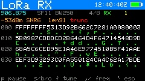

A general-purpose tool to receive and inspect **any** LoRa signal on the Cap LoRa
(SX1262) — not just satellites, and with no network or satellite data involved.
Useful for checking whether a LoRa transmitter is on the air, what a beacon's
bytes look like, and for peaking reception by ear. Press **`m`** on the Messages
screen to open it (LoRa must be enabled in Settings; it works even with no
messages in the log).

It takes over the shared radio while open, so CardSat messaging is paused until
you leave — the two share one SX1262 and one channel.

**Config screen.** Set the full SX1262 receive parameter set, then press **ENTER**
to start receiving:

- **Freq** — carrier. Press **ENTER** on this row to type the frequency directly
  in **MHz** (e.g. `433.775`) on a numeric entry screen. For fine tuning, `,`//`
  nudge it by the current step and **`s`** cycles the step size (1 kHz → 10 kHz →
  100 kHz → 1 MHz). (ENTER on any other row starts receiving.)
- **SF** — spreading factor 7–12.
- **Bandwidth** — the full SX1262 LoRa ladder: 7.8, 10.4, 15.6, 20.8, 31.25, 41.7,
  62.5, 125, 250, 500 kHz.
- **Coding** — coding rate 4/5–4/8.
- **Sync** — sync word (0x00–0xFF; **0x12** is the LoRa "private" default, **0x34**
  the public/LoRaWAN value).
- **Preamble** — preamble length in symbols (4–64).
- **CRC** — whether a payload CRC is expected (on/off).

All of these are **saved and restored** across reboots, and are kept separate from
the LoRa Messages parameters, so tuning the monitor never changes your messaging
setup.

**Monitor screen.** A classic hexdump of received frames that **updates
automatically as frames arrive** (it is not keypress-driven). Under the standard
title bar, a status line shows the live frequency, SF, BW, CR, a **PAUSE / RX /
`--`** state indicator, and a packet counter. Each frame is shown **16 bytes per
row: a line of hex with the ASCII characters directly beneath it** (non-printable
bytes shown as `.`), with a byte offset at the left. The newest frame is shown;
`;`/`.` scroll back and forth through the last dozen frames.

On a busy channel, press **`p`** to **pause** the display so you can read a frame
in detail: the radio keeps receiving into the buffer while paused (a `+N new`
indicator counts what arrived), and the frozen frame stays put until you press
**`p`** again to resume. You can also **tune live** without going back: `,`//`
nudge the frequency by the current step, **`f`** cycles the step, and **`s`** /
**`b`** / **`c`** cycle SF / BW / CR — each change re-applies to the radio
immediately, so you can sweep parameters until frames appear when you don't know a
signal's exact settings. **`x`** clears the buffer. **`` ` ``** (backtick) or
**ESC** returns to the config screen (the radio keeps running); pressing it again
on the config screen leaves the mode and restores messaging.

> **Receive-only.** This is a monitor — it never transmits. As with all RF
> features, use an antenna appropriate to the band you tune (e.g. a 70 cm antenna
> for 433 MHz); the Cap LoRa's SX1262 has no band-pass filter, so any frequency
> the chip supports works with the right antenna. Frames are stored up to 64 bytes
> for display; a longer on-air frame is shown truncated (its true length is still
> reported). LoRa modulation only — FSK/GFSK signals are not received.

### Update

- `k` or **ENTER** — update GP data from your configured source and sync the clock
  (NTP). The same action also refreshes the AMSAT OSCAR **activity marks** shown on
  the Satellites list, the **space-weather** data (solar flux + Kp), **and** the
  terrestrial **weather** for your site, so one press brings everything current. The
  Update screen notes this so it's clear `k` does more than GP.
- `f` — **fast update**: refresh the orbital elements (GP), the AMSAT activity
  marks (a single bulk fetch, so it's included), and the transponder data for your
  **favorites only** — skipping the space-weather and terrestrial-weather fetches
  that `k` also pulls. This is the quick way to bring your regularly-worked birds
  current without the longer full refresh — handy in the field. (If you haven't
  marked any favorites, it refreshes the currently active satellite instead.)
- `a` — fetch and cache **all** transponders for offline use. This runs **in a single
  session** — no reboots. CardSat fetches every satellite's transponder
  data in one pass, showing a running count on the Update screen (e.g. "TX 24/90: AO-91")
  and finishing on "Cached all N transponders". The whole pass takes a few minutes on a
  reasonable WiFi link; a per-satellite retry absorbs the occasional transient miss.
  (Earlier firmware split this across automatic reboots to work around a TLS memory limit;
  the BearSSL migration removed that limit, so it now completes in one go.) Satellites with
  no transmitters in the SatNOGS database are cached as an empty list, which is expected.
- `w` — connect WiFi only (no download).
- `` ` `` — back. Diagnostics print to the serial monitor at 115200.

### Settings

Settings are grouped into six submenus — **Radio / CAT**, **Rotator**,
**Passes / alerts**, **Display / sound**, **Station / logging**, and
**Network / data** (each shown with its item count). `;`/`.` move; ENTER opens a submenu
(or, inside one, edits a text field or runs an action); `,`/`/` change an adjustable
row; `` ` `` backs out to the submenu list, then home. Press `h` anywhere for the
on-screen key reference. The notable rows:

| Row | Action |
|---|---|
| Radio | `,`/`/` select model (auto-sets address + baud) |
| CI-V addr | ENTER → edit (hex); Icom only |
| CI-V wiring | `,`/`/` cycle **TX/RX (G2/G1)** / **1-pin G2** / **1-pin G1** — Icom wired CI-V only; single-pin is **confirmed on an IC-821** but still needs correct 5 V/3.3 V level interfacing, and TX/RX is the simplest path (see docs/interfaces/CIV_SINGLE_PIN.md) |
| CAT baud | `,`/`/` cycle 1200…115200 (incl. 57600) — applies to all radio protocols |
| Min pass el | `,`/`/` 0–30° |
| Decay solar | `,`/`/` cycle assumed solar activity **mean → min → max → auto** for the orbital-analysis decay estimate (changes the headline number and the bracket). **auto** uses the live F10.7 flux fetched with GP data |
| Weather units | `,`/`/` cycle the units for the **Weather** screen: **°F, mph → °C, km/h → °C, m/s**. Under *Display / sound*. |
| WiFi SSID | ENTER → edit · **`s`** → scan for networks and pick one |
| WiFi pass | ENTER → edit |
| WiFi 2 SSID | ENTER → edit an **optional second network** tried if the first fails (field use: a second router, or a phone hotspot). Leave blank to disable |
| WiFi 2 pass | ENTER → edit |
| Save & test WiFi | ENTER → connect and report OK/FAIL (tries the primary network, then the second if set) |
| AOS alarm | `,`/`/` or ENTER toggle on/off |
| IR pass beacon | `,`/`/` or ENTER toggle on/off — also flash the built-in IR LED on each pass alert, with a distinct flash count per event (see [§12](#12-aos-alarm-and-deep-sleep)). SD not required; off by default |
| Rotator (+ type / host / port / baud / ranges / offsets / deadband / park / pre-point) | `,`/`/` adjust, ENTER edits host/port. **Rot type** cycles **GS-232 → rotctl (net) → PstRotator → Yaesu (direct) → Easycomm I → Easycomm II → Easycomm III → SPID Rot2Prog**; see [§17](#17-antenna-rotator-gs-232-rotctl-pstrotator-yaesu-direct-rotctld-server) |
| GP source | ENTER → **source picker**: AMSAT (default), any CelesTrak JSON-PP category (Amateur Radio listed first), or **Custom URL…** — see [§14](#14-gp-age-and-accuracy) |
| VFO Type | `,`/`/` or ENTER toggle *Main Up/Sub Dn* ↔ *Main Dn/Sub Up* |
| Sat mode | `,`/`/` or ENTER toggle the rig's satellite mode on/off |
| CAT rate | `,`/`/` adjust the CAT update period in 10 ms steps (default 500 ms; soft-floored to what the CAT baud can service) |
| CAT delay | `,`/`/` adjust the pause after each command, 0–200 ms in 2 ms steps (default 70 ms; CI-V/Icom only) |
| Dopp FM band | `,`/`/` the FM-leg write deadband, 0–2000 Hz in 25 Hz steps (default 300 Hz). CardSat only re-sends an FM frequency once Doppler has moved it more than this — FM's wide passband absorbs the rest, so a loose value avoids needless CI-V chatter |
| Dopp linear band | `,`/`/` the SSB/CW-leg write deadband, 0–1000 Hz in 10 Hz steps (default 50 Hz). Tighter than FM because linear modes need close tracking; near closest approach CardSat tightens this automatically |
| Dopp lead | `,`/`/` the predictive-lead cap, 0–100 ms in 5 ms steps (default 50 ms; `0` = off). On fast overhead passes CardSat can compute Doppler slightly ahead to mask CAT latency, tapering the lead to zero near closest approach. Raise it if your rig's CI-V is slow; set `0` to disable |
| Screen sleep | `,`/`/` cycle off / 30 s / 1 min / 2 min / 5 min — blanks the backlight after that idle time |
| Brightness | `,`/`/` adjust the active screen brightness in ~6% steps; previews live. Under *Display / sound* |
| Volume | `,`/`/` adjust the speaker volume, 0–100% in ~9% steps; plays a short blip at the new level as you adjust so you can hear it. Applies to the AOS alarm, game sounds, and voice-memo playback, and audio plays uninterrupted while CardSat is on the network (a fetch or upload no longer pauses the speaker). Saved and restored across reboots. Under *Display / sound* |
| Tilt tuning | `,`/`/` or ENTER toggle **accelerometer passband tuning** on/off. Shown as **n/a (no IMU)** on boards without one (only the Cardputer **ADV** has the sensor). When on, roll the device left/right in TUNE mode on a linear bird to move through the passband. Under *Display / sound* |
| My callsign | ENTER → enter your station callsign (stored uppercase); used in the log and ADIF `STATION_CALLSIGN` |
| LoTW DXCC / CQ zone / ITU zone / primary / secondary / IOTA | A chained set of pickers for the **LoTW upload** station location. **DXCC** opens a full entity list (subdivision-bearing entities grouped at the top, marked `>`; type to filter). **CQ/ITU zone** are typed. **Primary** (labeled state/province/oblast/prefecture/kunta per your DXCC) opens a gated picker — required for US/AK/HI, **(n/a)** for entities without one. **Secondary** is county (US) or city/gun/ku (Japan), gated by the primary; **(n/a)** elsewhere. **IOTA** (e.g. `NA-005`) is optional for any entity. Inside a picker: `;`/`.` move, ENTER selects, typing filters, `` ` `` clears/back. Under *Station / logging*. See [§8 → LoTW upload](#logbook-of-the-world-lotw-direct-upload). |
| Cloudlog URL / key / station ID | ENTER → enter your self-hosted **Cloudlog** (or Wavelog) base URL (`https://…` or `http://…`), a **read-write API key**, and the numeric **station profile id** to file QSOs under, for **Log → Upload to Cloudlog**. Under *Station / logging*. See [§8 → Cloudlog upload](#cloudlog--wavelog-upload). |
| QRZ user / QRZ pass | ENTER → enter your QRZ.com username / password for the **QRZ Lookup** screen (requires a QRZ XML-data subscription). Password shown masked. Under *Network / data*. |
| Backup config+favs → SD | ENTER → copy config + favorites to `config.bak` / `favs.bak` |
| Restore config+favs | ENTER → restore them from the backup files |
| **Reset all data** | ENTER → type **ERASE** to wipe everything (red row) |
| CAT type (+ host / port / user / pass) | `,`/`/` cycle **Wired CI-V** → **Icom LAN** → **rigctl (net)**. Icom LAN drives the **IC-9700** over RS-BA1 (see [§3](#3-connecting-your-radio)); **rigctl** drives a radio attached to a remote Hamlib **rigctld** server over TCP (set host/port to your rigctld; Hamlib's conventional port is 4532). Under *Radio / CAT*. |
| Rigctld server (+ port) | `,`/`/` enable a **rigctld server** so a PC (Gpredict, WSJT-X, a logger) drives the radio through CardSat over TCP (default 4532); VFOA=downlink, VFOB=uplink. Under *Radio / CAT*. |
| Rotctld server (+ port) | `,`/`/` enable a **rotctld server** so a PC (Gpredict, …) drives **whichever rotator CardSat is configured for** through CardSat over TCP (default 4533). Under *Rotator*. |
| Web control (+ port) | `,`/`/` or ENTER enable the **mobile web control page** served over WiFi (default port 80). When on and connected, the row shows the device's IP address to browse to (e.g. `192.168.1.42` — open it as `http://192.168.1.42`). Under *Network / data*. Plain HTTP on the LAN, **no authentication** — see [§18](#18-mobile-web-control). |
| Rotator: manual control | ENTER opens a screen to jog az/el by hand with live read-back. For a **Yaesu (direct)** rotator this is also where you **calibrate the ADC**: it shows live ADC counts and you capture the axis endpoints with `1`/`2`/`3`/`4` (az 0 / az full / el 0 / el full) — see [§17](#17-antenna-rotator-gs-232-rotctl-pstrotator-yaesu-direct-rotctld-server) and [ROTOR_INTERFACE.md](docs/interfaces/ROTOR_INTERFACE.md). Under *Rotator*. |

### WiFi scan

Reached from **Settings** by pressing **`s`** on the **WiFi SSID** row. CardSat
scans for nearby networks and lists them strongest-signal first, with each
network's RSSI (dBm) and a `*` for secured networks.

- `;`/`.` — select a network.
- **ENTER** — use it: the SSID is saved and you're taken to password entry
  (open networks skip the password and return to Settings).
- `r` — rescan.
- `` ` `` — back to Settings.

### Edit

A simple text entry box (for the fields above and manual GP/transponder/time
entry). Type to append, **DEL** to backspace, **ENTER** to confirm, `` ` `` to
cancel.

**Adding a manual satellite** (from Satellites → `n`): you'll be prompted in
order for the **name**, **NORAD ID**, **epoch** (`YYYY-MM-DD HH:MM:SS`, UTC), then
the GP mean elements — **inclination**, **RAAN**, **eccentricity** (e.g.
`0.0006190`), **argument of perigee**, **mean anomaly**, **mean motion**
(rev/day), and **BSTAR** (drag; `0` is fine if unknown). The satellite is stored
with the downloaded ones and persists across GP refreshes.

> **Only have a TLE? Convert it with `tools/tle2gp.py`.** Manual entry asks for GP
> (OMM) mean elements, but some objects are still published only as a classic
> **two-line element set (TLE)**. The repo includes a small, dependency-free
> Python helper that decodes a TLE into exactly the fields above — handling the
> conversions that are easy to get wrong by hand: the TLE epoch (`YYDDD.dddddddd`
> → ISO date/time), the implied-decimal eccentricity, BSTAR's exponent notation,
> and the derivative scaling (TLE stores *n*-dot/2 and *n*-ddot/6; GP reports the
> full values). Run it on a file of one or more TLEs, or paste a 2–3 line set on
> standard input:
>
> ```
> python3 tools/tle2gp.py mysat.txt        # file with one or more TLEs
> python3 tools/tle2gp.py                   # then paste 2–3 lines, Ctrl-D
> python3 tools/tle2gp.py --json mysat.txt  # AMSAT-style GP/OMM JSON instead
> ```
>
> The default output lists each element with its label and units, ready to type
> straight into the `n` prompts in order (epoch, inclination, RAAN, eccentricity,
> argument of perigee, mean anomaly, mean motion, BSTAR). The `--json` form emits
> an AMSAT-style GP/OMM record, handy if you'd rather host the set at a **Custom
> URL** GP source (see [§7](#7-first-time-setup)) than type it in. Either way the
> numbers are identical to what CardSat would have downloaded — the script only
> *re-packages* the same SGP4 mean elements a TLE already contains, so accuracy
> still decays with the element set's age and you'll want a fresh TLE periodically.

**Adding a manual transponder** (from Passes → `n`): you'll be asked, in order,
for **Downlink low (Hz)**, **Uplink low (Hz, 0 = none/beacon)**, **Downlink high
(Hz, 0 = single channel/FM)**. If you gave a downlink high above the low *and* an
uplink, it's treated as **linear** and you'll also be asked **Uplink high (Hz,
0 = same bandwidth)**, **Inverting? (y/n)**, and finally the **Mode**. Single-
channel entries skip straight to Mode. Manual transponders are stored separately
from the SatNOGS cache so a GP/transponder refresh won't erase them. Up to **64
transponders** are held per satellite (SatNOGS plus your manual ones) — enough
for even the busiest birds, such as the ISS (~50 transmitters on SatNOGS).

---

## 9. Doppler tuning and the One True Rule

A satellite's motion shifts both the frequency you **receive** (downlink) and the
frequency the satellite **receives from you** (uplink). CardSat corrects both,
continuously.

CardSat follows the AMSAT **"One True Rule"** (Paul Williamson, KB5MU): *tune both
the transmitter and the receiver to achieve a constant frequency at the
satellite.* In practice the firmware holds your chosen spot in the transponder
fixed **as the satellite sees it**, and applies the Doppler correction to **both**
the receive and transmit frequencies every cycle. The result: you tune somebody
in, let go, and nobody drifts through the passband.

The corrections are:

```
RX = downlink × (1 − β) + calDl      (tune your receiver here)
TX = uplink   ÷ (1 − β) + calUl      (transmit here)
β  = range-rate ÷ c                  (c = speed of light)
```

where `downlink`/`uplink` are the satellite-side frequencies of your chosen
passband spot, and `calDl`/`calUl` are your calibration offsets ([§10](#10-calibration)).

### Choosing your spot in the passband

On a **linear transponder** you can move through the passband two ways:

- **TUNE mode** (device keys): press `m` until the passband line shows `<TUNE>`.
  `,`/`/` move your operating point down/up; `s` cycles the step; `x` recenters.
  The `PB` line shows your offset from band center, the half-width, and `INV` for
  inverting birds.
- **Radio-knob mode** (One True Rule, the natural way): press `d` to cycle the
  tune mode. In **FULL** (passband line shows `<FULL>` in orange) just **turn the
  radio's tuning knob** to move around the passband — CardSat reads your downlink,
  works out where you are, and keeps both legs Doppler-corrected around that fixed
  satellite frequency. Let go and you stay put. Pressing `d` cycles on through
  **downlink-only** (`<DL>` — One True Rule on the downlink, uplink left alone),
  **uplink-only** (`<UL>` — only the transmit leg is corrected; handy when an SDR
  or second receiver handles the downlink, and it needs no frequency read-back so
  it works even on set-only rigs), and back to **hold-both** (`<TUNE>`, device-key
  tuning). FULL and downlink-only need a rig that reports frequency; the cycle
  skips them otherwise.

For an **inverting** transponder the uplink moves opposite to the downlink (tune
the downlink up, the uplink goes down); for a non-inverting one they track
together. CardSat handles the mapping automatically.

### Tuning with the radio's knob

When you turn the radio's knob in FULL or downlink-only mode, CardSat distinguishes a
deliberate dial move from the rig's own tuning-step rounding and read-back jitter using
a **mode-aware threshold** (about 30 Hz on SSB/CW, 250 Hz on FM, never below the rig's
tuning step). The moment it detects a real move it adopts your new spot and then **holds
off its own Doppler writes to the downlink for a short grace window (~400 ms)** so it
never tugs against the knob while you're turning — it resumes downlink correction once
you let go. The uplink isn't connected to your knob, so it **keeps following** your new
passband point immediately and tracks the move without lag. If tracking ever feels
slightly sticky or slightly loose for your operating style, the `KNOB_MOVE_SSB_HZ`,
`KNOB_MOVE_FM_HZ`, and `TUNE_GRACE_MS` constants in the firmware are what to adjust.

If you turn the knob **past either edge of the passband**, CardSat holds you at the
edge (it can't operate you outside the transponder) and a flashing red **"OUT OF
PASSBAND"** banner appears at the bottom of the screen, naming the edge you ran into
(low or high), while it pulls the downlink back to that edge. Tune back inside and the
banner clears. It's a transient nudge, not a persistent alarm — just enough to tell you
why the dial stopped moving you through the band.

### Sidebands

For linear transponders CardSat sets the rig's modes for you: **USB on the
downlink, LSB on the uplink** (because an inverting linear transponder flips the
spectrum, so an LSB uplink is heard as a normal USB downlink). The exception is
any bird with an uplink or downlink **below 30 MHz (HF)**, which uses **USB up and
USB down**. FM and single-channel birds use the transponder's own mode on both
legs.

**Working CW through a linear bird.** Press **`k`** on Track to toggle **CW mode on
both legs** of a linear transponder, so you can work CW through the passband instead of
SSB. CardSat sets CW on the uplink and downlink; on an inverting transponder the
sideband still flips but CW is CW on both ends, so you simply zero-beat your downlink.
The choice is **per channel** — it resets when you change satellite or transponder — and
a `CW` tag appears on the Track and large-font readouts while it's active. On an FM bird
the key does nothing ("CW: linear birds only").

> **Frequency representation and display.** CardSat stores every frequency as a
> 32-bit count of hertz, so the highest frequency it can represent is about
> **4294 MHz** — comfortably above the amateur-satellite bands in use (2 m, 70 cm,
> 23 cm, 13 cm). Frequencies above that can't be entered or tracked. On screen,
> readouts **shed decimal places as the integer part grows** so they always fit the
> panel: sub-GHz birds keep five decimals (e.g. `145.99000`), while higher bands
> show fewer (`1296.500`, and so on). The large-font views trim one more decimal
> than the normal views to keep the big digits inside the screen. This only affects
> the *displayed* precision — the underlying tuning is always full-resolution.

### Tilt tuning (accelerometer, opt-in, ADV only)

A third way to move through a linear transponder's passband, alongside the device keys
and the radio knob. The Cardputer **ADV** has a motion sensor (the original Cardputer
does not). When **Tilt tuning** is switched on under *Settings → Station / logging*, you
can roll the device left and right to move through the passband instead of (or alongside)
the `,`/`/` keys. It's deliberately a **rate** control, not an absolute one: a gentle
tilt nudges slowly for fine work, a firmer tilt slews faster, and holding the device
level holds the frequency. There's a dead-zone of a few degrees around level so a
hand-held device doesn't drift, and the rate saturates past roughly 35°.

It only acts on the **Track**, **large-font**, and **Manual** screens, in **TUNE**
mode, on a **linear** bird — everywhere else it does nothing. A **TLT** (Track /
Manual) or **TILT** (large-font) marker shows when it's armed. On a board without
the sensor the setting reads **n/a (no IMU)** and can't be turned on. Tilt tuning
is off by default; many operators will prefer the keys, since tilting the device
also moves your antenna and your eyes — it's offered as an option, not the default.
Once the board has the sensor you can flip it on and off mid-pass with **`y`** on
the Track or large-font screen, without opening Settings; the change is saved
either way.

---

## 10. Calibration

Real radios and satellites have small oscillator offsets. **CAL mode** lets you
null them out per satellite.

1. On **Track**, press `m` until the cal line shows `<CAL>`.
2. Find a known signal (your own downlink, or the satellite's beacon).
3. Trim the **downlink** with `,`/`/` and the **uplink** with `;`/`.`. `s` cycles
   the step (10/100/1000 Hz); `x` zeroes both.
4. Press **ENTER** to save the calibration **for this satellite** — it's stored
   and reloaded automatically next time you track that bird.

The passband position is *not* persisted (it's per-pass); calibration *is*.

### Editing calibrations on the SD card

Per-satellite calibrations are stored as a plain-text file, so you can author or
bulk-edit them on a computer instead of nudging each bird by hand. With the
microSD removed (or over USB mass storage), open **`/CardSat/calib.txt`**. Each
line is one satellite:

```
# norad  downlink_Hz  uplink_Hz      (lines starting with # or ; are comments)
43017   -250   300
25544    120     0
```

- The first field is the **NORAD catalog number**; the next two are the
  **downlink** and **uplink** offsets in **Hz** (signed — negative lowers the
  frequency). These are the same `calDl`/`calUl` values you trim in **CAL** mode.
- Whitespace-separated, one satellite per line. Blank lines and lines beginning
  with `#` or `;` are ignored, so you can annotate the file freely.
- The file is read each time you select or track a satellite, so edits take
  effect the next time you open that bird — **no reflash needed**. Saving a
  calibration on the device (CAL → **ENTER**) rewrites this file but preserves
  your comment lines.

CTCSS tone overrides work the same way in **`/CardSat/tones.txt`**, one line per
satellite as `norad tone_tenths` (tenths of a Hz, so `670` = 67.0 Hz; `0` forces
the tone off):

```
# norad  tone_tenths
25544   670
```

Both files live on the microSD card if one is present, otherwise in the device's
internal flash. If a satellite has no line in `calib.txt`, the global calibration
from **Settings** is used.

---

## 11. Working a pass, step by step

**An FM bird (e.g. a repeater satellite):**

1. **Update → k** to refresh GP data (and the clock) if you have WiFi.
2. **Satellites** → highlight the bird → `f` to favorite it → **ENTER** to open
   Passes.
3. Pick the pass you want; press `d` to preview its elevation curve if you like.
4. At AOS, **ENTER/t** to Track. Press `r` to start sending to the radio.
5. CardSat sets FM on both legs and Dopplers the single channel. Talk.

**A linear (SSB/CW) bird:**

1–4 as above. On Track you'll start in **TUNE** (press `d` to cycle to FULL radio-knob mode).
5. Press `r` to enable radio output. CardSat sets **USB down / LSB up** (or
   USB/USB on HF) and corrects both legs.
6. Tune to a clear spot — with the device `,`/`/` keys, or by turning the rig's
   knob in `<FULL>` mode. Your downlink stays put; the uplink tracks (inverted if
   the bird inverts).
7. If your own signal isn't centered, switch to **CAL** (`m`), trim, and **ENTER**
   to save.

Watch the **ECL** flag and the polar Sun glyph — some birds change behavior in
eclipse.

---

## 12. AOS alarm and deep sleep

**AOS alarm** (toggle in Settings → *AOS alarm*): when enabled and you have
favorites and a set clock, CardSat tracks the soonest upcoming favorite AOS in the
background. It **beeps** at T-60 s, T-30 s, and T-10 s, then sounds a longer
double-beep and shows a blinking **"AOS!"** banner at acquisition. Once a pass is
underway it also chirps at **TCA** (closest approach / peak elevation — a double
mid-tone) and at **LOS** (a descending two-tone), so you can follow a pass by ear
without watching the screen. All of these sounds are governed by this one setting:
turning the AOS alarm off silences the AOS, TCA and LOS cues together. A small
orange countdown banner appears on any screen within the last minute.

**AOS lead alert** (Settings → *AOS lead alert*, **off** by default; **2 / 5 / 10 /
15 min**): an earlier "get ready" cue, a distinct rising three-tone chirp and a
screen flash, sounded that many minutes *before* AOS — enough lead time to get to the
radio and point an antenna. It's separate from and in addition to the final
60/30/10/0-second countdown above, and (like the countdown) it's gated by the AOS
alarm toggle.

**Next favorite pass on Home.** The home screen shows a persistent line for the
soonest upcoming favorite pass — the satellite and a live AOS countdown (or **IN
PASS** while one is up) — so "what's next and when" is answered without opening
Passes. It reflects the same pass the alarm is tracking.

**IR pass beacon** (toggle in Settings → Station → *IR pass beacon*, off by
default): when enabled, every pass-alert event *also* emits a burst of flashes from
the Cardputer's **built-in IR LED** (GPIO 44), with a **distinct flash count per
event** so external hardware can tell them apart. The flashes accompany the existing
beeps — they don't replace them — and are gated by the same AOS-alarm machinery, so
they only fire when the AOS alarm is on. Each flash is a ~60 ms burst of standard
**38 kHz IR carrier** (with ~140 ms gaps), the kind any common IR receiver/
demodulator detects:

| Event | Flashes |
|---|---|
| T-60 s to AOS | 1 |
| T-30 s to AOS | 2 |
| T-10 s to AOS | 3 |
| AOS (pass start) | 4 |
| TCA (peak elevation) | 5 |
| LOS (pass end) | 6 |

CardSat only **transmits** these counts — what you do with them is up to you. Point
a 38 kHz IR receiver module (e.g. a TSOP38238 or a Vishay TSOP4838) at the
Cardputer, count the pulses in each burst, and trigger whatever you like: key a
relay to power up a rotator or preamp at T-10, flash a shack light at AOS, start an
SDR recording, drive a bigger external alert, or log events on a second
microcontroller. The flashing is fully non-blocking — it runs one burst at a time
between the normal tracking updates, so radio, rotator, and web control keep running
throughout. Build whatever receiver and logic you want around the counts above.

> **The IR pass beacon is host-verified only.** The carrier timing and flash-count
> logic were checked off-device, but the actual IR output and a receiver decoding it
> have not been confirmed on hardware. The 38 kHz carrier, duty cycle, and burst/gap
> timing may need tuning for your particular receiver; treat the counts as the stable
> contract and the exact waveform as adjustable.

**Deep sleep** (Next Passes → `z`): CardSat computes the next favorite AOS and
puts the ESP32 into deep sleep until **~60 s before** it, dramatically extending
battery life between passes. The screen shows how long it will sleep and for which
satellite. On wake, the unit reboots straight to **Next Passes** with the pass
imminent and the alarm ready. (Press the reset button to wake early.) The clock is
preserved across deep sleep, but make sure it was set — via NTP or GPS — before
sleeping.

---

At get-ready time the battery is checked too: at or below **30%** the flash carries a
yellow **BATT n%** note (with a low warning tone), so a pass is not lost to a dying
cell that a quick top-up before AOS would have saved.

## 13. Sun, Moon, weather, and reference tools

CardSat computes the Sun's position and whether the satellite is illuminated:

- **Polar screen** — a yellow Sun glyph at its az/el (when above the horizon), the
  Sun's azimuth/elevation in the readout, and **sat SUNLIT** (green) or **sat
  ECLIPSE** (orange).
- **Track screen** — an orange **ECL** flag when the satellite is in Earth's shadow.
- **Pass detail** — the elevation curve is colored yellow (sunlit) / blue
  (eclipse), and a sunlit-percentage is given for the pass.

This uses a low-precision Sun ephemeris and a cylindrical Earth-shadow model — the
sunlit↔eclipse transition is a hard edge rather than the few-second penumbral
fade, which is plenty for knowing whether a bird has power or is optically visible.

### Sun / Moon antenna tracking

**Sun / Moon** on the main menu shows the live position of both bodies from your
location. It opens in a **graphical sky view**: a polar dome (zenith at center,
North up, horizon at the rim) with the Sun drawn as a rayed yellow disc and the
Moon as a cyan crescent, so you can see at a glance where each one is. A compact
panel on the right lists azimuth, elevation and above/below-horizon for both. A
body below the horizon is shown faintly just outside the rim so its bearing is
still readable. Press **`g`** to toggle between the graphic and a plain
azimuth/elevation data list. `;`/`.` selects which body the rotator follows
(marked with a green ring, not a highlight bar). Press **`o`** to drive the
rotator at the selected body — useful for antenna gain checks against Sun noise,
EME pointing, or rotator calibration against a visible target. **`x`** stops;
**`` ` ``** parks and disengages.

Behavior notes:

- The rotator has **one master at a time**: engaging Sun/Moon tracking disengages
  satellite rotator tracking and vice versa, and opening **Rotator manual**
  control disengages both.
- While the selected body is **below the horizon** the rotator parks and waits;
  tracking resumes automatically when it rises.
- Tracking keeps running if you navigate to other screens — an orange **SUN** /
  **MOON** tag in the header shows it's active. Going back from the Sun/Moon
  screen parks and disengages.
- The Moon ephemeris is a low-precision series (~arc-minutes after topocentric
  parallax correction) — far finer than any amateur antenna beamwidth. The Sun
  is good to ~0.01°.

#### Sky sources (`s`)

Press **`s`** on the Sun/Moon screen for a secondary **sky-sources** plot: the
classical planets and the strongest cosmic radio sources, on the same sky dome
(zenith center, North up, elevation = radius). It's an antenna-pointing aid and a
reference for the brightest RF sources crossing the sky — handy for a Sun-noise-style
gain check against a strong source, or simply to know what's overhead.

**Radio sources** are drawn as orange crosses and **planets** as cyan dots; an
object below the horizon sits just outside the rim in gray so its bearing is still
readable. `;`/`.` step through the objects (a green ring marks the selection); the
right-hand panel shows the selected object's azimuth, elevation, above/below-horizon
status, and whether it's a radio source or a planet. `` ` `` returns to Sun/Moon.

The catalog covers the planets **Mercury, Venus, Mars, Jupiter, Saturn**
(computed live) and the fixed radio sources **Cassiopeia A** (the brightest
galactic source), **Cygnus A**, the **galactic center (Sgr A\*)**, the **Crab
nebula (Tau A)**, and **Virgo A (M87)**, plus a few bright stars (Polaris, Vega,
Antares) for orientation. Positions use the same low-precision ephemeris as the
Moon — far finer than any amateur beamwidth.

#### Sun / Moon transits (`t`)

Press **`t`** on the Sun/Moon screen to open the **transit finder** for the active
satellite. It scans the next **48 hours** for times the satellite passes in front of
(or close to) the **Sun or Moon** as seen from your location — the dramatic
astrophotography event where the ISS is silhouetted on the solar or lunar disc. The
scan runs incrementally with a progress bar (it never blocks the device), then lists
each close approach: the body (Sun/Moon), a countdown to the event, the minimum
angular separation, the body's elevation, and whether it's a true **TRANSIT** (the
satellite crosses the disc) or a near **conjunction**. Press `r` to rescan, `;`/`.`
to move the selection.

Because the ground path of a transit is only a few kilometers wide, this is a
**point prediction for your exact location** — moving a few km changes it, and fresh
elements matter for the center-line. **Never observe a solar transit without proper
solar filtering on your eyes and optics.**

#### EME / moonbounce (`e`)

Press **`e`** on the Sun/Moon screen for the **EME (Earth-Moon-Earth) screen** — the
numbers a moonbounce operator needs to find their own echo and judge whether the Moon
is workable. It reads live from your location and clock:

- **Self-echo Doppler** for **50 / 144 / 432 / 1296 / 10368 MHz** — the total round-trip
  frequency shift on your own signal returning off the Moon. This is dominated not by
  the Moon's orbital motion but by **your own station's rotation** as the Earth turns, so
  CardSat computes it **topocentrically** (your position *and* velocity projected onto the
  Earth–Moon line). The figure is small at 50 MHz but swings to a few kHz at 1296 and tens
  of kHz at 10 GHz across a Moon pass — which is exactly the offset you tune out to hear
  your echo. A geocentric-only number would be wrong by thousands of Hz at microwave.
- **Range and range-rate** — the current Earth–Moon distance and how fast it is changing
  (the quantity the Doppler is derived from).
- **Path degradation** — the extra path loss relative to perigee (roughly +2 dB at
  apogee, from the inverse-fourth-power round-trip law), with a **near perigee** / **near
  apogee** note. Perigee is the easiest Moon; apogee the hardest.
- **Sky-noise flag** — a coarse **cold sky / warm / HOT** indicator from the Moon's
  galactic latitude. Near the galactic plane the 144 MHz sky-background temperature is
  high, degrading weak-signal reception; well away from it the sky is cold and quiet.
- **Mutual-Moon window** — press **`m`** and enter a DX station's grid to scan the next
  two weeks for the spans when the Moon is **above the horizon for both stations at once**
  — the common EME window in which a QSO is geometrically possible. Press **`g`** in that
  view to change the grid.
- **30-day planner** — press **`p`** for one row per day: the Moon's **declination**
  at 12:00 UTC and the **path degradation**. High declination means long, high Moon
  tracks (for the northern hemisphere — southern operators want it negative, and the
  raw numbers are shown so either reading works); low degradation means a near-perigee
  Moon. A green star marks days with both. This is how EME operating weekends are
  actually picked.
- **Sun-proximity warning** — whenever the Moon is up and within about **10°** of the
  Sun, a red **SUN** flag appears: with the Sun in the beam, solar noise buries weak
  echoes regardless of everything else.
- **Rotator** — press **`o`** to aim a connected rotator at the Moon and track it (the
  same one-master-at-a-time rule as Sun/Moon tracking); **`x`** stops. **`` ` ``** returns
  to the Sun/Moon screen.

The Moon position uses the same low-precision series as the Sun/Moon screen (arc-minute
class, far finer than any amateur beamwidth); the Doppler figures are intended as an
operating aid — "where is my echo, roughly, and which way is it moving" — rather than a
sub-Hz prediction. Cross-check against a dedicated EME calculator (MoonSked, the ARRL EME
tool) for your grid when precision matters.

### Space weather

**Space Wx** on the main menu summarises the indices that matter most for
propagation: the **solar 10.7 cm radio flux** (F10.7, a proxy for solar activity
and ionospheric ionisation), the **planetary Kp index** (geomagnetic disturbance,
0–9), and the **running A index** (the daily-equivalent geomagnetic amplitude,
shown when the feed provides it). Each value is
labeled in plain terms — flux low/moderate/good/very-high, Kp
quiet/unsettled/minor-storm/moderate-storm/major-storm, and A
quiet/unsettled/active/storm — and color-coded, with a short **operating outlook**
line translating the numbers into what to expect on HF and satellite paths, plus a
note of how old the data is.

Opening **Space Wx** shows the last cached values immediately, then — if WiFi is up —
fetches an update in the background, showing an **"Updating Space Wx"** banner on the
bottom status bar and then a brief result (**Space Wx updated/unchanged**, **update
failed**, or **WiFi failed**) before the banner clears. The indices are also
refreshed whenever you run **Update**, and **`r`** forces a refresh on demand. The Kp and
A fetch is independent of the flux fetch, so a hiccup in one never suppresses the other.

This is a planning cue, not a forecast: the flux and Kp are observed values, and
the outlook text is a simple heuristic reading of them, not a calibrated
propagation prediction. A high Kp (storm) is the main thing to watch — it warns of
auroral flutter on VHF and disturbed high-latitude HF.

#### HF / 6m propagation guide (`p`)

Press **`p`** on the Space Wx screen for a **propagation guide** that turns the same
two indices — the 10.7 cm solar flux and the Kp index — into band-by-band operating
guidance, for the operator who works HF and 6 m as well as the birds:

- **HF band conditions** from the solar flux: a summary (which bands are open in
  daylight) and a quick **10 / 15 / 20 m** open / marginal / shut read. Higher flux
  raises the maximum usable frequency, so the high bands open as the flux climbs.
- **Geomagnetic effect** from Kp: quiet / unsettled / storm, and what that means for HF
  (a storm degrades paths and can black out polar routes).
- **Auroral VHF** likelihood: a high Kp is the trigger for **6 m / 2 m auroral**
  propagation, so the screen flags when it's possible and reminds you to beam toward the
  pole.
- **D-layer absorption** on the low bands (worse when the field is disturbed).

When a previous sample exists (six or more hours older), each index carries a
**delta** — "142 sfu +5" is a rising flux, and direction is half of what these
numbers tell an HF operator. The previous sample survives reboots via the cache.

Press **`r`** to refetch the indices without leaving the screen; **`` ` ``** returns to
Space Wx. As on the Space Wx screen itself, these are **climatological rules of thumb,
not a real-time model** — the screen says as much — and **6 m sporadic-E**, the dominant
summer opening, is *seasonal* and is not predicted by these indices.

### Weather

**Weather** on the main menu (just below Space Wx) shows current conditions and a
short forecast for your operating site — handy for portable and field operation. It
displays the current temperature and sky condition, wind speed/direction and
humidity, then a row for each of the next few days with the day's condition, high/
low, and chance of precipitation.

The data comes from **Open-Meteo** (open-meteo.com), a free, no-key weather service.
The location is taken from the same site coordinates the prediction engine uses
(your GPS fix or manually set lat/lon), so set your location first. Opening **Weather**
shows the cached forecast immediately, then — if WiFi is up — fetches an update in the
background with an **"Updating Weather"** banner on the bottom status bar, followed by a
brief result (**Weather updated**, **update failed**, **WiFi failed**, or **Set a
location first**) before the banner clears. It also refreshes when you run **Update**, and
**`r`** forces a refresh. Like Space Wx, the last result is cached to flash, so it remains
viewable offline with a note of its age.

Units (°F·mph, °C·km/h, or °C·m/s) are selectable in *Settings → Station / logging
→ Weather units*; changing them re-labels the cached values immediately without
needing a re-fetch.

*Weather data by Open-Meteo.com, licensed under CC BY 4.0.*

The same fetch now also pulls **hourly cloud cover for the next 48 hours**. It is not
shown on the Weather screen itself; it feeds the **visible-pass list** and the
**Sun/Moon transit finder**, which append a color-coded cloud percentage to each row —
the go/no-go a visible pass or a transit photo actually hinges on. Cached with the rest
of the forecast, so the readouts work offline until the window ages out.

### Transponder database

From the **Satellites** list, press **`t`** to browse every transponder and
beacon entry the on-device catalog holds for the selected satellite (sourced from
SatNOGS with the transponder cache). Each entry is shown as a short block: its
description, the **downlink** (a range for linear transponders) with mode, and the
**uplink** with any CTCSS tone and inverting/linear flags. `;`/`.` scrolls through
the list. Entries are **ordered by usefulness**: two-way transponders first, then
amateur-band before non-amateur (so any out-of-band TT&C or telemetry downlinks fall
to the end), active before inactive. Transmitters SatNOGS marks **inactive** are
**dimmed and tagged "(off)"** so you can tell at a glance which are no longer believed
operational. It's a quick offline reference for a bird's frequencies and modes — handy
for checking what a satellite carries without a radio connected. If nothing shows,
the transponders haven't been cached yet; run **Update** with WiFi on.

### QRZ callsign lookup

**QRZ Lookup** on the main menu looks up a callsign in the **QRZ.com** database and
shows the operator's name, mailing address, country, grid square and license class.
It uses QRZ's XML data service, which **requires a QRZ XML-data subscription**.

To use it, enter your QRZ **username** and **password** in *Settings → Network /
data* (rows **QRZ user** / **QRZ pass**). Then open **QRZ Lookup**, press **ENTER**,
type a callsign, and press ENTER again. CardSat logs in to QRZ, caches the session
key, and displays the result; the key is reused for subsequent lookups until it
expires (then it re-logs in automatically).

The screen handles the obvious cases plainly:

- **No WiFi** — it simply says WiFi isn't connected; connect via Update or Settings
  and try again.
- **No credentials** — it explains that a QRZ XML subscription is required and that
  you need to enter your username and password in Settings.
- **Not found / login error** — the QRZ error message (e.g. "Not found", "password
  incorrect") is shown in the status line.

Your QRZ password is stored on the device the same way the WiFi and radio-LAN
passwords are; it is shown masked in Settings. CardSat talks to QRZ over HTTPS.

### Grid distance & bearing (Grid dist/bearing)

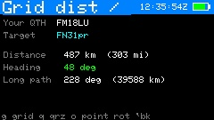

**Grid dist/bearing** on the main menu (just before QRZ Lookup) is a great-circle
calculator for terrestrial VHF/UHF work — tropo, contests, or just aiming a beam at a
known grid. Press **`g`** and enter a **Maidenhead grid**; CardSat shows the
**distance** (km and miles) and the **beam heading** from your station, both **short
path and long path**.

- Press **`o`** to **point a connected rotator** at the computed bearing. This is a
  terrestrial heading, so the elevation is set to 0.
- Press **`q`** to **look up a callsign's grid**: this opens a small **QRZ → grid**
  screen (separate from the main QRZ Lookup, which is untouched). Enter a callsign; on
  **ENTER** it seeds the calculator with that operator's grid so you get distance and
  bearing to them directly.

Your own grid comes from your set location, so set that first on the **Location**
screen. `` ` `` returns to the main menu.

### Upcoming activations (Activations)

**Activations** on the main menu shows the **upcoming satellite activations** that
operators have scheduled on **[hams.at](https://hams.at)** — roves, grid
activations, and special operations announced ahead of time. It's a quick way to see
who's planning to be on which bird, from where, and when, so you can be listening for
a rare grid or a wanted station.

Opening **Activations** shows the last-known list immediately from the on-device cache —
even with no WiFi — then, if WiFi is up, fetches an update in the background with an
**"Updating Activations"** banner on the bottom status bar, followed by a brief result
(**Activations updated/unchanged**, **update failed**, or **WiFi failed**) before
the banner clears. Each row shows the **date, callsign, satellite and grid**. Move with
`;`/`.`, press **ENTER** on a row for the full detail — **start and end times (UTC), mode,
frequency, and the activator's comment** — and `` ` `` to go back to the list. Press
**`r`** at any time to refresh.

**Do I actually have a footprint? (0.9.43)** When you open an activation's detail, CardSat
checks whether the listed satellite is really above the horizon at the same time as *both*
you and the activator — a genuine mutual window. Because hams.at keplerian data can lag,
the check searches **±30 minutes around the listed start** and reports the co-visibility
window it finds, so a pass that has drifted since the alert was posted is still caught. The
detail screen shows a **footprint note**: the mutual window's start–end and duration in
green if one exists, "No footprint near listed time" in yellow if not, or a short reason
("set clock first", "no activator grid", "sat not in your list") when it can't be computed.
The activator's comment is often longer than the screen; scroll it in place with `;`/`.`.
Press **`a`** to set a SKED reminder (T-60/30/10 beeps and a flash), and — when a footprint
exists — **`w`** to open the **mutual-window screen**.

The **mutual-window screen** draws a small **polar plot** of the pass: the satellite's track
as seen from **you** (cyan, "M") and from the **DX** (orange, "D") across the window, with
the **date, AOS, LOS, duration and peak elevation for each station** beside it. From there,
**`d`** opens a **DX Doppler table tailored to this activation**: CardSat reads the
activation's frequency (from the freq field, then the comment) and, if it matches one of the
satellite's real **two-way** transponders, pre-selects that transponder and locks the DX dial
to the listed frequency as a **fixed downlink or uplink** (whichever leg the number falls in).
On a bird with **more than one transponder** (AO-7, for example), the listed frequency is
**remembered and re-applied as you cycle transponders** with `t` — it stays locked onto
whichever transponder it belongs to and is not lost by stepping through the others.
If no usable frequency is found, it opens the normal DX Doppler table instead. The existing
DX Doppler (reached from the **Mutual** schedule) is unchanged; the activation path is a
separate, pre-seeded view.

The feed is fetched over HTTPS from `https://hams.at/feeds/upcoming_alerts`, parsed (up to
30 activations), and **cached to flash** so the last-known roster survives a reboot and
shows instantly offline. The **Update** screen's `k` also refreshes it alongside the GP
update. Times are shown exactly as the feed provides them, in UTC. Some activations list
"(none)" for frequency or elevation — those simply weren't specified by the operator, and
the activator's comment often fills in the detail.

---

## 14. GP age and accuracy

### Theory — what GPs and SGP4 actually are

**Why a satellite needs "elements" at all.** You cannot just store a satellite's
position and velocity and expect it to stay useful — it sweeps through space at
~7.5 km/s and the orbit itself slowly changes shape. Instead, the satellite is
described by a compact set of numbers that, fed to a matching math model, *regenerate*
the position at any time. Those numbers are the **orbital elements**; the model is
**SGP4**. The two are a matched pair: the elements only mean what they mean *because*
SGP4 is the model that will consume them.

**TLE, OMM and "GP".** The historical packaging is the **Two-Line Element set (TLE)** —
two 69-character lines, a fixed-column format dating to punch cards, holding the
elements plus epoch, drag term, and catalog bookkeeping. **OMM** (Orbit Mean-elements
Message) is the modern, self-describing replacement carrying the *same* numbers as
JSON, XML or KVN instead of fixed columns. CelesTrak's umbrella term for "current
mean elements in whatever format" is **GP** (General Perturbations). CardSat downloads
**GP data as JSON/OMM** (it never has to parse the brittle column format off the wire),
but internally it renders each set back into a TLE line-pair — epoch encoded as
`YYDDD.dddddddd`, B\* in TLE exponent notation, with the line checksums — and hands
that to the SGP4 library, which still ingests elements the classic way. The element
values are identical; only the wrapper changes. This matters more than it once did:
the 18th Space Defense Squadron has announced plans to retire the legacy TLE format
in favor of OMM — the punch-card wrapper is finally being sunset after half a
century — so CardSat's GP-native pipeline needs no change when the old format
disappears. (Because they're the same numbers,
a TLE can be mechanically decoded into the GP fields CardSat's manual entry asks
for — that's what the bundled **`tools/tle2gp.py`** helper does; see [§8](#8-screen-map-and-navigation).)

**Oversized sources.** CardSat holds up to 150 satellites in memory; several CelesTrak
groups carry more (some far more). Since v0.9.54 an oversized source is handled
honestly: satellites on your **favorites** list are loaded first — guaranteed, even if
they sit past the 150th object in the file — the remaining slots fill in file order,
and the truncation is *visible*: the status line reports "Loaded X of Y" and the boot
log prints `[gp] parsed X of Y satellites (truncated; favorites kept)`. Downloads are
also preflighted against free storage — a group too large for the active filesystem is
refused with "file too big for storage" *before* writing, so it can't fill an
internal-flash unit mid-write or disturb the previous good catalog. If you need a bird
from deep in a big group, favorite it (Satellites → `f`) and refresh.

**What SGP4 is.** SGP4 (Simplified General Perturbations 4) is the analytic propagator
that NORAD/USSPACECOM elements are *fit to*. "Analytic" means it isn't numerically
integrating forces step by step; it applies closed-form expressions for the
perturbations that matter for a near-Earth satellite over days-to-weeks:

- **Earth's oblateness** — the equatorial bulge (the **J2** zonal harmonic, with smaller
  J3/J4 terms) that precesses the orbit plane and rotates perigee. This is the
  dominant non-Keplerian effect and the reason pass times march earlier each day.
- **Atmospheric drag** — modeled through the **B\*** ("B-star") term, a fitted
  ballistic-and-density coefficient that slowly shrinks the orbit. (A companion
  model, **SDP4**, extends the same scheme to deep-space orbits with period
  > 225 min by adding lunar/solar gravity and resonance terms — the pair is often
  written "SGP4/SDP4." In practice CardSat's birds are all near-Earth, so the SGP4
  branch is what runs.)

Crucially, the **"mean" elements are not osculating elements.** They are deliberately
*detuned* values chosen so that, after SGP4 adds its periodic terms back in, the output
matches reality. You cannot mix them with a different model, average them, or read the
mean motion as an instantaneous rev-rate and expect physical truth — they are
model-specific fitting constants. This is also why CardSat propagates with the **WGS72**
gravity constant set: that is the set the elements were fit against, and using WGS84
would introduce a small systematic error.

**From element to az/el — the frames.** Propagating gives position and velocity in the
**TEME** frame (True Equator, Mean Equinox — the quirky inertial-ish frame SGP4 outputs).
To point an antenna, CardSat rotates the observer's geodetic latitude/longitude/altitude
into the same TEME frame using **GMST** (Greenwich Mean Sidereal Time — Earth's rotation
angle for the instant), differences the two position vectors to get the slant vector,
and resolves that into topocentric **azimuth/elevation**. Range-rate (for Doppler) is
taken directly from the projection of the relative *velocity* onto the slant direction,
evaluated at the exact fractional second rather than by differencing whole-second range
samples — cleaner right at closest approach where range-rate changes fastest.

**Where the error comes from.** SGP4 near a fresh epoch is good to roughly a kilometer.
Error grows with **element age** because the small unmodelled accelerations (drag
fluctuations from space weather, higher-order gravity, solar radiation pressure)
integrate over time, and drag is the worst offender — it depends on upper-atmosphere
density, which swings with solar activity and isn't known in advance. So a low,
draggy orbit (ISS, cubesats) can develop noticeable along-track timing error (the
satellite arriving early or late along an otherwise-correct path) within a week or
two, while a high, stable orbit stays usable far longer. Along-track error shows up to
you as **pass-time slip**; cross-track error shows up as **pointing/Doppler error**.
The practical defense is simply to refresh elements often enough for the orbit you
care about.

### GP age indicator

SGP4 predictions degrade as the GP mean elements age. CardSat shows the **age of
the element set** (days since the GP epoch) on the Passes and Track screens, color
coded:

- **Green** — under 14 days (fresh).
- **Yellow** — 14–28 days (getting old).
- **Red** — over 28 days (stale; expect timing/pointing error). In the Next Passes
  schedule, stale sats are flagged with a red **`!`**.

Refresh with **Update → k** whenever you have WiFi. For low orbits, weekly (or
fresher) elements are best.

### Choosing the element source

By default CardSat pulls the **AMSAT** daily GP bulletin (all amateur satellites,
JSON, including the friendly `AMSAT_NAME`). To change source, open **Settings → GP
source** and press ENTER for a picker:

- **AMSAT (amateur)** — the default bulletin.
- **CelesTrak categories** — any CelesTrak GP group in JSON-PP format. Amateur
  Radio is listed first, followed by SatNOGS and the Special-Interest, Weather &
  Earth Resources, Communications, Navigation, Scientific and Miscellaneous
  groups. CelesTrak omits `AMSAT_NAME`, so CardSat falls back to `OBJECT_NAME`
  and the data parses correctly.
- **Custom URL…** — type any URL that returns OMM JSON / JSON-PP.

Move with `;`/`.` (or `{`/`}` to page) and press ENTER to select. The choice is
saved immediately and used by the next **Update → k**.

---

## 15. Working offline

CardSat is designed to operate with no network in the field:

1. With WiFi, go to **Update** and press `k` (GP + clock) and then `a` (cache
   **all** transponders). Both are written to flash. The transponder cache runs
   in a single session and finishes on "Cached all N
   transponders" — let it run to completion before going offline.
2. After that, everything — pass prediction, transponders, Doppler, the schedule —
   works with WiFi off. The clock keeps running (and survives deep sleep); use GPS
   or manual `c` entry to set it where there's no NTP.

Cached data persists across power cycles until you refresh it or perform a reset.

### Hand-curating your own GP data (SD card, no online update)

You don't have to use the online update at all. CardSat reads its orbital elements
from a plain JSON file on the storage card — **`/CardSat/gp.json`** — and you can
write that file yourself: hand-pick exactly the satellites you want, drop the file on
the microSD card, and run CardSat with no network. This is handy for field use with
no WiFi, for a small fixed set of birds, or for pinning known-good elements so an
automatic refresh can't replace them mid-operation.

The file is a **JSON array of OMM objects** — the same JSON format CelesTrak and
Space-Track export when you request "JSON", so the easiest path is to download real
OMM JSON for the satellites you want, delete the objects you don't, save it as
`gp.json`, and copy it to `/CardSat/gp.json` on the card. Each object needs at minimum
`NORAD_CAT_ID`, `EPOCH` (ISO 8601 **with the time of day** included), and
`MEAN_MOTION`, plus the full Keplerian set (eccentricity, inclination, RAAN, argument
of perigee, mean anomaly) and `BSTAR` for correct predictions. If you only have a
classic TLE, the bundled **`tools/tle2gp.py`** helper converts it to the JSON object
CardSat expects.

Two things to remember: the clock must be set (GPS or manual entry) since you're
offline, and **running the online Update (`k`) with WiFi overwrites `/CardSat/gp.json`**
— so to stay fully offline, just don't run it, or keep a backup of your curated file.

> See **[docs/guides/OFFLINE_GP_DATA.md](docs/guides/OFFLINE_GP_DATA.md)** for the
> complete field reference, a full worked example, and a step-by-step curation
> checklist.

---

**What persists and works without WiFi.** Every network data source is cached to
flash and reloaded at boot, so after one online refresh the unit is fully usable
offline in the field:

- **GP / orbital elements** — passes, Doppler, and all tracking run entirely from the
  cached elements.
- **Weather** — the current conditions, the multi-day forecast, and the 48-hour cloud
  cover (used by the visible-pass and transit screens) all render from cache.
- **Space weather** — the F10.7 flux and Kp, their trend deltas, and the propagation
  guidance derived from them.
- **AMSAT status** — the per-satellite activity marks (active / not-heard / telemetry)
  and the catalog name map, so the AMSAT status screen is populated offline.

Opening any of these screens shows the cached data immediately, then attempts a refresh
only if WiFi is reachable; if it is not, the cached values stay on screen with a brief
"WiFi failed" note rather than a blank screen. A failed or interrupted refresh never
discards good cached data — downloads are staged and only swapped in on success. The
one thing that inherently needs a live connection is *submitting* an AMSAT report and
fetching the per-report who-heard-it detail; those say so and leave everything else
working.

## 16. Radio-specific notes

CardSat speaks three CAT dialects, selected by the **radio model** in Settings.
Defaults are editable; the **CI-V address** field applies to **Icom only**.

| Radio | Family / protocol | Default baud | Interface | Read-back |
|---|---|---|---|---|
| IC-820 | Icom CI-V | 9600 | CI-V 5 V single-wire | yes |
| IC-821 | Icom CI-V | 9600 | CI-V 5 V single-wire | yes |
| IC-910 | Icom CI-V | 19200 | CI-V 5 V single-wire | yes |
| IC-970 | Icom CI-V | 9600 | CI-V 5 V single-wire | yes |
| IC-9100 | Icom CI-V | 19200 | CI-V 5 V single-wire | yes |
| IC-9700 | Icom CI-V | 19200 | CI-V 5 V single-wire | yes |
| FT-847 | Yaesu 5-byte | 57600 | serial (TTL/RS-232) | yes¹ |
| FT-736R | Yaesu 5-byte | 4800 | serial (TTL/RS-232) | no |
| TS-790 | Kenwood ASCII | 4800 | RS-232 (MAX3232) | yes |
| TS-2000 | Kenwood ASCII | 57600 | RS-232 (MAX3232) | yes |

Protocol command sets follow the Hamlib backends (`icom`, `yaesu/ft847`,
`yaesu/ft736`, `kenwood/ts2000`, `kenwood/ts790`). Serial framing is set
automatically: **Icom 8N1, Yaesu 8N2, Kenwood 8N1 — except 8N2 at 4800 baud.**
The TS-790 generation (IF-232C interface: TS-450/690/790/850/950) requires **two
stop bits at 4800 baud** (one stop bit at higher rates such as the TS-2000's
57600); CardSat selects this by baud automatically. Note the TS-790's CAT is via
the **optional IF-232C** adapter — its operating manual documents the interface
but not the command set, so the TS-790 mapping leans on the shared Kenwood
protocol and is the least bench-verified of the rigs here.

The CAT *interface circuit* differs by family. **Icom CI-V** uses a 3.3 V-safe
single-wire interface (**[CIV_INTERFACE.md](docs/interfaces/CIV_INTERFACE.md)**); you
can wire it as **separate TX/RX** (G2/G1, the default) or **single-pin** (one shared
open-drain wire, confirmed on an IC-821) — set this with **CI-V wiring** in Settings
and see [§3 → Icom CI-V](#3-connecting-your-radio) and
**[CIV_SINGLE_PIN.md](docs/interfaces/CIV_SINGLE_PIN.md)**. **Yaesu** and
**Kenwood** use RS-232-level serial — build a **MAX3232** level shifter as in
**[RS232_INTERFACE.md](docs/interfaces/RS232_INTERFACE.md)** (⚠️ untested; build at your own risk).

### Automatic PL / CTCSS tone for FM satellites

Several FM birds require a subaudible **PL (CTCSS) tone** on the uplink. CardSat
applies it automatically: when the active transponder is **FM with an uplink** and
the satellite is in its built-in tone table, it enables the rig's **TX CTCSS
encoder** at the right frequency the moment radio output is on, turns it **off**
again when you switch to a transponder that doesn't need one, and disables it when
you turn radio output off (so your rig isn't left transmitting a tone). The tone in
use is shown on the Track screen as a `PL nn.n Hz` line, and a status flash
confirms it (`PL 67.0 Hz on uplink`).

Built-in tones (operating tone, by NORAD id): **ISS** 67.0, **SO-50** 67.0,
**AO-91** 67.0, **AO-92** 67.0, **PO-101** 141.3. SatNOGS carries no structured
tone field, so this list lives in `SatDb::knownCtcssHz()` — extend it there as new
FM satellites appear. **SO-50 note:** the 67.0 Hz figure is the *operating* tone;
arming its 10-minute timer with a 74.4 Hz burst is a separate manual step on your
radio.

**Setting tones yourself.** Press **`c`** on the Track screen to set a tone for the
current satellite. Enter a frequency in Hz (e.g. `67.0`, `141.3`) and it is snapped
to the nearest standard CTCSS tone; enter `0` to force the tone **off** for that
bird; leave it **blank** to clear your override and fall back to the built-in
default. The override is stored per satellite (by NORAD, in `tones.txt`) and wins
over the table, so it survives reboots and a GP/transponder refresh, and it's how
you add a tone for any FM bird not already in the built-in list.

Tone-over-CAT is supported on **IC-910/9100/9700, FT-847, and TS-2000** (the
`hasTone` flag in `radio_profiles.h`); on other models the `PL` line reads
`(rig n/a)` and no tone command is sent. Encoders by family: **Icom** CI-V `1B 00`
(tone freq, BCD) + `16 42` (encoder on/off); **FT-847** sat-TX opcodes `2B`
(tone, via the CAT code table) + `4A…2A`/`8A…2A` (encoder on/off); **TS-2000**
`TN` (tone number) + `TO` (encoder on/off). All are taken from the Hamlib
backends; like the rest of CAT they're host-verified but not yet exercised on a
real radio — watch the serial trace and confirm the rig shows the tone.

**Icom.** CardSat drives MAIN/SUB directly and forces the rig's built-in satellite
mode **off** at startup on the rigs that expose it over CAT (IC-910, IC-9100,
IC-9700). Downlink on SUB, uplink on MAIN. Read-back uses `0x03`; it is confirmed
working on hardware for the **IC-821** and supported in firmware for the
IC-820/910/970/9100/9700. Wrong-VFO fixes live in `radio_profiles.h`.

> **IC-820/821/970 satellite mode and band pairing are MANUAL.** Unlike the
> IC-910/9100/9700, these three rigs have **no working CI-V command** to toggle
> satellite mode (the IC-821's sat-mode command is a no-op on real hardware —
> confirmed on an IC-821) or to assign which band sits on MAIN vs SUB. Their
> `0x07 D0`/`D1` bytes are band *access* (which band a read/write targets), not a
> MAIN/SUB assignment. So on these radios you must **engage satellite/full-duplex
> mode, set up the band pair, and set any uplink PL tone on the radio's front
> panel**; CardSat then only Doppler-tunes within that layout. See
> **[RADIO_SETTINGS.md](docs/interfaces/RADIO_SETTINGS.md)** for the full per-radio CAT-vs-manual
> breakdown. This matches how Hamlib, OscarWatch, SatPC32, and Gpredict treat the
> same radios.
>
> By contrast, the **IC-910, IC-9100, and IC-9700 _can_ set up MAIN/SUB over CAT**,
> and **CardSat now orients MAIN/SUB automatically** on all three when you turn radio
> control on for a two-way transponder (once at engage, never per tick), so you don't
> pre-arrange the bands:
> - **IC-9100/9700** issue `0x07 D2 00/01 <bandcode>` to set MAIN/SUB band selection
>   directly.
> - **IC-910** reads MAIN (`0x07 D1` then `0x03`) and, if it's the wrong band, issues
>   one swap (`0x07 D0`) — the 910's MAIN/SUB can't share a band, so one check fixes
>   both. This also **fixes a latent bug**: the 910's MAIN-select byte was previously
>   `0x07 D0` (the *swap* command); it is corrected to `0x07 D1`.
>
> ⚠️ **Host-verified only — untested on real 910/9100/9700** (the author runs an
> IC-821, which has none of these commands); a leg outside 2 m/70 cm/23 cm is skipped
> and set manually. The 820/821/970 remain fully manual for band setup.

> **IC-910 satellite-mode & tone commands differ from the IC-9100/9700.** The
> IC-9100/9700 toggle satellite mode with CI-V `0x16 0x5A`, but the **IC-910 uses a
> different command group entirely: `0x1A 0x07`** (verified from the IC-910 CONTROL
> COMMAND table — on the IC-910, command `0x16` has no satellite-mode sub-command).
> Likewise the CTCSS tone encoder is `0x16 0x42` (Repeater tone) on the
> IC-9100/9700 but **`0x16 0x43` (Subaudible tone) on the IC-910** — its `0x42` is
> the auto-notch filter. CardSat sends the right command for each rig. (Earlier
> firmware sent `0x16 0x07`/`0x16 0x42` to the IC-910, so sat mode never engaged
> and the tone key toggled the notch; both are fixed.)

> **IC-820H vs IC-821H MAIN/SUB select.** These two rigs use the *same* CI-V
> command (`07`) for band select but with the **two sub-commands swapped** — a
> quirk confirmed from each radio's own manual (CI-V command table):
>
> | Radio | Address | Main band access | Sub band access |
> |-------|---------|------------------|-----------------|
> | IC-821H | `4C` | `0x07 D0` | `0x07 D1` |
> | IC-820H | `42` | `0x07 D1` | `0x07 D0` |
>
> CardSat ships the correct (reversed) mapping for each, so both tune the right VFO
> out of the box. If you ever swap one rig's CI-V address onto the other's profile,
> remember the band-select bytes differ too. The frame is otherwise identical:
> preamble `FE FE`, controller `E0`, command `07`, end `FD`.

**Icom over the network.** The **IC-9700** can be driven over WiFi/Ethernet instead
of the CI-V bus — set **CAT type → Icom LAN** in Settings (with the IC-9700 selected
as the radio model). CardSat carries the *same* CI-V frames shown below inside the
RS-BA1 UDP protocol, so MAIN/SUB, read-back, sat mode and CTCSS behave identically;
only the transport changes. Other networked Icoms (IC-705, IC-7610, IC-785x) use the
same RS-BA1 protocol so the link would establish, but they are single-receiver radios
without the MAIN/SUB satellite architecture and are not supported. Setup is in
[§3](#3-connecting-your-radio); the wire protocol is documented in
`docs/interfaces/ICOM_LAN_PROTOCOL.md`.

**Yaesu (FT-847, FT-736R).** 5-byte CAT (four data bytes + opcode), big-endian BCD
at 10 Hz. CardSat enables CAT at startup and sets the satellite RX (downlink,
opcode `0x11`) and TX (uplink, `0x21`) VFOs directly.

¹ **FT-847 read-back** uses "read freq & mode" (`0x03`, patched to `0x13` for the
SAT-RX/downlink VFO), which returns 4 big-endian BCD bytes + a mode byte. This works
only on **firmware-updated** FT-847s — early units have no read capability and stay
silent (CardSat times out and holds the passband). In satellite mode the radio can
occasionally return the uplink VFO instead (Hamlib #1286); CardSat rejects any read
that jumps more than 1 MHz from the commanded downlink, so a stray reply holds steady
rather than jerking the passband. So **radio-knob (One True Rule) tuning works on a
firmware-updated FT-847**; on older units, use the device **TUNE** keys.

The **FT-736R** can't report frequency over CAT at all (TUNE keys only), and its
native opcodes differ from the FT-847 — the proven path is an **FT-847-emulating**
interface (KA6BFB / HS-736USB), in which case select **FT-847**. Put either radio in
**VFO** (and its satellite mode in VFO) before enabling CAT.

**Kenwood (TS-790, TS-2000).** ASCII commands terminated by `;`: downlink on
**VFO A** (`FA<11-digit Hz>;`), uplink on **VFO B** (`FB…;`), mode via `MD<n>;`,
read via `FA;`. Connects over **RS-232** (DB-9) — use a **MAX3232** level shifter,
not the CI-V circuit. On the TS-2000, bridge **CTS/RTS** (or use "RTS +12 V") for its
handshake quirk and verify the VFO-A/B ↔ main/sub-band behavior for your firmware.
The TS-790 supports a subset of the same commands.

> **All Yaesu/Kenwood sat rigs:** CAT **cannot switch the band pair.** You select
> the uplink/downlink bands and engage the rig's own satellite / full-duplex mode
> **on the radio**; CardSat Doppler-tunes within that. (Same as SatPC32.)

### Watching the CAT trace

CardSat prints **every CAT frame it sends** to the serial monitor at **115200
baud**, decoded, with the radio's reply where the protocol provides one. Connect
over USB, open a serial monitor at 115200, and you'll see traffic like:

Icom (CI-V):
```
[CI-V TX] FE FE A2 E0 07 D1 FD  sel-band SUB
[CI-V TX] FE FE A2 E0 05 00 60 58 45 14 FD  set-freq 145456000 Hz
[CI-V RX] radio ACK (FB)
[CI-V TX] FE FE A2 E0 03 FD  read-freq req
[CI-V] SUB freq read: 145456000 Hz
```

Yaesu / Kenwood:
```
[CAT TX] 14 59 00 00 11  set-freq RX 145900000 Hz
[CAT TX] 43 59 00 00 21  set-freq TX 435900000 Hz
[CAT TX] FA00145900000;
[CAT TX] MD2;
[CAT RX] FA00145900000;
[CAT] VFO-A (downlink) read: 145900000 Hz
```

How to read it:

- **`[CI-V TX]` / `[CAT TX]`** — a frame sent to the radio (raw bytes, or the ASCII
  string for Kenwood) plus a decode: which VFO, set-freq `<Hz>`, set-mode, read
  request, or CAT-on.
- **`[CI-V RX] radio ACK (FB)`** — Icom accepted the command; **`NAK (FA)`** means it
  rejected it. (Yaesu set commands aren't acknowledged.)
- **`… freq read: <Hz>`** — the frequency read back (Icom/Kenwood) used by radio-knob
  One True Rule tuning; `no valid reply` if it failed.

This is the fastest way to confirm your **wiring, model, address, and baud**, and to
watch the **Doppler corrections** stream during a pass. The **Icom LAN** backend adds
its own `[NET]` traces for the connect/auth handshake and keepalives (the CI-V frames
it carries are the same ones shown above). Silence a backend by setting `CIV_DEBUG` /
`YAESU_DEBUG` / `KW_DEBUG` / `ICOMNET_DEBUG 0` at the top of
`civ.cpp` / `yaesu.cpp` / `kenwood.cpp` / `icomnet.cpp` and rebuild.

### CAT self-test

**Settings → Radio / CAT → Run CAT self-test** exercises the whole CAT link in one
shot, on the device, with no satellite pass needed. It needs the radio turned on first
(start CAT output with `r` on Track). The test sets and reads back the **downlink** and
**uplink** frequencies, sets the **downlink/uplink modes**, sends a **band select**,
toggles **sat mode**, and probes **PTT read** and **CTCSS** — reporting each step as
`[PASS]`, `[FAIL]`, or `[INFO]` (the latter for things a given radio doesn't support
over CAT, like sat-mode commands on the older rigs or PTT read where the protocol has
none). `;`/`.` scroll the results, `` ` `` exits. It's the quickest way to confirm a
new radio, address, baud, and wiring are all correct before a pass — a `[FAIL]` on the
set+read lines points straight at a CI-V address / baud / wiring problem, while
`[INFO] … not supported` lines are normal and just reflect that radio's capabilities.

---

## 17. Antenna rotator (GS-232, rotctl, PstRotator, Yaesu direct, rotctld server)

CardSat can both **drive** a rotator and **act as a rotator server** for other software.
The network *client* backend is labeled **rotctl** in Settings — it connects to a
rotctld server, it is not itself the daemon. Separately, CardSat can run its **own
rotctld server** (Settings → Rotator → *Rotctld server*, default port **4533**) so a
networked PC (Gpredict, …) drives whichever rotator CardSat is configured for; a `P`
from the PC disengages CardSat's own tracking. A **manual control** screen (Settings →
Rotator → *Rotator: manual control*) jogs az/el by hand with live read-back. With the
azimuth **el range** set to 180°, the *flip* decision is made once per pass and held to
LOS. The `rotctld` and `rigctld` servers have **no authentication** — run them on a
trusted LAN only.

CardSat can drive an az/el antenna rotator through one of several interchangeable
backends, chosen in Settings with **Rot type**:

- **GS-232** -- a directly-attached controller speaking the **Yaesu GS-232A/B**
  protocol (a Yaesu G-5500 with a GS-232B, a SPID controller in GS-232 mode, or any
  GS-232 emulator: K3NG / RadioArtisan / ERC). Because all three ESP32-S3 UARTs are
  already in use (USB, CAT, GPS), this link is created by an **I2C->UART bridge**
  (SC16IS750/752) on a second I2C bus, so it coexists with the radio and GPS.
- **Easycomm I / II / III** -- the open, plain-ASCII tracking protocol used by
  **SatNOGS, K3NG, ERC** and most homebrew rotator controllers (the same protocol
  Hamlib's `easycomm` backends speak). Choose the version your controller expects:
  **II** is the common decimal-degree form (`AZ123.4 EL045.0`), **I** is the older
  integer form, and **III** shares II's positioning grammar. Uses the same
  **I2C->UART bridge** as GS-232.
- **SPID Rot2Prog** -- the binary protocol of **SPID MD-01 / MD-02** (Alfa/
  RFHamDesign) controllers, as documented in Hamlib's `spid` (`rot2prog`) backend.
  Whole-degree positioning over the same **I2C->UART bridge**. (If your SPID box is
  set to GS-232 emulation, you can use **GS-232** instead.)
- **rotctl (net)** -- connects to a **Hamlib `rotctld` server** anywhere on the same WiFi
  network. CardSat is the TCP client (the same role Gpredict plays), so any
  rotator Hamlib supports can be driven over the LAN with no extra CardSat wiring.
- **PstRotator (net)** -- a **PstRotator** (YO3DMU) instance on the LAN, driven
  over **UDP** (the same datagrams Gpredict/SatPC32 send it). CardSat sends
  `<PST>...</PST>` control messages to PstRotator's UDP Control port; PstRotator
  then drives whatever controller it is configured for.
- **Yaesu (direct)** -- a Yaesu **G-5500**-class az/el controller wired **straight to
  CardSat**, with no GS-232 box: an I2C **ADS1115** reads the position-feedback
  voltages and an I2C **PCF8574** drives the four direction lines, both on the same
  I2C bus the GS-232 bridge would use. CardSat closes the pointing loop itself. This
  is a hardware build with its own calibration step -- see
  **[ROTOR_INTERFACE.md](docs/interfaces/ROTOR_INTERFACE.md)** (⚠️ untested; build at your own risk).
  Calibrate from **Settings → Rotator → Rotator: manual control** (capture keys
  **1/2/3/4** at the axis endpoints).

> **The Easycomm and SPID backends are host-verified only.** The ASCII
> formatting/parsing and the SPID binary frame encode/decode were checked
> off-device, but neither has been exercised against a physical controller yet.
> Treat them as untested; verify carefully before trusting them with real hardware.

Only one rotator is active at a time. The pointing logic -- alignment offsets,
deadband, flip mode, park-on-LOS -- is identical for all of them; **Rot type** only
changes how the final azimuth/elevation reaches the hardware.

### Wiring

Chain: **Cardputer I2C (Wire1) -> SC16IS750 -> MAX3232 -> DB-9 -> GS-232 controller.**

- The bridge runs on the Cardputer-ADV expansion I2C bus, **G8 = SDA / G9 = SCL**
  (`ROT_I2C_SDA` / `ROT_I2C_SCL` in `config.h`), on a second I2C controller
  (Wire1) so it never touches the keyboard/IMU bus. These are confirmed from the
  M5Stack Cap LoRa-1262 pinmap and don't collide with CAT (G1/G2), the GPS UART
  (G13/G15), the LoRa SPI (G3/G4/G5/G6/G14/G39/G40), or the SD card (CS G12).
- GS-232 uses RS-232 voltage levels, so a **MAX3232** sits between the bridge's
  TTL TXD/RXD and the controller's DB-9 (three wires: TXD, RXD, GND).
- The SC16IS750 needs a 14.7456 MHz crystal (the common breakouts have one); set
  `ROT_XTAL_HZ` if yours differs, and its I2C address (A0/A1 strap) in
  `ROT_I2C_ADDR` (default 0x4D).
- On the Cap LoRa-1262, G8/G9 is exactly the I2C bus broken out to the cap's
  **HY2.0-4P Grove Port.A**, so a Grove SC16IS750 bridge plugs straight in. That
  bus also carries the cap's PI4IOE5V6408 IO expander (~0x43/0x44, used only for
  the LoRa RF switch, which CardSat never drives), so keep `ROT_I2C_ADDR`
  (default `0x4D`) clear of those — or add a TCA9548A mux if anything clashes.

### Settings

Enable and tune the rotator in **Settings** (scroll past the radio rows):

| Setting | Meaning |
|---|---|
| Rotator | off / on (builds the selected backend) |
| Rot type | **GS-232** (I²C bridge), **Easycomm I/II/III** (I²C bridge), **SPID Rot2Prog** (I²C bridge), **rotctl (net)** (TCP), **PstRotator (net)** (UDP), or **Yaesu (direct)** (I²C ADC + output expander, no GS-232 box) |
| Net host | server IP / hostname (rotctl or PstRotator backend) |
| Net port | server port -- rotctld TCP **4533**, PstRotator UDP **12000** |
| Rot baud | GS-232 serial speed (1200 / 4800 / 9600); GS-232 backend only |
| Rot deadband | degrees; suppress moves smaller than this (anti-chatter) |
| Rot park az | azimuth the rotator parks at on LOS / when disabled |
| Rot pre-point | lead before AOS to pre-aim at the rise bearing (off / 30 s / 1-5 min) |
| Rot Az offset | added to commanded azimuth (mount alignment) |
| Rot El offset | added to commanded elevation |
| Rot az range | azimuth travel: **0..360** (default), **-180..+180** (centered on N), or **0..450** (90 deg overlap) |
| Rot az lookahead | `,`/`/` 0–10 s (default 3 s; `0` = off). On a **0..450** rotator only: CardSat predicts the bearing this many seconds ahead and, when a pass is about to cross north, commits early to the 361–450° overlap band so it makes a short move instead of unwinding ~360°. Has no effect on 0..360 or flipped passes. Tune to your rotator's slew speed |
| Rot el range | **90 deg**, or **180 deg** = flip over the top for high passes |

`Rot type` and `Net port` adjust in place with `,`/`/`; `Net host` and `Net port`
also open a text editor with ENTER.

### Using it

On the **Track** screen press **`o`** to start/stop pointing. The status line
shows **Rot ON / off / n/c** (*n/c* = no link: the I2C bridge wasn't found, or
the rotctld server isn't reachable). Pressing `o` re-attempts the link on the
spot, so you can engage as soon as the controller or server comes up. While on,
CardSat sends the satellite's azimuth and elevation about once a second -- the
GS-232 `W aaa eee` command, rotctld's `P <az> <el>`, or PstRotator's `<PST><AZIMUTH>..</AZIMUTH><ELEVATION>..</ELEVATION></PST>` datagram -- but only when the
position has moved past the deadband, since rotators are slow and mechanical.
When the satellite sets, or you press `o` again or leave the screen, the rotator
**parks** at the configured azimuth/elevation.

**Pre-positioning before AOS.** A slow rotator can take most of a minute to slew
across the sky, so by the time it reaches the rise bearing the pass has already
begun. With **Rot pre-point** set to a lead time (default **2 min**; `off`
disables it), CardSat predicts the next pass for the tracked satellite and, once
AOS is within that window, aims the rotator at the **rise azimuth on the horizon**
instead of the idle park position -- so it is already pointed when the satellite
appears and live tracking takes over smoothly. Set the lead a little longer than
your rotator's worst-case slew time. Outside the window it still rests at **Rot
park az**.

**Azimuth range (0-360 / +/-180 / 0-450).** By default CardSat assumes the
azimuth axis runs **0 to 360 deg**, 0 deg = North, 180 deg = South. **Rot az
range** offers two alternatives for rotators built differently:

- **-180..+180** -- the axis is centered on North and swings +/-180 deg. CardSat
  re-expresses each bearing into that range (e.g. 270 deg -> -90 deg), the same
  option Gpredict offers.
- **0..450** -- the rotator has **90 deg of overlap** past North (a common
  Yaesu/SatPC32 arrangement). A bearing of 0-90 deg is reachable either directly
  or as 360-450 deg, so CardSat commands whichever is **nearer its current
  position**: a pass crossing North continues up into the 360-450 region instead
  of unwinding a full turn -- no dead-zone spin at culmination.

Both affect what is sent on the **rotctld** path (e.g. `P -90.0 12.0` or
`P 372.0 8.0`). GS-232 controllers natively accept 0-450 and re-wrap negatives, so
the GS-232 backend follows the overlap but the +/-180 framing has no visible
effect there.

For overhead passes, setting **Rot el range** to **180 deg** enables a **flip**:
near culmination CardSat commands elevation past 90 deg (over the top) together
with a 180 deg azimuth flip, so an antenna on a 0-180 deg elevation rotator rides
through zenith without the fast 180 deg azimuth swing a 0-90 deg mount would need.
Leave it at **90 deg** for a conventional elevation rotator. CardSat points
**open-loop** from its own SGP4 prediction (it does not poll the controller's
heading); the GS-232 `C2` read-back exists in the backend for diagnostics but is
not used in the tracking loop.

### Network rotators (rotctld and PstRotator)

To use the network backend, run `rotctld` on any machine that can reach your
rotator (or use a controller that speaks rotctld natively), set **Rot type** to
**rotctl (net)**, and enter the server's address in **Net host** (an IP is
simplest) and **Net port** (Hamlib default **4533**). A dummy server for a bench test:

```
rotctld -m 1 -t 4533 -vvvvv
```

`-m 1` is Hamlib's dummy rotator model and `-vvvvv` makes rotctld log every
command it receives, so you can watch CardSat's `P`/`S` commands arrive without
moving real motors (without the verbose flag the server is silent, which can look
like nothing is being sent); swap in your rotator's model and
serial port for the real thing. CardSat opens the socket when you enable the
rotator and reconnects on its own (throttled to a few seconds) if it drops, so a
server that is briefly down or rebooted recovers without intervention. Pointing
is open-loop from CardSat's SGP4 prediction -- it does not read the heading back.

Hardware that speaks rotctld natively works the same way, with no PC in between.
For example, the **MuseLab AntRunner** (BG5DIW) portable az/el rotator (360 deg
azimuth / 180 deg elevation, controlled over WiFi by its onboard ESP32) and the
**AntRunner-Pro** (fixed-install, 360 deg / 90 deg, controlled over Ethernet) both
present a Hamlib `rotctld`-compatible network service. Set **Rot type** to
**rotctl (net)** and point **Net host** / **Net port** at the AntRunner's rotctld
service (or at a `rotctld` instance bridging to it over USB).

> rotctld has **no authentication** -- keep it on a trusted LAN and never expose
> the port to the internet. Several clients may connect to one rotctld and can
> contend for the rotator.

**PstRotator (UDP).** If you already run **PstRotator** on a shack PC, CardSat can
drive it directly instead of a rotctld server. In PstRotator, open
**Communication > UDP Control Port**, set the port (default **12000**), and tick
**UDP Control** in Setup. On CardSat set **Rot type** to **PstRotator (net)**,
**Net host** to the PC's IP, and **Net port** to that UDP port -- *remember to
change it from rotctld's 4533 to 12000*. CardSat then sends
`<PST><AZIMUTH>az</AZIMUTH><ELEVATION>el</ELEVATION></PST>` to point and
`<PST><STOP>1</STOP></PST>` to stop. PstRotator does its own azimuth range,
offsets and flip, so CardSat sends a plain 0-360 bearing here; leave CardSat's
**Rot az range** / **Rot el range** at default and let PstRotator manage overlap
and flip (or use CardSat's and keep PstRotator neutral -- just don't double up).

This backend also drives the **WA4MCM PSR-100** (Don Friend, WA4MCM) -- a popular
portable, lightweight az/el satellite-rotor kit for field/portable work. The
PSR-100 accepts the same PstRotator-style `<PST>` UDP az/el datagrams over its
WiFi interface, so CardSat points it directly: set **Rot type** to **PstRotator
(net)** and aim **Net host** / **Net port** at the PSR-100's UDP interface -- no
PC running PstRotator in between.

> The PstRotator UDP control is **unauthenticated and connectionless** -- keep it
> on a trusted LAN. Because UDP has no connection to lose, CardSat reports
> **Rot ON** whenever WiFi is up and a host is set; it cannot tell whether
> PstRotator is actually listening, so confirm the antenna follows on the first
> pass.

> The rotator only points while you are on the Track or Polar screen. It only
> moves the antenna -- it does not change the radio's bands, and CAT on the
> Yaesu/Kenwood sat rigs can't switch the band pair either, so set those by hand.

The GS-232 backend is bench-reasoned against the GS-232A/B manuals and Hamlib's
gs232a/gs232b backends, and host-tested for the bridge baud math and command
formatting -- it has not been run against a physical SC16IS750 or a real rotator.
The I2C pins (G8/G9) are confirmed from the Cap LoRa-1262 pinmap; still confirm
the SC16IS750's strapped address and the controller's baud before keying real
motors. The rotctld backend follows the published Hamlib `rotctld` protocol and
is the one rotator path you can fully bench-test without trusting hardware
encoders -- point it at `rotctld -m 1` and watch the commands -- but it has not
driven a physical rotator either. The **PstRotator** UDP backend is host-verified
for message formatting against the PstRotator manual (Rev. 7.5); it has not been
run against a live PstRotator instance.

---

## 18. Mobile web control

CardSat can serve a small **mobile-friendly web page over your WiFi network**, so a
phone, tablet, or laptop on the same network can drive it without touching the
keypad. It's **off by default**.

**Enable it:** *Settings → Network / data → Web control* (`,`/`/` or ENTER to turn
on; **Web port** sets the port, default 80). Once it's on and CardSat is connected
to WiFi, the **Web control** row shows the address to open — for example
`http://192.168.1.42`. Type that into any browser on the same network.

**What the page does:**

- **Satellite selection** — pick one of your favorites from the drop-down and tap
  **Track** to make it active. (If you haven't marked any favorites, the list
  falls back to the catalog.) A **filter box** narrows a long list as you type, and
  the **★** button beside the selector adds or removes the chosen satellite from
  your favorites, just like marking one on the device.
- **In-pass indicator & AOS countdown** — the header shows a live **"IN PASS — LOS
  in m:ss"** while the active satellite is up (with the peak elevation and time
  under the sky plot), and a **"Next AOS in m:ss"** countdown otherwise, so you
  know at a glance when to be ready. A small green **RAD** / **ROT** / **R+R** badge
  in the header lights up whenever the device's radio and/or rotator are tracking —
  mirroring the on-device header tag — so you can tell from your phone that the rig
  may be transmitting even after you've left the device's Track screen.
- **Live sky plot** — a polar plot (N up, elevation as distance from the rim) that
  **always draws the pass arc with a direction-of-travel arrowhead** and an AOS
  marker: while the satellite is up it shows the **current** pass path with the live
  position dot overlaid; between passes it shows the **next** pass path so you can see
  where it will rise and set. The green dot appears the moment the bird comes up.
- **Adaptive refresh** — the page polls **faster during a pass** (sub-second, so the
  fast-moving Doppler frequencies stay current) and **slows down between passes** to
  save battery and network traffic, backing off automatically if the connection
  drops and showing **"reconnecting…"** until it recovers.
- **Live readout** — downlink (RX) and uplink (TX) frequencies, azimuth/elevation,
  and the current tune mode. Beside the RX label a small **±N.NN kHz** figure shows
  how much **Doppler shift** is being applied right now. **Tap either frequency to
  copy it** to the clipboard (handy for setting a second radio by hand). Below the
  mode, an **AMSAT activity line** shows the current bird's live status when it has
  been reported — e.g. **"AMSAT: Heard 3h ago · 5 rpt"**, colored green (heard),
  yellow (telemetry), or red (not heard).
- **Transponder selection** — a drop-down lists the active satellite's
  transponders by name and mode; choosing one selects it on the device (the same
  selection the `t` key cycles), so you can pick the FM channel or the linear
  passband from your phone.
- **Radio & rotator control** — the **tuning cluster** nudges the passband down/up
  with a **visible, tappable step** (100 Hz / 1 kHz / 5 kHz — the same step the `s`
  key cycles), plus **Center** and **TX→**. Buttons also switch **radio** and
  **rotator** output on/off. These do exactly what the corresponding keys do on the
  Track screen — the web page drives the same controls, it doesn't second-guess them.
  Rapid taps are debounced so a burst can't queue up stale commands.
- **Fast calibration pad** — the centerpiece for correcting drift **during a pass**:
  **RX cal** and **TX cal** each get big one-tap **−/+** buttons with a **tappable
  step** (10 / 100 / 1000 Hz) and a live readout, so you can net onto a signal without
  a keyboard. **Zero cal** clears both in one tap. An **Exact…** toggle reveals the
  type-an-exact-value-in-Hz path when you want a precise number. Calibration is saved
  per-satellite, the same as on the device; for a linear bird the current passband
  position and bandwidth are shown. The RX/TX dials are always computed live from the
  transponder plus Doppler plus this calibration, so calibration is the operator-settable
  correction rather than a free-typed absolute frequency.
- **Manual (no-radio) tuning** — tap **Manual** to switch the control card to the
  hand-tuning calculator. It shows the **HOLD** leg (the frequency to park your own
  radio on) and the **TUNE** leg (the Doppler-corrected frequency to follow),
  exactly as the on-device Manual screen does, with the same round-trip Doppler
  correction on linear birds. **Swap leg** chooses whether you hold the downlink or
  the uplink; Tune ±, next transponder, CAL, and recenter work as on the device.
- **Orbital analysis** — tap **Orbit** for a read-only summary of the same numbers
  the on-device orbital-analysis pages compute: altitude and footprint, period,
  apogee/perigee, inclination/eccentricity, decay estimate, live range-rate and
  sub-point, sunlit/eclipse state, beta angle, J2 node and perigee drift (with a
  sun-synchronous flag), mean/true anomaly, time to perigee/apogee, the
  instantaneous **orbital velocity**, the **launch year and time in orbit** (from
  the COSPAR designator), the element-set number and launch-sibling count, and the
  multi-day pass outlook. It's view-only — nothing on the device changes.
- **Upcoming passes** — a table of the next passes (AOS, peak time, max elevation,
  duration, rise→set azimuth) with a **★** marking each **optically-visible** pass
  (sunlit satellite, dark sky). Above it, a compact **timeline bar** shows the same
  passes laid out in time — visible ones in orange, a white tick for "now" — so you
  can eyeball spacing at a glance. **Tap a pass** (row or bar) to arm a **browser
  AOS notification**: your phone alerts you when that pass begins (grant the
  notification permission when prompted).

The page is **responsive** — a single column on a phone, and a two-column layout on
a tablet or computer. It coexists with the rigctld/rotctld servers and the normal
on-device UI; the device keeps tracking and you can use its keypad at the same time.

**Files (download).** A **Files** link in the page header opens a simple file browser at
`/files` for pulling files off the device without removing the SD card or rebooting into a
Launcher. It lists the `/CardSat` tree — rove plans, screenshots, logs, notes, and the like
— with sizes and modified times; click a folder to descend, click a file to download it.
To grab several at once, tick the checkbox beside each file and press **Download selected** —
the browser saves them one after another. (The device still streams a single file per
request, so multi-select adds no memory cost on the unit; a browser may ask permission the
first time a page hands it several downloads.)

Access is confined to `/CardSat` (a path guard rejects anything outside that tree), and the
page is **download-only** — there is no upload path, so it cannot write to or modify the
device's filesystem. Like the rest of web control it's unauthenticated on
the LAN, so the same trust caveat applies.

> **Developers:** the page is backed by a small **HTTP + JSON API** (`/api/status`,
> `/api/sats`, `/api/passes`, `/api/orbit`, `/api/tx`, and a few `POST` controls) that
> a third-party client can call directly. It's fully documented — every endpoint,
> parameter, and response field, plus the access model — in
> `docs/interfaces/WEB_API.md`.

> **Security.** This is plain **HTTP on the local network with no password** —
> anyone who can reach your WiFi can open the page and operate the radio and
> rotator. Use it only on networks you trust, and don't forward the port to the
> internet. Turning **Web control** off stops the server immediately. In the field,
> pairing this with a **phone hotspot** (see the second-WiFi network in
> [§7](#7-first-time-setup)) gives you a private network for phone-to-CardSat
> control with no other infrastructure.

### Network control roles: client vs server

Besides the web page, CardSat speaks the **Hamlib network protocols** — and it can sit
on *either* end of them. It helps to keep the two roles straight, because the names
differ by a single letter:

- **CardSat as the client** — *it* drives a remote device. **`rigctl (net)`** (a CAT
  type, [§3](#3-connecting-your-radio)) makes CardSat connect to someone else's
  **`rigctld`** server to control a radio; **`rotctl (net)`** (a rotator type,
  [§17](#17-antenna-rotator-gs-232-rotctl-pstrotator-yaesu-direct-rotctld-server)) makes
  it connect to a **`rotctld`** server to point an antenna. In both cases CardSat is the
  one issuing commands, and the daemon name ends in **-d**.
- **CardSat as the server** — *other software* drives **CardSat**. The **Rigctld
  server** (Settings → Radio / CAT) and **Rotctld server** (Settings → Rotator) make
  CardSat itself a **`rigctld`/`rotctld`** daemon, so a PC running Gpredict, WSJT-X, a
  logger, or plain `rigctl`/`rotctl` can drive whatever radio and rotator CardSat is
  connected to — CardSat does the Doppler and pointing, the PC just sends frequencies or
  bearings.

The rule of thumb: the **client** option in CardSat's menus is named for the *client
tool* (`rigctl` / `rotctl`), while the **server** option is named for the *daemon* it
becomes (`rigctld` / `rotctld`). Default ports follow Hamlib convention — **4532** for
rig, **4533** for rotator — and **none of these network services use authentication**,
so keep them on a trusted LAN.

---

## 18b. Printing to a receipt printer

CardSat can print text reports to a **network thermal receipt printer** — the pocket
battery kind — over WiFi. It speaks **ESC/POS over raw TCP port 9100**, which virtually
every receipt printer supports; the reference target is an **Epson TM-P20II (Wi-Fi
model)**. (Bluetooth printers are *not* supported: the ESP32-S3 has no Bluetooth
Classic, and most cheap BT receipt printers are Classic-only. See
[docs/design/PRINTING_SCOPE.md](docs/design/PRINTING_SCOPE.md).)

**Setup.** Put the printer on the same WiFi, note its IP, and enter it in
**Settings → Network / data → Printer IP** (port defaults to 9100). **Printer format**
sets the page language to match your hardware: **ESC/POS (receipt)** (default — thermal
receipt printers like the TM-P20II or GZM8022), **Plain text** (no control codes; the
universal fallback most raw-9100 printers accept), **PCL (HP)** (HP LaserJet / OfficeJet
and other office printers — a PJL-wrapped job with a fixed-pitch font and page-eject),
**PostScript** (PostScript office printers — a Courier document with automatic page
breaks), **ESC/P2 (Epson)** (Epson page / inkjet / dot-matrix printers), **Star Line**
(networked Star thermal printers, TSP-series), **ZPL (Zebra label)** (network label
printers — each report line becomes a positioned field on a label). Serial and file outputs
are always plain text.

> The ESC/POS, plain-text, PCL and PostScript paths are the primary targets; **ESC/P2,
> Star Line and ZPL are provided but untested against real hardware** — verify on your
> device before relying on them, and use the /CardSat/Reports file as a fallback.

**Raster printing for driverless printers (AirPrint / IPP Everywhere / Mopria).** Most
network printers sold today are "driverless" — they accept raster page images over IPP rather
than a page-description language, and PWG Raster is the format the great majority of them
support (it is *required* by the IPP Everywhere standard, and many AirPrint printers accept it
too). CardSat can generate this on the device: select **Printer format → PWG raster
(AirPrint)**, or **URF raster (AirPrint)** for the Apple-Raster variant that some AirPrint
printers require instead. CardSat renders the report to a 300-DPI grayscale page one scanline
at a time (~4 KB working memory, no full-page buffer) and streams it over IPP (port 631). Both
encoders were validated byte-identical to the reference `ppm2pwg`/`ppm2pwg -f urf` tools and
confirmed printing on a real AirPrint printer.

*Which raster format?* Try **PWG raster** first — it reaches the most printers. If the printer
accepts only Apple Raster, use **URF raster**. To find out what your printer supports, use
**Test printer (probe formats)** in the printer settings: it asks the printer over IPP and
shows which document formats it accepts (e.g. "PWG URF PDF JPEG"). If PWG or URF appears, the
matching raster format will work. Raster is heavier than the text formats — prefer a text
format (PCL/PostScript/ESC-POS) where the printer supports one; use raster when it is the only
thing the printer accepts, which is the common case for home printers.

**Suggested settings by printer type.** Set these under Settings → Network. When unsure on a
network printer, run **Test printer** first to see what it accepts.

| Printer type | Example | Printer format | Paper width | Transport |
|---|---|---|---|---|
| Pocket WiFi receipt (58 mm) | Epson TM-P20II | ESC/POS (receipt) | 58 mm (32 col) | Raw : 9100 |
| Desktop WiFi receipt (80 mm) | GZM8022 | ESC/POS (receipt) | 80 mm (48 col) | Raw : 9100 |
| HP office laser/inkjet | LaserJet, OfficeJet | PCL (HP) | 64 col | Raw : 9100 (or IPP) |
| PostScript office printer | workgroup printers | PostScript | 64 col | Raw : 9100 (or IPP) |
| AirPrint / IPP Everywhere home printer | most modern home printers | PWG raster | 64 col | IPP : 631 (auto) |
| AirPrint printer, URF-only | some HP LaserJets | URF raster | 64 col | IPP : 631 (auto) |
| Epson page/inkjet (raw) | ESC/P2 models | ESC/P2 (Epson) | 64 col | Raw : 9100 |
| Star thermal (network) | TSP-series | Star Line | 80 mm (48 col) | Raw : 9100 |
| Zebra label printer | ZPL models | ZPL (Zebra label) | 32–48 col | Raw : 9100 |
| No printer | — | any | any | Serial / file only |

The raster formats (PWG, URF) switch to IPP on port 631 automatically — you do not need to
change the transport. Only set **Printer transport → IPP** by hand for a PCL/PostScript office
printer that exposes IPP but not raw 9100.

**Printer transport** chooses how the network job reaches the printer: **Raw (:9100)** —
the JetDirect raw-socket path used by all the formats above (the default), or **IPP
(:631)** — the Internet Printing Protocol, an HTTP job for office printers that expose IPP
but not raw 9100. IPP carries your selected page language (use **PCL** or **PostScript**
with it) as the document. **Important limitation:** IPP on CardSat sends PCL or PostScript;
it does **not** rasterize. Many modern home/AirPrint printers are **raster-only** — they
advertise only `image/urf` or `image/pwg-raster` and have no PCL/PostScript interpreter.
Those printers will **accept an IPP job and then silently discard it** (your computer prints
to them only because the computer rasterizes first). CardSat cannot drive a raster-only
printer — there isn't enough RAM on the ESP32-S3 to render a full-page bitmap. For such a
printer, use **Save to /CardSat/Reports** and print the .txt from a computer. To check what a printer
supports, the `tools/ipp_probe.py` script queries it and sends test pages. **Printer paper**
sets the width: **58 mm (32 col)**, **80 mm (42 col)**, **80 mm (48 col)**, or
**Font B (64 col)** — every report reflows to match, and the wider paper adds columns
where it helps (the day-sheet gains an LOS time and full-width names; the log puts each
QSO on one line).

**Three ways to receive a report — you don't need a printer.** Any report can go to any
combination of three places, set in Settings → Network:
- the **network printer** (Printer IP above),
- the **USB serial console** (*Print to serial: on*) — the report prints in your serial
  monitor, ready to copy and paste, so an operator with no printer still benefits,
- a **text file** (*Save to /CardSat/Reports: on*) — an 80-column `.txt` under `/CardSat/Reports` on the
  SD card, named per report (e.g. `passes-123456.txt`), to pull off later.

If none of the three is enabled a print action says so; if the printer is unreachable but
serial or file is on, the report still goes there and the status notes the printer failed.

**Printing is contextual — print from the screen that shows the data.** Press **`p`** on
the relevant screen: the **Passes** screen prints the day-sheet; **Mutual windows**, **DX
Doppler**, **EQX**, and **Target search** each print their table; the **Notes** browser
prints the highlighted note; the rove-plan viewer prints the plan you're reading. On the
**schedule**, **`P`** prints every favorite's upcoming passes. On a pass's **polar
(sky-track) screen**, **`P`** prints an ASCII sky map of that pass -- the satellite's arc
across the sky in printer-safe characters (`+` zenith, `.` horizon, `*` track). In the note editor,
**`Fn+p`** prints the note. On the **About** screen, **`p`** opens a **Print submenu** listing **every** report — the
one place to reach the ones without a natural home screen (ticket, satellite card,
Keplerian elements, QSO log, workable horizon) as well as all the others; ENTER prints the
highlighted one and the list stays open. **`a`** and **`c`** on About remain direct
shortcuts for the *Support AMSAT* page and your *operator contact card*. Over the USB serial console (115200), the
`print` command does any report from a keyboard — `print passes|ticket|card|keps|log|rove|
horizon|amsat|contact|mutual|dxdopp|eqx|allpass|target|note|orbit|illum|tenday|timeline`. The console also has read-only
diagnostics: `heap` (free heap + largest block), `mem` (a full memory baseline — live heap,
min-ever high-water, and the static byte cost of the catalog and the large per-screen arrays),
and `memtrace` (toggles a one-line heap log on every screen change, for profiling which screens
cost the most). The About screen's heap line likewise shows live / largest-block / minimum-ever
free heap. These exist to establish a memory baseline ahead of any future RAM optimization.

**The reports.** *Passes* — favorites' AOS/elevation/azimuth/duration for 24 h, one line
each. *Ticket* — an outreach slip for the active satellite (rise time, direction, and the
**selected transponder's** downlink/uplink — whichever you have chosen on Track — plus a
friendly line) for demos and classrooms. *Card* — the active
satellite's transponders (for a **linear** transponder the whole passband is shown,
low–high, not just the bottom edge) plus its next three passes. *Keps* — the active satellite's
Keplerian elements. *Log* — your recent QSOs as a paper backup. *Rove* — the plan being
viewed (viewer `p`), or a fresh export of the current survey from the menu/console.
*Horizon* — the workable-horizon union export.
*Orbital analysis* — a **permanent record** of the active satellite's orbital characteristics
at the current element set: Keplerian elements, epoch, period, SMA, apogee/perigee and their
footprint diameters, orbital speeds at apogee/perigee, J2 nodal and apsidal drift, sun-synchronous
flag, repeat-track resonance, longest-possible pass, beta angle and full-sun/eclipse geometry,
decay estimate, and launch identity. It deliberately **omits live values** (current range,
Doppler, az/el, sub-point, next pass) so the printout is a lasting snapshot of the orbit rather
than a momentary look. Printed with `p` from the Orbital-analysis screen. *Illumination* — the
active satellite's sunlit fraction of each orbit over the next 60 days, plus an **ASCII raster**
(one line per day, `#` sunlit / `.` eclipse across the orbit) mirroring the on-screen shading,
from the Illumination screen. *10-day passes* — every pass of the active satellite over the
coming ten days as a dated table (AOS/LOS/peak elevation) **and an ASCII day-timeline** (a 24 h
UTC track per day, passes marked by elevation tier), from the 10-day screen. *6-hour timeline* —
all favorites' passes in the next six hours as a sorted list **and an ASCII timeline** (one row
per favorite across the six-hour window), from the Sky-at-a-glance timeline. All
times are **UTC**. Reports stream a line at a time, so printing costs the device almost
no memory.

---

## 19. Managing data and factory reset

CardSat keeps all of its data in a **`/CardSat`** folder:

- cached GP data and per-satellite transponder caches,
- your manual GP satellites and manual transponders (kept separate, so a refresh won't
  erase them),
- favorites, per-satellite calibration, and all settings.

CardSat stores this on the **microSD card** by default (in the `/CardSat` folder), so
your configuration travels with the card and is easy to back up. If no card is present
at boot it **falls back to the internal LittleFS** flash (same `/CardSat` folder) so
the unit still works standalone. The serial monitor reports which it mounted
(`[fs] using microSD card for storage (/CardSat)` or `[fs] no SD card - falling back
to internal LittleFS`). Insert the card **before powering on** — the filesystem is
chosen once at startup. For the LittleFS fallback you must flash CardSat with a
partition scheme that includes a data region, e.g. **Huge APP (3MB No OTA/1MB SPIFFS)**.

### Screenshots

Press **`b`** on any screen (except the text editors, the Tools list, and the
DXCC / character lookups, where letters are input) to save a screenshot of exactly
what's displayed. Images
are written to **`/CardSat/Screenshots/`** on the SD card as 24-bit BMP files named
`shot_0001.bmp`, `shot_0002.bmp`, … (never overwritten). A short high beep confirms
each capture; a low beep means there's no SD card to write to — screenshots require
the card, as the LittleFS fallback is too small for images. The key works on every
screen **except** the text-entry screen (where `b` types normally), and it is
intentionally hidden — no footer hint — so it never appears in the captured image.
BMPs open anywhere and convert easily to PNG for documentation.

**Factory reset:** Settings → **Reset all data** → type **ERASE** to confirm. On the
SD card this removes CardSat's own files in `/CardSat` (it never formats your card);
on internal LittleFS it formats the data partition. Either way it reboots to a clean
first-run state. Use it to start over or before handing the unit to someone else.

---

## 20. Troubleshooting

**No passes / "Clock not set."** Set the clock first: Update → `k` (NTP), enable
GPS, or Location → `c` to enter UTC manually. Also confirm your location is set.

**No transponders on Track.** The satellite's transponders weren't cached. With
WiFi, open the bird from Satellites (it fetches from SatNOGS), or use Update → `a`
to cache everything. You can also add one manually (Passes → `n`).

**"file too big for storage" on Update.** The chosen GP source is larger than the free
space on the active filesystem (most likely a big CelesTrak group on an internal-flash
unit, whose LittleFS partition is small). Nothing was written — the previous catalog is
intact. Use a microSD card, or pick a smaller group.

**Printer unreachable.** If a print action reports the printer can't be reached, check
that the printer is powered, on the same WiFi, and that its IP in Settings → Network is
current (DHCP can move it). "No print output on" means no sink is enabled.

**Connects but nothing prints (office printers).** An HP or other office printer on port
9100 speaks **PCL or PostScript**, not the ESC/POS receipt codes CardSat sends by default —
so it receives the job and silently discards it. Set **Settings → Network → Printer format**
to **PCL (HP)** or **PostScript** to match your printer (try PCL first for HP LaserJet /
OfficeJet; PostScript for PostScript-capable models). **Plain text** is a safe universal
fallback. If unsure, turn on **Save to /CardSat/Reports** and print the .txt from a computer instead.

If the printer exposes **IPP but not raw 9100**, set **Printer transport → IPP (:631)** with
format **PCL** or **PostScript**. If the printer is **raster-only** (AirPrint-style, advertising
only `image/urf`/`image/pwg-raster`), select **Printer format → PWG raster** (or **URF raster**)
instead — CardSat renders the page on-device and prints to it over IPP. Use **Test printer
(probe formats)** to see which formats a printer accepts and pick the matching one.

**Bench debugging over USB.** Connect a serial monitor at **115200 baud** and type
`help`: a read-only console reports the firmware version (`ver`), free heap and largest
block (`heap`), catalog counts including truncation (`sats`), favorites and the active
bird (`fav`), the next pass (`next`), and WiFi state (`net`) — plus `time`, `gps`
(fix, coordinates, grid), `bat`, `fs` (storage backend and free space), `up`time, and
`pass <sat>` for the next pass of *any* catalog bird by name fragment or NORAD number.
It never changes *device* state —
the `print` commands only transmit a report to your configured printer
([§18b](#18b-printing-to-a-receipt-printer)) — so it is safe to leave connected.

**Radio doesn't respond / wrong VFO moves.** Check the **CAT baud** (and, for
Icom, the **CI-V address**) in Settings match the radio. Open the serial monitor at
115200 and watch the **CAT trace** ([§16](#16-radio-specific-notes)): each command is shown
decoded, and the radio should reply **ACK (FB)** rather than **NAK (FA)**. If the
wrong VFO tunes, the MAIN/SUB select bytes for that model may need adjusting in
`radio_profiles.h`.

**Radio-knob tuning feels jumpy or unresponsive.** Read-back happens about twice a
second, so there's up to ~0.5 s of latency, and a 20 Hz threshold ignores tiny
readback jitter. On a slower CAT link (9600 baud) it's less snappy. If your rig
quantizes frequency coarsely, that threshold may need tuning.

**Predictions seem off.** Check the **GP age** indicator — refresh GP data if it's
yellow/red. Confirm your location and that the clock is correct (UTC).

**"Network problem" reboot prompt.** If downloads keep failing with refused
connections, CardSat first retries and hard-resets WiFi automatically (this clears a
wedged socket pool). If that still doesn't recover, it shows a **Network problem**
screen offering a reboot — press **ENTER**/`y` to reboot (the reliable cure once the
socket stack is stuck) or `` ` ``/`n` to keep running and try again later. CardSat
never reboots on its own; the choice is always yours.

**Fewer satellites than expected after Update.** The GP file streams straight to
flash and is parsed incrementally, so it isn't limited by RAM; the catalog holds
up to 220 sats. If the count looks short, open the serial monitor — the line
`[net] streamed N bytes ... (declared M)` should show **N == M** (a complete
download). All-null placeholder entries in the AMSAT feed (sats with no current
elements) are skipped on purpose.

**No alarm beeps.** Confirm **AOS alarm** is on in Settings, you have **favorites**,
and the **clock is set** — the alarm tracks only the soonest upcoming favorite AOS,
so with no favorites or an unset clock there's nothing to count down to.

**GPS not fixing.** Make sure the right **GPS source** is selected (Location → `s`)
and that GPS is enabled (`p`). The Grove source shares pins with CAT — don't use
both at once.

**"fs open" / "No filesystem" when downloading GP (often under a launcher).**
CardSat needs somewhere to store the GP file. Run directly from flash it uses the
internal SPIFFS/LittleFS partition; under a launcher that didn't attach a SPIFFS
region it falls back to the **microSD card**. If you see `fs open` / `no filesystem`,
either insert a microSD card (the launcher usually boots from one anyway), have the
launcher allocate a SPIFFS partition for CardSat, or flash CardSat directly with the
**Huge APP (3MB No OTA/1MB SPIFFS)** partition scheme. The serial monitor's
`[fs] …` line at boot tells you what mounted.

**Rotator shows "n/c" or won't move.** *n/c* means the I2C->UART bridge didn't
answer. Check `ROT_I2C_SDA`/`ROT_I2C_SCL` in `config.h` match your wiring and the
SC16IS750's address (`ROT_I2C_ADDR`) doesn't clash with another I2C device. If it
reaches the bridge but the rotator is silent, confirm the MAX3232 level shifter is
in line and the controller's baud matches **Rot baud** in Settings.

---

## 21. Screen-by-screen reference

This section catalogs **every screen** in the firmware in a uniform format —
what it is for, how you get to it, what it shows, and what each key does. It
complements the task-oriented walkthroughs in [§8](#8-screen-map-and-navigation) (which
follow the natural operating flow); use this section when you want the complete
picture of one specific screen.

Throughout, the navigation keys are the printed arrow legends — `;` up, `.`
down, `,` left, `/` right — with **ENTER** to select and `` ` `` (or **DEL**) to
go back. `b` saves a screenshot on any screen. Only the *screen-specific* keys are
listed below.

### Home menu


- **Purpose** — the top-level launcher.
- **Reached from** — power-on lands here; `` ` `` from most top-level screens returns here.
- **Shows** — a scrolling list of the twenty destinations: Satellites, Next
  Passes (all favs), Passes (sel), Track (sel), World Map, Sun / Moon, Space Wx,
  Weather, Activations, AMSAT status, Overhead now, Grid dist/bearing, QRZ Lookup,
  Location, Update, Settings, Log, Messages, About, and Charge / Sleep. The header
  carries the clock and battery gauge.
- **Keys** — **`t`** opens the **Tools** hub (below); after LOS, `q` (60 s window) deep-sleeps until the next favorite pass; `;`/`.` move the highlight; **ENTER** opens the selected item; any; `{`/`}` page within a category.
  **letter** jumps to the next item starting with it (repeat to cycle — `s` steps
  through Satellites, Sun / Moon, Space Wx, Settings).

### Satellites


- **Purpose** — browse the catalog, choose favorites, and reach the per-satellite
  analysis tools.
- **Reached from** — Home → Satellites.
- **Shows** — the satellite list (up to 220 from GP data plus any manual sats). A
  right-edge mark shows AMSAT activity: a filled dot = heard, filled square =
  telemetry only, ring = not heard, nothing = no reports. Favorites are flagged.
- **Keys** — `;`/`.` move (`{`/`}` page); `f` toggle favorite; `v` show
  favorites only; `n` add a new satellite by hand; `x` delete a manual satellite;
  `o` open **Orbital analysis**; `y` open **Simulation**; `t` open the
  **Transponder database**; `e` open the **EQX table**; `k` open the
  **OSCARLOCATOR** view; `2` open the **sat-to-sat visibility finder**; `3` open
  the **3D Globe**; `d` open the **10-day pass overview**; `i` open the
  **Illumination** raster; **ENTER** opens **Passes** for the highlighted bird.

### Orbital analysis


- **Purpose** — a nine-page deep dive into one satellite's orbit: geometry,
  dynamics, lighting, and pass planning. Full theory and per-page detail are in
  [§8 → Orbital analysis](#orbital-analysis-o).
- **Reached from** — Satellites → `o`.
- **Shows** — one page at a time: Info, Live, Next pass, Ground track, Doppler,
  Nodal, Sun / Beta, Pass outlook, Orbit position, Physical, and **Explore**. The
  **Explore** page is a sandbox: it seeds apogee, perigee and inclination from the
  tracked satellite, then lets you edit them (`;`/`.` pick a row, type a value, `x`
  reseeds) and watch the derived characteristics recompute live — period, revs/day,
  eccentricity, apogee/perigee velocity, footprint radius, longest possible pass, nodal
  drift, and whether the orbit is sun-synchronous. It never alters the real elements, and
  all quantities stay metric (km, km/s, min).
- **Keys** — `,`/`/` flip pages; `r` recompute; on the **Doppler** page `f` sets
  the beacon frequency; `` ` `` leaves.

### Simulation


- **Purpose** — a "time machine" that propagates the selected satellite to an
  arbitrary time so you can preview geometry past or future.
- **Reached from** — Satellites → `s`.
- **Shows** — the sub-point and footprint (and, in world-map view, the track) at
  the simulated instant, with the offset from now.
- **Keys** — `,`/`/` step the time backward/forward; `;`/`.` change the step
  size; `m` toggle the world-map view (sub-point + footprint); `x` reset to now;
  `` ` `` back.

### Transponder database

- **Purpose** — inspect every transponder/beacon entry CardSat holds for a
  satellite (from SatNOGS plus any you added).
- **Reached from** — Satellites → `t`.
- **Shows** — a scrollable list of entries with description, downlink (and mode),
  uplink, and tone/inverting flags. The currently selected entry is highlighted
  with a `>`; entries you added by hand are tagged with a `*`.
- **Keys** — `;`/`.` select an entry; `x` **delete** the selected entry, *only if
  it's a manual one* (`*`-tagged) — press `x` once to arm, `x` again to confirm.
  `` ` `` back. Deleting rewrites that satellite's `/CardSat/mtx_<norad>.json`
  file; SatNOGS-cached entries can't be deleted here (they'd return on the next
  Freq update). To **edit** a manual transponder, delete it and re-add it with `n`
  on the **Passes** screen.

### EQX table (OSCARLOCATOR)

- **Purpose** — a table of **equatorial crossing (EQX)** times and longitudes for
  the selected satellite, for use with a classic **OSCARLOCATOR** plotting board.
  Each EQX is an **ascending-node** crossing — the moment the satellite's
  ground track crosses the equator heading **north**. With the EQX time and
  longitude you rotate the Oscarlocator's track overlay to that longitude and read
  AOS/LOS and mutual visibility directly off the board, with no live computer at
  the operating position. A `d` keypress switches the table to the **descending
  node** (southbound equator crossing) if you'd rather reference that.
- **Reached from** — Satellites → `e`.
- **Shows** — a scrollable, day-grouped table covering the next **3 days**, each
  row an EQX **date**, **time in UTC**, and **sub-satellite longitude in
  West-positive** notation (`123.4 W`), matching the convention printed on
  Oscarlocator dials. Successive crossings step westward by roughly
  360°×(period/sidereal-day) per orbit (~28.7° for an AO-7-class orbit).
- **Computed on-device** from the satellite's current GP elements (SGP4) — no
  network needed — so the longitudes drift as the elements age; run **Update**
  every week or two to keep them fresh, the same as for tracking.
- **Keys** — `;`/`.` scroll a page at a time; `d` **toggle ascending ↔
  descending** node (recomputes the table — ascending/EQX is the default and the
  usual OSCARLOCATOR reference, descending gives the southbound equator crossing);
  `r` recompute (e.g. after the clock is set or new elements are loaded); `` ` ``
  back. Requires the **UTC clock** to be set (GPS or Location → `c`). The header
  shows **EQX** for ascending or **DEQX** for descending.

> The table mirrors the output of the **AO-7_OSCARLOCATOR** generator
> (github.com/prstoetzer/AO-7_OSCARLOCATOR), but works for any satellite in the
> catalog and runs entirely on the Cardputer.

### Next Passes (schedule)


- **Purpose** — the unified upcoming-pass schedule across **all** your favorites,
  so you see what is next regardless of which bird it is.
- **Reached from** — Home → Next Passes (favs).
- **Shows** — favorites' passes in time order (up to 24 favorites tracked), each
  with satellite, AOS time/countdown, max elevation and duration. Stale-element
  sats carry a red `!`.
- **Keys** — `;`/`.` select; **ENTER** opens **Pass detail**; `m` opens the live
  **World map**; `t` the **sky-at-a-glance** timeline; `p` the **Rove planner**
  (below); `w` the **Workable horizon** and `s` the **Target search** (both below);
  `z` arms **deep sleep** until the next AOS; `` ` `` back.

Three planning tools hang off this screen, and they answer three different questions.
The **Rove planner** (`p`) asks *"what would the schedule look like from a place and
time I choose?"* — a what-if for a trip. The **Workable horizon** (`w`) looks
*outward*: over the next ten days, what is the complete set of states, DXCC entities,
and grids this station can ever reach? And **Target search** (`s`) looks *inward*:
pick one place and find every chance to work it. All three share the same footprint
engine underneath; they differ only in the direction of the question.

### Rove planner

- **Purpose** — a *from-a-hypothetical-place-and-time* pass survey. Enter a grid
  square, date, time, and a **± window** (all passes within X hours of that time);
  for **every favorite** it lists each pass with **AOS, LOS, max elevation**, and the
  number of **workable US states and DXCC entities** during that pass — so a rover can
  pick a spot and time and see, at a glance, which passes put the most grid/entity reach
  under the footprint.
- **Reached from** — Next Passes (favs) → `p`.
- **Shows** — a small input form (grid / date / time / ± hours / **GO**), then a list of
  passes across all favorites sorted by AOS, each row `name  AOS  maxEl  St Dx`
  (workable-state and DXCC counts). The survey runs in the background with a progress
  line so the unit stays responsive.
- **Pass detail (ENTER on a row)** — the **polar plot** for that pass from the entered
  site, with AOS/LOS/max-el/length and the workable-state, DXCC and grid counts; `s`, `d`
  and `g` open the full workable **US-state**, **DXCC** and **grid** lists for that pass.
- **Save to text file** — `w` on the results screen writes the whole survey to a formatted
  `.txt` under `/CardSat/RovePlans/` on the active filesystem: a header (grid, centre time,
  window, pass count) followed by one block per pass with the pass details, the list of
  workable **states** and **DXCC** entities, and the **count** of workable grids (the grid
  list itself is not written — only the number).
- **Keys** — in the form: `;`/`.` move between fields, **ENTER** edits a field or starts
  the survey on **GO**, `+`/`-` bump the window; in the results: `;`/`.` select a pass,
  **ENTER** opens detail, `w` saves the text file, `g` returns to the form; `` ` `` back.
- **Note** — the workable-entity counts are a property of the satellite's footprint over
  the pass, so they don't depend on the entered site; the entered grid sets the AOS/LOS
  and max-elevation geometry. All quantities are UTC.
- **Saved plans (on-device viewer)** — press `l` on the planner to open a browser of the
  `.txt` plans you've saved with `w`. It lists them newest-first with each plan's date-stamp
  and size; `ENTER` opens a **read-only, scrolling viewer** (`;`/`.` scroll, `{`/`}` page),
  `d` deletes (with a confirm), `r` rescans, `` ` `` back. The viewer holds a bounded slice
  of the file in RAM, so a very large plan shows a *"(truncated — download for full file)"*
  note; use the web **Files** page ([§18](#18-mobile-web-control)) to pull the whole file.

### Workable horizon

- **Purpose** — a ten-day *outward* view: over the coming ten days, which US states,
  DXCC entities, and (optionally) grids will **ever** be workable through **any** of your
  favorites? Where the Rove planner answers "what does a chosen place and time look like,"
  the Workable horizon answers "over the whole coming week and a half, what is the complete
  set of places I can reach from here."
- **Reached from** — Next Passes (favs) → `w`.
- **Shows** — a progress bar while the ten-day sweep runs (incrementally, one pass per
  loop, so the unit stays responsive), with the running counts of workable **states** and
  **DXCC** growing live as coverage accumulates. The result is the **union** across every
  favorite and every pass — an entity counts as workable if it falls inside the footprint
  during *any* pass while the satellite is above your horizon.
- **Grids off by default** — the grid union needs a few kilobytes of working memory, which
  on this board is better left free for other tasks (notably network uploads). States and
  DXCC — the common case — use no extra memory. Press `g` on the results screen to re-run
  the sweep **with grids included** on demand.
- **Drill-down** — `s` opens the full **Workable states** list, `d` the full **Workable
  DXCC** list (both drawn from the ten-day union, and titled to distinguish them from the
  Rove planner's per-pass lists).
- **Save to text file** — `w` writes the whole result under `/CardSat/workable/` on the
  active filesystem.
- **Keys** — `s` states list, `d` DXCC list, `g` re-run including grids, `w` save,
  `` ` `` back.

### Target search

- **Purpose** — the *inward* counterpart to the Workable horizon: pick **one** place and
  find every upcoming chance to work it. This is the direct rover / award-chaser question —
  *I need this state (or DXCC entity, or grid) — when is my next shot?* — answered for the
  next ten days across your whole fleet in a single screen.
- **Reached from** — Next Passes (favs) → `s`.
- **Pick a target** — a **US state**, a **DXCC entity**, or a **grid**. Grids are typed
  into the on-screen editor; states and DXCC are chosen from a filterable list (type a
  letter to narrow it).
- **Shows** — every pass, across **all** favorites over the next ten days, where the chosen
  target sits inside the footprint while the satellite is up for you — listed **in time
  order across the whole fleet** (soonest first, satellites mixed together), each row
  showing the satellite, the date, the **workable window** (the span of the pass during
  which the target is actually in the footprint), and the maximum elevation. Up to 40 of
  the soonest passes are kept. If the target simply can't be reached from your location in
  the window — for instance a distant DXCC entity no single LEO footprint can cover
  together with your QTH — the search completes and reports none, rather than leaving you
  guessing.
- **Polar plot** — press **ENTER** on any row to see that specific pass drawn as a polar
  plot.
- **Save to text file** — `w` writes the results under `/CardSat/search/`.
- **Keys** — in the picker: type to filter, `;`/`.` select, **ENTER** choose; in the
  results: `;`/`.` select, **ENTER** polar plot of that pass, `w` save, `` ` `` back.

### Passes


- **Purpose** — the pass list for one selected satellite, and the jumping-off
  point to tracking, the visualizers, and the workable lists.
- **Reached from** — Satellites → ENTER, or Home → Passes (sel).
- **Shows** — up to twelve upcoming passes for the bird (AOS/LOS, max elevation,
  duration). A yellow `*` marks an **optically-visible** pass.
- **Keys** — `;`/`.` select; `d` **Pass detail**; `t` or **ENTER** open
  **Track**; `n` add a manual transponder; `r` recompute; `x` **Mutual windows**;
  `v` **10-day overview**; `V` **visible-pass list** (next 10 days); `i`
  **Illumination**; `g`/`w`/`e` workable grids / US states / DXCC **for this pass**;
  `` ` `` back (to Satellites, or Home if opened from the Home menu).

### Pass detail


- **Purpose** — the full numeric breakdown of one pass plus its polar plot.
- **Reached from** — Passes → `d`, or Next Passes → ENTER.
- **Shows** — AOS/TCA/LOS times and azimuths, max elevation, duration, and a polar
  (sky) plot of the arc.
- **Keys** — `p` toggle to the dedicated **Pass polar** view; `` ` `` back.

### Pass polar


- **Purpose** — a full-screen polar (azimuth/elevation sky) plot of a single
  pass's arc.
- **Reached from** — Pass detail → `p`.
- **Shows** — the pass traced on a polar grid (zenith center, horizon rim), with
  AOS/LOS marked.
- **Keys** — `p` toggle back to Pass detail; `` ` `` back.

### Mutual windows (co-visibility)


- **Purpose** — find the times a satellite is simultaneously visible to you **and**
  to a second station — the windows in which a contact is geometrically possible.
- **Reached from** — Passes → `x`.
- **Shows** — the other station's grid (editable) and a list of mutual-visibility
  windows with start/end and the overlap duration.
- **Keys** — `;`/`.` scroll the windows; **`d`** open the **DX Doppler table** for
  the highlighted window; **ENTER** edit the remote grid; `` ` `` back.

### DX Doppler table

- **Purpose** — for a selected mutual window, the per-30-second RX/TX dial
  frequencies for **both stations** through the pass, for manual tuning of a
  coordinated contact.
- **Reached from** — Mutual windows → `d`.
- **Shows** — a scrolling table for the selected transponder, two lines per
  30-second step: your dials (green, "me") and the DX station's (cyan, "DX"), each
  with RX and TX — in one of three modes — **true rule**, **fixed downlink**, or
  **fixed uplink** — with an anchor dial and (for a linear transponder) a passband
  operating point. The header shows the passband point **relative to the center of
  the passband's downlink** (e.g. `ctr`, `+7.5k`, `-12.5k`), so you can see at a
  glance how far off-center you are working.
- **Keys** — `t` cycle transponder; `m` cycle mode; `a` cycle anchor (my RX/TX, DX
  RX/TX); `,`/`/` step the passband — in a **fixed** mode they move the **anchored
  dial** to the next **round 1 kHz** (so you park on, e.g., 145.950 MHz, not
  145.9502), and in **true rule** they nudge the operating point by 1 kHz; `;`/`.`
  scroll the time steps; `` ` `` back to the mutual list.

### Sat-to-sat visibility

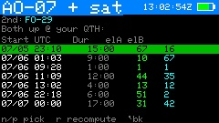

- **Purpose** — the windows when the selected satellite and a second satellite are
  both above your horizon at once, over the next few days; detail in
  [§8 → Sat-to-sat visibility](#sat-to-sat-visibility-2-from-satellites).
- **Reached from** — Satellites → `2`.
- **Shows** — first a **pick screen** (choose the second satellite, no calculation
  yet), then after you start the search a scrolling list of overlap windows with
  start time (UTC), duration, and the peak elevation of each bird.
- **Keys** — `n`/`p` step the second satellite forward/back **instantly** (no search
  runs while you cycle); **ENTER** (or `r`) runs the window search for the chosen
  pair; `;`/`.` scroll the results; `` ` `` back to Satellites. Because cycling no
  longer triggers a multi-day search on every step, choosing a different second
  satellite is immediate.

### 10-day pass overview


- **Purpose** — an at-a-glance visibility chart of one satellite's passes over ten
  days, modeled on InstantTrack's multi-day view.
- **Reached from** — Passes → `v` (or Satellites → `d`).
- **Shows** — one row per day (today at top), each a 24-hour UTC timeline; every
  pass is a bar shaded by peak elevation (dim-green < 15°, green < 40°, yellow
  above). A red tick marks now.
- **Keys** — `;`/`.` scroll one day (forward indefinitely, not before today);
  `r` recompute; `` ` `` back to Passes.

### Illumination


- **Purpose** — a 60-day solar-illumination raster (DK3WN *illum* style) showing
  when the satellite is sunlit vs. eclipsed across its orbit.
- **Reached from** — Passes → `i` (or Satellites → `i`).
- **Shows** — horizontal axis date (today → +60 d), vertical axis one orbital
  period; cells yellow in sunlight, dark in eclipse. A live readout shows current
  SUN/SHADOW status, eclipse minutes/percent per orbit, and time to the next
  transition.
- **Keys** — `,`/`/` scroll one day through the window (forward indefinitely, not
  before today); `r` recompute; `` ` `` back to Passes.

### Track


- **Purpose** — the main operating screen: live pointing, Doppler-corrected
  frequencies, transponder selection, calibration, and radio/rotator control. Full
  detail in [§8 → Track](#track), Doppler theory in
  [§9](#9-doppler-tuning-and-the-one-true-rule).
- **Reached from** — Passes → `t`/ENTER, or Home → Track (sel).
- **Shows** — az/el (and GP age), range/range-rate (ECL flag in eclipse), the
  transponder, DN/RX and UP/TX frequencies, the passband line, the calibration
  line, the radio status, a rotator status line, and a `PL` tone line on FM birds
  that need one.
- **Keys** — `m` switch TUNE/CAL; `d` cycle Doppler tune mode (linear birds);
  `t` next transponder; `c` set CTCSS/PL tone; `r` radio output on/off; `o`
  rotator on/off; `p` **Polar**; `z` large-font readout; `f` **Manual mode**;
  `l` **Log QSO**; `v` voice memo (SD card); `a` **point-here arrow**; `y` tilt
  tuning on/off (ADV, if IMU); `g`/`w`/`e` workable grids / US states / DXCC now;
  in TUNE: `,`/`/` move spot, `s` step, `x` recenter; in CAL: `,`/`/` trim
  downlink, `;`/`.` trim uplink, `s` step, `x` zero; **ENTER** save calibration;
  `` ` `` leave (returns to where you came from).
- **Leaving keeps tracking** — pressing `` ` `` returns to the previous screen and,
  if the radio/rotator are engaged, **they keep tracking in the background** (a green
  **RAD**/**ROT**/**R+R** header tag appears on other screens). Stop with `r`
  (radio) or `o` (rotator, which also parks).

### Point-here arrow (`a` from Track)

- **Purpose** — a big, glanceable compass arrow to the satellite's azimuth plus an
  elevation bar, for hand-aiming a portable antenna without reading numbers.
- **Reached from** — `a` on the Track screen.
- **Shows** — a compass rose (N up) with an arrow pointing where to aim (green above
  the horizon, dim below), an elevation bar (0 at bottom, 90 at top), the numeric
  az/elevation/range, the rise compass direction, and a status line. The radio and
  rotator keep running underneath.
- **Keys** — `` ` `` back to Track.

### Manual mode

- **Purpose** — a no-radio frequency calculator: CardSat shows the
  Doppler-corrected dial frequencies so you can tune a non-CAT rig by hand.
- **Reached from** — Track → `f`.
- **Shows** — the same RX/TX figures as Track, formatted for manual dialing, with
  the passband/tune controls but no CAT output.
- **Keys** — mirror Track's tuning set: `m`, `t`, `s`, `x`, the `,`/`/`,`;`/`.`
  tune/cal keys, `g`/`w`/`e` workable lists, `l` log, `p` polar, `v` voice memo,
  `z` large-font Manual, `u`/`e`/`f` as on Track; `` ` `` back.

### Polar

- **Purpose** — a live full-screen polar sky plot of the satellite you are
  tracking, for visual aiming.
- **Reached from** — Track → `p`.
- **Shows** — the current az/el as a marker on a polar grid, with the pass arc.
- **Keys** — `p` toggle back to Track; `l` **Log QSO**; `v` voice memo (microSD,
  ADV); `` ` `` back.

### OSCARLOCATOR

- **Purpose** — a live azimuthal-equidistant "plotting board" showing the
  satellite's sub-point on the Earth in real time, with its footprint; the
  graphical companion to the tabular **EQX table**.
- **Reached from** — Satellites → `k`.
- **Shows** — a disc centered on your station (QTH mode) or a pole (polar mode),
  with a coastline, graticule, the satellite marker (sunlit/eclipse color), its
  ground footprint, an amber **QTH range ring** (footprint radius at mean altitude),
  the blue **full ground-track arc** across the disc (AOS green, LOS orange, travel arrow), and a
  sub-point/az/el/range readout. In polar mode the North/South sheet is chosen
  automatically and flips live as the satellite crosses the equator.
- **Keys** — `m` toggle QTH-centered ↔ polar; `` ` `` back to Satellites.

### 3D Globe

- **Purpose** — an orthographic 3-D wireframe Earth that auto-follows the selected
  satellite, for an at-a-glance view of where it (and your other favorites) are on
  the planet, with the day/night terminator.
- **Reached from** — Satellites → `3`.
- **Shows** — a wireframe globe (near hemisphere only) with graticule, coastline,
  a yellow **day/night terminator**, your QTH (white cross), all favorites as
  green dots, the selected satellite centered (sunlit/eclipse color) with its
  **ground footprint** and a blue **ground-track trail** (one orbit), and a
  sub-point/az/el/altitude readout. A **second (DX) location** entered by grid
  (`g`) adds an orange marker and footprint; the overlap with the satellite
  footprint is the mutual-visibility region. The globe rotates to keep the selected
  satellite centered.
- **Keys** — arrow keys turn the globe (free-look); **ENTER** re-snaps to
  auto-follow; **`g`** set a DX grid, **`G`** clear it; `` ` `` back to Satellites.

### Workable grids


- **Purpose** — the Maidenhead grid squares currently (or, from Passes, during the
  pass) reachable through the satellite's footprint.
- **Reached from** — Track → `g` (live) or Passes → `g` (for the pass).
- **Shows** — the list/scatter of workable grids; from Track it refreshes live
  while radio and rotator control keep running.
- **Keys** — `;`/`.` scroll; `{`/`}` page; **`f`** set a prefix filter (e.g. `EM`,
  `EM2`, `EM21` — upper-cased per the grid rule); **`c`** clear the filter; `` ` `` back.

### Workable US states


- **Purpose** — the US states (for WAS chasing) under the footprint now or during
  the pass.
- **Reached from** — Track → `w` (live) or Passes → `w` (for the pass).
- **Shows** — the workable states list.
- **Keys** — `;`/`.` scroll; `` ` `` back.

### Workable DXCC


- **Purpose** — the DXCC entities under the footprint now or during the pass.
- **Reached from** — Track → `e` (live) or Passes → `e` (for the pass).
- **Shows** — the workable DXCC list (derived from bundled cty.dat geometry).
- **Keys** — `;`/`.` scroll; `` ` `` back.

### Sun / Moon


- **Purpose** — point the rotator at the Sun or Moon for sun-noise/EME work and
  antenna calibration; full detail in [§13 → Sun / Moon](#sun--moon-antenna-tracking).
- **Reached from** — Home → Sun / Moon.
- **Shows** — the selected body's live az/el (and a sky-dome graphic in graphic
  view). An orange SUN/MOON header tag appears while it is driving the rotator.
- **Keys** — `;`/`.` switch Sun↔Moon; `g` toggle graphic/list view; `o` rotator
  tracking on/off; **`s`** open the **Sky sources** plot; **`t`** open the **Sun/Moon
  transit finder** (below); **`e`** open the **EME / moonbounce** screen (below);
  `x` stop; `` ` `` park and back.

### Sun / Moon transits

- **Purpose** — find upcoming times the active satellite crosses (or closely
  approaches) the **Sun or Moon** from your location — the ISS-on-the-disc
  astrophotography event. Full detail in [§13 → Sun / Moon transits](#sun--moon-transits-t).
- **Reached from** — `t` on the **Sun / Moon** screen (predicts for the satellite
  currently selected).
- **Shows** — an incremental 48-hour scan with a progress bar, then a list of close
  approaches: body (Sun/Moon), a countdown, minimum angular separation, body
  elevation, and a **TRANSIT** (crosses the disc) vs **near** (conjunction) label.
  Requires the clock and your location to be set.
- **Keys** — `;`/`.` move the selection; `r` rescan; `` ` `` back to Sun / Moon.
  **Never observe a solar transit without proper solar filtering.**

### Sky sources

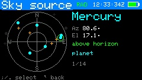

- **Purpose** — the planets and the strongest cosmic radio sources on a sky dome,
  for antenna pointing and as an RF-source reference; detail in
  [§13 → Sky sources](#sky-sources-s).
- **Reached from** — Sun / Moon → `s`.
- **Shows** — a sky dome (zenith center) with planets as cyan dots and radio
  sources (Cas A, Cyg A, Sgr A\*, Tau A, Vir A) as orange crosses; a readout gives
  the selected object's az/el and type.
- **Keys** — `;`/`.` select an object; `` ` `` back to Sun / Moon.

### EME / moonbounce


- **Purpose** — the moonbounce numbers: self-echo Doppler per band, topocentric
  range/rate, path degradation vs perigee, a galactic sky-noise flag, and a
  mutual-Moon window vs a DX grid; detail in [§13 → EME](#eme--moonbounce-e).
- **Reached from** — Sun / Moon → `e`.
- **Shows** — Moon az/el and up/down; range (km) and range-rate (m/s); degradation
  (dB, with a near-perigee/apogee note); sky flag (cold/warm/HOT with galactic
  latitude); self-echo Doppler for 50/144/432/1296/10368 MHz. The `m` sub-view lists
  common Moon windows vs a DX grid over the next 14 days.
- **Keys** — `o` point/stop rotator at the Moon; `x` stop; `m` mutual-Moon window
  (then `g` change grid, `;`/`.` select); `p` 30-day planner; `` ` `` back
  (sub-view → main → Sun/Moon). A red **SUN** flag appears when the Moon is within
  ~10° of the Sun.

### EME 30-day plan

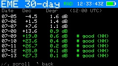

- **Purpose** — pick the good EME days: per-day Moon declination (12:00 UTC) and
  path degradation for the next 30 days, with a star on high-declination,
  near-perigee days (the northern-hemisphere heuristic; raw values shown for both
  hemispheres).
- **Reached from** — EME / moonbounce → `p`.
- **Keys** — `;`/`.` scroll; `{`/`}` page; `` ` `` back to EME.

### Space weather


- **Purpose** — solar flux and geomagnetic indices with a plain-language operating
  outlook; detail in [§13 → Space weather](#space-weather).
- **Reached from** — Home → Space Wx.
- **Shows** — F10.7 flux, planetary Kp, running A index, an **aurora likelihood**
  line derived from Kp (unlikely / possible / likely, with latitude), each labeled
  and color-coded, an HF/satellite outlook line, and a data-freshness note.
- **Keys** — `p` open the **HF / 6m propagation** guide (below); `r` refresh over WiFi; `` ` `` back.

### HF / 6m propagation

- **Purpose** — rule-of-thumb band guidance from the solar flux and Kp; detail in
  [§13 → propagation guide](#hf--6m-propagation-guide-p).
- **Reached from** — Space Wx → `p`.
- **Shows** — the two indices (color-coded); an HF band summary and a 10/15/20 m
  open/marginal/shut read; the geomagnetic effect; auroral-VHF likelihood; D-layer
  absorption; and a rule-of-thumb disclaimer (6 m Es is seasonal).
- **Keys** — `r` refetch in place; `` ` `` back to Space Wx.

### Weather


- **Purpose** — terrestrial current conditions and a multi-day forecast for the
  operating site; detail in [§13 → Weather](#weather).
- **Reached from** — Home → Weather.
- **Shows** — current temperature, sky, wind and humidity, then per-day condition,
  high/low and precipitation chance, plus a freshness note. Units per Settings.
- **Keys** — `r` refresh over WiFi; `` ` `` back.

### QRZ callsign lookup


- **Purpose** — resolve a callsign to name, location, grid and license class via
  the QRZ.com XML API; detail in [§13 → QRZ callsign lookup](#qrz-callsign-lookup).
- **Reached from** — Home → QRZ Lookup.
- **Shows** — prompts for credentials/WiFi if needed; otherwise the looked-up
  station's details.
- **Keys** — **ENTER** type a callsign to look up; `;`/`.` scroll a long result;
  `` ` `` back.

### Grid distance & bearing

- **Purpose** — great-circle distance and beam heading to a Maidenhead grid, for
  terrestrial VHF/UHF work; detail in [§13 → Grid distance & bearing](#grid-distance--bearing-grid-distbearing).
- **Reached from** — main menu → **Grid dist/bearing**.
- **Shows** — your grid, the target grid, distance (km/mi), heading (short path),
  long-path heading and distance, and a rotator-engaged line when pointing.
- **Keys** — `g` enter grid; `q` QRZ → grid lookup; `o` point/stop rotator at the
  bearing (el 0); `x` stop; `` ` `` back to the menu.

### QRZ → grid

- **Purpose** — resolve a callsign to its grid (via the QRZ account already set up
  for QRZ Lookup) and seed the grid calculator with it.
- **Reached from** — Grid dist/bearing → `q`.
- **Shows** — the callsign, the operator's name and grid on success, or the QRZ
  error.
- **Keys** — `c` enter callsign; **ENTER** use the found grid in the calculator;
  `` ` `` back to the calculator.

### AMSAT status


- **Purpose** — every bird with a recent AMSAT live-status report, sorted
  most-active-and-most-recent first; detail in [§14 → AMSAT status](#gp-age-indicator).
- **Reached from** — Satellites → `s`, or the **AMSAT status** main-menu item.
- **Shows** — one row per reported satellite: name, status word (colored), "heard
  N ago" recency, and how many stations reported, within the configured window.
- **Keys** — `;`/`.` select; **ENTER** adopt as the active satellite and jump to
  Track; **`g`** open the selected bird's **individual reports** (below); **`p`**
  **report this bird's status** (below); `u` re-fetch in place; `` ` `` back.

### AMSAT reports (per satellite)

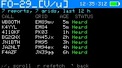

- **Purpose** — the selected satellite's **individual status reports**: who heard
  it, from which grid, how long ago, and what they reported — headed by a
  **distinct-grid count** ("7 reports, 5 grids"), a footprint-activity read the
  summary count can't give.
- **Reached from** — AMSAT status → `g` (fetched on demand from the AMSAT
  reports API for the configured status window).
- **Shows** — one row per report: callsign, grid, age, and the color-coded status
  (Heard / Telemetry / Not heard / Crew).
- **Keys** — `;`/`.` scroll; `{`/`}` page; `r` refetch; `` ` `` back.

### Report satellite status

- **Purpose** — submit a **public status report** to amsat.org, exactly like the
  web form: Heard / Telemetry Only / Not Heard / Crew Active. **Mode-aware**: the
  status system tracks some birds per mode (`AO-7_[U/v]` vs `AO-7_[V/a]`,
  `ISS_[FM]` vs `ISS_[SSTV]`, ...), and CardSat targets the entry matching the
  transponder you are actually working.
- **One-key from Track** — press **`i`** ("I heard it"): CardSat resolves the
  mode from the active transponder's uplink/downlink bands, asks once on the
  status line, and a second `i` within ~3 s sends **Heard**. If the mode can't be
  resolved (beacon selected on a multi-mode bird), the picker opens instead.
- **Full picker** — `p` on the **AMSAT status** screen (or the ambiguous case
  above): choose the API name (mode) and any of the four status values, **ENTER**
  sends. The report is public under your callsign with your grid; the server
  replaces a repeat report for the same satellite, hour and 15-minute period, so
  a double-send is harmless.
- **Needs** — your callsign in Settings, the clock set, WiFi, and the satellite
  present in the AMSAT catalog (the name map refreshes with each elements
  update and is cached for offline boots).

### Activations

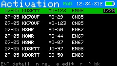

- **Purpose** — list the upcoming satellite activations scheduled on hams.at (roves,
  grid activations, special operations); detail in
  [§13 → Upcoming activations](#upcoming-activations-activations).
- **Reached from** — Home → Activations.
- **Shows** — a scrollable list of upcoming activations (date, callsign, satellite,
  grid); entries you've entered yourself are marked with a leading **`*`** and shown
  in cyan. ENTER opens a detail view with start/end times (UTC), mode, frequency,
  the activator's comment (scrollable), and a **footprint note** — whether the
  satellite is co-visible with the activator near the listed time (±30 min).
- **Keys** — `;`/`.` move; **ENTER** open the selected activation's detail; `r`
  refresh the feed; **`n`** add your own activation/sked (works offline — see below);
  **`e`** edit the selected entry if it's one of your own (feed entries are
  read-only); in the detail view, `;`/`.` scroll the comment, **`a`** sets a **sked
  reminder** (T-60/30/10 countdown beeps and a flash at the start, independent of the
  favorites AOS alarm), and **`w`** opens the **mutual-window screen** when a
  footprint exists; when a sked is set, **`c`** on the list clears it; `` ` `` back.

### Activation mutual window and tailored DX Doppler

- **Purpose** — for an activation with a footprint, show the co-visibility pass and
  give a DX Doppler view pre-set to the activation's frequency; detail in
  [§13 → Upcoming activations](#upcoming-activations-activations).
- **Reached from** — `w` on an activation's detail (mutual window) → `d` (DX Doppler).
- **Shows** — a small polar plot of the pass (satellite track from your site in cyan
  and from the DX site in orange) with the date, AOS, LOS, duration and peak
  elevation for each station; the DX Doppler table then lists RX/TX dial frequencies
  for both stations across the window, with the transponder and fixed downlink/uplink
  pre-selected from the activation's frequency when it matches a two-way transponder.
- **Keys** — mutual window: **`d`** DX Doppler, `` ` `` back to the detail. DX Doppler:
  the same controls as the main DX Doppler table (`t` transponder, `m` mode, `a`
  anchor, `;`/`.` scroll), `` ` `` back to the mutual window.

### New / Edit sked (manual activation entry)

- **Purpose** — enter your own activations or personal skeds in the **same format as
  the hams.at feed**, for operations that aren't posted to that site. Your entries are
  stored separately and **merged into the Activations list alongside the fetched ones**,
  surviving feed refreshes and reboots.
- **Reached from** — `n` (new) or `e` (edit a `*`-marked entry) on the Activations
  screen. Works with no WiFi.
- **Shows** — a field list: Date (YYYY-MM-DD UTC), Call, Sat, Grid, Start/End
  (HH:MM UTC), Mode, Freq, Comment. A new entry pre-fills today's date and your
  callsign.
- **Keys** — `;`/`.` move between fields; **ENTER** edit the selected field; `s` save
  (needs at least a date plus a satellite or callsign); when editing an existing entry,
  `x` deletes it (press twice); `` ` `` cancel. Saved entries appear immediately in the
  Activations list marked with `*`, and a sked reminder can then be set on them with
  `a` like any other activation.

### Overhead now

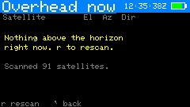

- **Purpose** — a snapshot of every satellite in the loaded catalog that is **above
  the horizon right now**, sorted by elevation — a quick "what can I work / see this
  moment" glance.
- **Reached from** — Home → Overhead now.
- **Shows** — each satellite currently up, with its elevation, azimuth, and rise
  compass direction (high passes in green, near-horizon in yellow), plus a count of
  how many are up out of how many were scanned. The scan runs once when you open the
  screen.
- **Keys** — `r` rescan (recompute the snapshot for the current instant); `;`/`.`
  scroll; `` ` `` back.

### Location


- **Purpose** — set your station position and clock, and view the GPS sky plot.
- **Reached from** — Home → Location.
- **Shows** — current lat/lon/altitude, grid, time source and clock, and GPS
  status when enabled.
- **Keys** — `e` edit latitude; `o` edit longitude; `a` edit altitude; `g` enter a
  Maidenhead grid; `p` enable/disable GPS; `s` pick the GPS source; `c` set the UTC
  clock by hand; **`v`** open the **live GPS position** screen; **ENTER** open the
  **GPS sky plot**; `` ` `` back.

### Live GPS position

- **Purpose** — a full-precision position readout (DMS, decimal, grid) plus ground
  speed and course, for rovers and portable ops; detail in
  [§13 → Live GPS position](#live-gps-position-v).
- **Reached from** — Location → `v`.
- **Shows** — latitude/longitude in degrees-minutes-seconds to 0.001″ and in
  decimal degrees, altitude, Maidenhead grid, ground speed (km/h and knots) and
  course; a status line with fix/sat-count/HDOP.
- **Keys** — `` ` `` back to Location.

### LoRa Messages

- **Purpose** — CardSat-to-CardSat broadcast text chat over the Cap LoRa (SX1262);
  detail in [§8 → LoRa Messages](#lora-messages-home--messages).
- **Reached from** — Home → Messages.
- **Shows** — a scrolling message history (yours in cyan as `>me`, others in green
  by callsign) with a status line of frequency / SF / bandwidth / your callsign.
- **Keys** — `n` write + send a message; `;`/`.` scroll history; `r` retry the
  radio bring-up if it wasn't ready; `` ` `` back to Home.
- **Notes** — needs LoRa enabled in Settings and your callsign set; the LoRa radio
  is built into the standard binaries (RadioLib required at build time). Untested
  hardware path.

### GPS sky plot

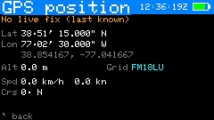


- **Purpose** — a polar plot of the GNSS satellites currently in view, by signal
  strength — useful for checking antenna/fix quality.
- **Reached from** — Location → ENTER.
- **Shows** — GNSS satellites placed by azimuth/elevation, colored green (strong)
  to gray (weak), with fix data.
- **Keys** — `` ` `` back. (The plot updates live; no other keys.)

### Update


- **Purpose** — refresh everything that comes from the network in one place.
- **Reached from** — Home → Update.
- **Shows** — the last GP age and a note that `k` also refreshes the clock, AMSAT
  status, space weather and terrestrial weather.
- **Keys** — `k` (or ENTER) download GP + sync clock (NTP) + AMSAT + space wx +
  weather; `f` fast update (GP + AMSAT + favorites' transponders, skips space wx/weather);
  `a` fetch and cache **all** transponders for offline use; `w` connect WiFi only;
  `` ` `` back.

### GP source

- **Purpose** — choose where element sets come from.
- **Reached from** — Settings → GP source → ENTER.
- **Shows** — a picker: AMSAT (amateur, default), the CelesTrak category groups
  (Amateur first, then SatNOGS and the other groups), and Custom URL.
- **Keys** — `;`/`.` move (`{`/`}` page); **ENTER** select; `` ` `` back. The
  choice is saved immediately and used by the next Update.

### Settings


- **Purpose** — all configuration, grouped into six submenus (Radio / CAT,
  Rotator, Passes / alerts, Display / sound, Station / logging, Network / data),
  each shown with its item count. Each row and its adjust keys are tabulated
  in [§8 → Settings](#settings).
- **Reached from** — Home → Settings.
- **Shows** — the submenu list, then the rows within a chosen submenu with their
  current values.
- **Keys** — `;`/`.` move; **ENTER** open a submenu / edit a text field; `,`/`/`
  change a value in place; `` ` `` back.

### WiFi scan

- **Purpose** — pick a network from a live scan instead of typing the SSID.
- **Reached from** — Settings → WiFi SSID row → `s`.
- **Shows** — nearby networks, strongest first, `*` marking secured ones.
- **Keys** — `;`/`.` select; **ENTER** choose (then enter the password unless the
  network is open); `r` rescan; `` ` `` back.

### Rotator manual / calibration

- **Purpose** — jog the rotator by hand with live read-back, and — for a **Yaesu
  (direct)** rotator — calibrate the position ADC. Detail in
  [§17](#17-antenna-rotator-gs-232-rotctl-pstrotator-yaesu-direct-rotctld-server)
  and ROTOR_INTERFACE.md.
- **Reached from** — Settings → Rotator: manual control → ENTER.
- **Shows** — commanded and actual az/el; for Yaesu direct, the live ADC counts
  for each axis.
- **Keys** — `,`/`/` jog azimuth; `;`/`.` jog elevation; `s` step size; `x` stop;
  *(Yaesu direct only)* `1`/`2`/`3`/`4` capture the ADC counts at az 0 / az full /
  el 0 / el full; `` ` `` back.

### CAT serial monitor

- **Purpose** — a live on-device terminal showing the raw CAT traffic between CardSat
  and the radio, for confirming wiring, model, address, and baud without a PC. Detail
  in [§16 → CAT self-test](#16-radio-specific-notes).
- **Reached from** — Settings → Radio / CAT → *CAT serial monitor*.
- **Shows** — each frame as hex (or ASCII for Kenwood), **TX in cyan, RX in green**,
  with a decode line. While open it **actively polls the rig** (~every 700 ms) by
  reading the downlink frequency, so live traffic appears even with no pass running.
- **Keys** — `p` toggle polling on/off (off = passive view); `s` type a raw frame in
  hex and transmit it; `` ` `` back.

### CAT self-test

- **Purpose** — exercise the whole CAT link end-to-end in one shot and report what
  works, before trusting it for a pass. Detail in [§16 → CAT self-test](#16-radio-specific-notes).
- **Reached from** — Settings → Radio / CAT → *Run CAT self-test* (radio must be on —
  start CAT with `r` on Track first).
- **Shows** — a scrolling list of steps (downlink/uplink set+read, modes, band select,
  sat mode, PTT read, CTCSS), each marked `[PASS]`, `[FAIL]`, or `[INFO]` (the last for
  capabilities a given radio doesn't expose over CAT).
- **Keys** — `;`/`.` scroll; `` ` `` back.

### Log menu


- **Purpose** — the QSO logging hub.
- **Reached from** — Home → Log.
- **Shows** — New QSO entry, View / edit log, Export to ADIF, Sign & upload to LoTW,
  Upload to Cloudlog, Voice Memos, Notes. (The list scrolls; a `^`/`v` marker shows when
  there are more items above or below.)
- **Keys** — `;`/`.` move; **ENTER** open the selected item; `` ` `` back.

### Sign & upload to LoTW

- **Purpose** — sign un-uploaded satellite QSOs into a `.tq8` and upload them
  directly to ARRL's Logbook of the World (microSD card + your LoTW key required;
  full setup in [§8 → LoTW upload](#logbook-of-the-world-lotw-direct-upload)).
- **Reached from** — Log menu → Sign & upload to LoTW.
- **Shows** — SD-card status, whether the LoTW key/cert are on the card, your
  station DXCC/CQ/ITU fields, and the count of QSOs not yet uploaded.
- **Keys** — `u` sign & upload (prompts for the key password if encrypted);
  `a` toggle re-send mode (include QSOs already uploaded); `` ` `` back.

### Upload to Cloudlog

- **Purpose** — upload satellite QSOs to a self-hosted **Cloudlog** (or **Wavelog**)
  online logbook over WiFi. Because a Cloudlog instance can itself forward QSOs to
  LoTW/eQSL, this is usually an alternative to the on-device LoTW upload rather than an
  addition. Tracked independently of LoTW, so a QSO sent to one isn't marked sent to the
  other. Full setup in [§8 → Cloudlog upload](#cloudlog--wavelog-upload).
- **Reached from** — Log menu → Upload to Cloudlog.
- **Shows** — your configured Cloudlog server, whether the API key and station ID are
  set, and the count of QSOs not yet sent to Cloudlog.
- **Keys** — `u` upload (connects WiFi if needed); `a` toggle re-send mode (include QSOs
  already sent to Cloudlog); `` ` `` back.

### Log entry


- **Purpose** — create or edit one QSO record. Full field list in
  [§8 → Logging QSOs](#logging-qsos-log).
- **Reached from** — Track/Polar/Manual → `l`, or Log menu → New QSO entry, or Log
  list → ENTER on a record.
- **Shows** — every editable field: date, time, sat, mode, DL/UL MHz, call, RST
  sent/received, grid, notes.
- **Keys** — `;`/`.` move between fields; **ENTER** edit the selected field (the
  Sat field opens the satellite picker; Mode toggles SSB/CW on linear birds); `s`
  save; `` ` `` cancel.

### Log list (view / edit)


- **Purpose** — review and correct stored contacts.
- **Reached from** — Log menu → View / edit log.
- **Shows** — a scrollable list of the most recent 60 QSOs, newest first.
- **Keys** — `;`/`.` move; **ENTER** open a record to edit; (within a record)
  `x` twice to delete; `` ` `` back.

### Voice Memos

- **Purpose** — browse, play back, and manage the voice memos on the SD card, and
  record new standalone memos.
- **Reached from** — Log menu → Voice Memos.
- **Shows** — all memos newest-first: date, time, the satellite recorded on (or `-`
  for a standalone memo), and length. A `REC` timer replaces the list while recording.
- **Keys** — `;`/`.` move; **ENTER** play the selected memo (any key stops);
  `n` record a new standalone memo (any key stops & saves); `d` delete (with confirm);
  `r` refresh; `` ` `` back to the Log menu.

### Notes (browser)

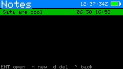

- **Purpose** — browse, open, create and delete the plain-text notes stored under
  `/CardSat/notes/`. Full description in [§8 → Notes](#notes-free-form-text-editor).
- **Reached from** — Log menu → Notes.
- **Shows** — your notes newest-first, each with the date and time it was last saved
  (UTC).
- **Keys** — `;`/`.` move; **ENTER** open the selected note; `n` new note; `d` then
  **ENTER** delete (with confirm); `` ` `` back to the Log menu.

### Notes (editor)

- **Purpose** — a full multi-line text editor for one note. Because `;` `.` `,` `/`
  are typed as punctuation, all editor commands use the **Fn** modifier.
- **Reached from** — Notes browser → ENTER on a note, or `n` for a new one.
- **Shows** — the note text with a block cursor; the header shows the note name and a
  `*` when there are unsaved changes; the footer shows the line number.
- **Keys** — type normally (**ENTER** = new line, **delete** = backspace);
  **Fn + `,`/`/`** cursor left/right; **Fn + `;`/`.`** cursor up/down;
  **Fn + `s`** save (prompts for a name the first time); `` ` `` exit (unsaved work
  is saved automatically, or you're prompted for a name).

### World map


- **Purpose** — a live equirectangular map of all favorites' footprints with the
  day/night terminator.
- **Reached from** — Home → World Map, or Next Passes → `m`. Back returns to
  wherever you entered from.
- **Shows** — every favorite's sub-point and footprint, your station marker, the
  graticule, and **day/night shading**: the night hemisphere is shaded a dim gray so
  you can see at a glance which footprints (and which part of your own sky) are in
  darkness. The shaded region is computed from the sub-solar point and updates live.
- **Keys** — `f` cycle which favorite is highlighted; **`c` recenter the map on
  your QTH** (press again to return to the classic 0°-centered view); **`n` toggle the
  night-hemisphere shading** on/off (remembered across reboots); `` ` `` back.
- **Recentering** — by default the map is centered on 0° longitude. Press `c` to
  center it on your station's longitude instead, so your QTH sits in the middle and
  the world wraps around it; this is remembered across reboots. Only the longitude
  is shifted — north stays up and the equator stays centered. The orbital-analysis
  ground-track map and the simulation map keep the standard 0°-centered view.

### Help

- **Purpose** — an on-device scrollable key reference, available almost anywhere.
- **Reached from** — `h` on most screens.
- **Shows** — per-screen key summaries.
- **Keys** — `;`/`.` scroll; `g` opens the **Glossary & math**; `m` opens the
  **User guide**; `s` opens the **Ham satellite history**; `t` opens the **Tech
  help** guide; `l` opens the **Learn** (radio + orbit theory) screen; `o` opens the
  **Orbit animations**; `f` opens the **band plan / frequency reference**; `a` opens
  the **AMSAT Fox anatomy** — an
  animated, labeled tour of a 1U Fox CubeSat (spin with `;`/`.`, pause with space,
  cycle the callouts with `,`/`/`; facts sourced from AMSAT's Fox documentation;
  `i` inside opens a short **Fox & CubeSats** primer); `c` opens a **CubeSat
  Simulator** intro — AMSAT's desktop satellite for hands-on learning (kits at the
  AMSAT Store; cubesatsim.com); `` ` `` back.

### Station readiness

- **Purpose** — one glanceable green/red checklist of everything a working pass
  depends on: clock, location, GP data and age, WiFi, radio and rotator
  configuration, SD card, callsign, battery. First-hour onboarding and a pre-pass
  field check in one screen.
- **Reached from** — About → `r`.
- **Keys** — `` ` `` back to About.

### Understanding state vectors

Most of CardSat works from **GP mean elements** (the modern successor to the two-line element
set, or TLE): a compact set of six orbital numbers — mean motion, eccentricity, inclination,
right ascension of the ascending node, argument of perigee, and mean anomaly — plus a drag
term, all referenced to an epoch. Those elements are what SGP4 propagates to predict where a
satellite will be. But mean elements are not the only way to describe an orbit, and for a
brand-new object you often won't have them yet. That's where a **state vector** comes in.

**A state vector is the most direct possible description of an orbit: where the object is and
how fast it's moving, right now.** It is just two 3-D vectors at a single instant (the epoch):

- **Position** `(rx, ry, rz)` — the satellite's location, in kilometres, measured from the
  centre of the Earth along three perpendicular axes.
- **Velocity** `(vx, vy, vz)` — how fast it's moving along each of those axes, in kilometres
  per second.

Six numbers and a timestamp. Unlike mean elements, a state vector needs no orbital theory to
interpret — it is the raw kinematic truth at that moment. Given a state vector and the laws of
gravity, you can (in principle) compute the entire orbit forward and backward in time. In fact
the two descriptions are interchangeable: a state vector and a set of orbital elements at the
same epoch describe the *same* orbit, just in different coordinates — one Cartesian (x/y/z), the
other in terms of the ellipse's shape and orientation.

**Why the numbers look the way they do.** For a satellite in low Earth orbit, the position
components are each a few thousand kilometres (the orbital radius is roughly 6,700–7,400 km, so
the three components sum in quadrature to that), and the velocity components are each a few
kilometres per second (orbital speed at that altitude is about 7.5 km/s). A component can be
positive or negative depending on which side of each axis the satellite is on and which way it's
heading. There's nothing to "read" from an individual number the way you'd read an inclination;
the meaning is in the vectors as a whole.

**Frames — the part that trips people up.** A state vector is only meaningful together with the
**reference frame** its x/y/z axes are defined in. The same physical orbit produces *different*
numbers in different frames, because the axes point in different directions. Two frames matter
here:

- **TEME** (True Equator, Mean Equinox) — the somewhat idiosyncratic inertial-ish frame that
  SGP4 itself uses internally. If your source already gives TEME, CardSat uses it directly.
- **J2000** (also called GCRF or, for our purposes, ICRF) — the standard modern inertial frame,
  fixed to the stars at the J2000.0 epoch. Most launch providers and orbit-determination tools
  publish in J2000/GCRF. CardSat rotates a J2000 state into TEME on-device (using IAU-76
  precession and a truncated IAU-80 nutation model, accurate to about 1–2 metres) before fitting.

Choosing the wrong frame is the single most common mistake: the fit will either fail to converge
or produce elements that are subtly wrong, because the axes were misaligned by the small but real
rotation between the two frames (tens of metres of position difference at LEO). If your source
says "J2000", "GCRF", "ICRF", or "EME2000", pick **J2000**; if it says "TEME" or "true equator",
pick **TEME**.

**Where you get one.** Launch providers, deployment brokers, and rideshare integrators routinely
distribute a state vector for a payload — often *before* launch, with an epoch days or weeks in
the future — so operators can plan the first passes before the object has a NORAD catalogue
number and public TLE. Orbit-determination software (from a radar or optical track) also outputs
state vectors. Any of these can be typed into CardSat's **State vector → GP** tool.

**Why CardSat fits rather than converts.** You might expect a state vector to convert *directly*
into orbital elements — and mathematically it does, into what are called **osculating** elements
(the instantaneous ellipse that exactly matches the position and velocity at that moment). The
catch is that SGP4 does **not** expect osculating elements; it expects **mean** elements, which
have the short-period gravitational wobbles deliberately averaged out. Feeding osculating
elements straight into SGP4 produces errors of many kilometres, because SGP4 then re-adds
perturbations that were already baked into the osculating values. So instead of a one-shot
conversion, CardSat runs a small **differential-correction fit**: it starts from the osculating
elements as a first guess, then repeatedly nudges the six mean elements and re-runs its own SGP4
until the propagator reproduces your entered state vector to within the achievable precision
(tens of metres, limited by the TLE number format). The result is a set of mean elements that
behaves correctly in every other CardSat prediction. Because a single instant carries no
information about atmospheric drag, the drag term `B*` is set to zero — which is fine for the
first days but means the elements slowly drift; re-acquire real published elements once the
object is catalogued. See **State vector → GP** under *Tools*, below, for the step-by-step
operation.

### Tools


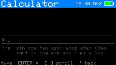

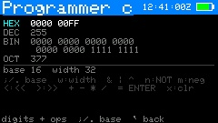

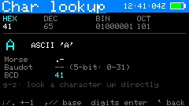

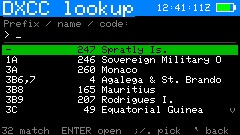

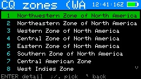

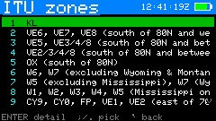


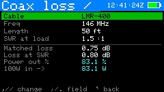

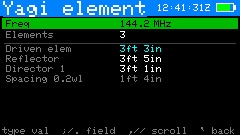

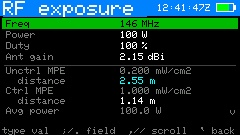

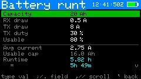


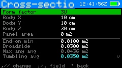

- **Purpose** — a set of **35 offline** ham-radio and satellite bench tools, all computed
  locally (no network needed): the **scientific**, **programmer's**, and **graphing**
  calculators, a **Tiny BASIC** interpreter, a **location converter** (Maidenhead / decimal /
  DMS / DDM / Plus Code / UTM / MGRS / USNG), the **link budget** chain, **state vector → GP**,
  the **CubeSatSim C2C** crib, the DXCC / CQ-zone / ITU-zone / CTCSS / operating / radio-math
  reference cards, **character lookup**, and the live-recalc forms for **coax loss / power**,
  **dipole**, **vertical / ground plane**, **yagi** and **quad** dimensions, **RF unit**
  conversions (dBm / W / V), **SWR / return loss**, **free-space path loss**, **RF exposure**,
  **battery runtime**, **orbit lifetime**, **cross-section area**, **phasing line / stub**,
  **wavelength / frequency**, **attenuator pad**, **dB chain sum**, the ARRL radio-math
  calculators (**complex / polar**, **reactance & resonance**, **RC/RL time constant**), and a
  general **unit converter**.
- **Reached from** — About -> `t`.
- **Menu order** — the menu is grouped **compute-first**: the interactive calculators and
  converters (scientific, graphing, programmer, Tiny BASIC, location converter, link budget),
  then the satellite-compute tools (state vector → GP, CubeSatSim), then the reference lookups
  (DXCC, CQ zones, ITU zones, CTCSS, operating references, radio math, character lookup), then
  the live-recalc **forms**. A **first-letter jump** (press a letter to hop to the next tool
  starting with it) and last-tool memory make the list quick to navigate. The entries below
  follow roughly the same grouping — calculators and converters first, then the references,
  then the forms — though the **forms** are described together after the link budget rather
  than strictly last.
- **Calculator** — a traditional tape interface: type an expression
  (`2+3*sin(45)`), ENTER evaluates, and the expression and its result join a
  **scrolling tape** above the entry line (`[`/`]` scroll back through history —
  the arrow keys `;` and `.` stay available as expression characters, `.` being the
  decimal point). Supports `+ - * / ^ ()`, `pi`, `e`, the previous result as `Ans`,
  and sin cos tan asin acos atan sqrt ln log exp abs, with trig in **degrees**. It
  also carries **amateur-radio helpers** (press `'` for the second hint page): the
  functions `dbm(W)` and `w(dBm)` for power, `db(ratio)` and `undb(dB)`, `wl(MHz)` for
  wavelength in metres and `fq(m)` for the reverse, `sinh/cosh/tanh`, `floor/ceil/round`,
  and the constants `c` (speed of light m/s), `kB` (Boltzmann), `Re` (Earth radius km),
  `mu` (Earth GM) and `g0`. So `wl(146)` gives the 2 m wavelength, `dbm(100)` gives
  50 dBm, `db(2)` gives 3.01 dB. The function hints stay pinned just above the footer;
  `'` toggles between the general and ham pages. You can also type **metric-prefix
  suffixes** on numbers (`100k`, `2.2n`, `47p`, `146M` -- case matters, `M`=mega vs
  `m`=milli), and press **`\`** to toggle **engineering-notation** output (results shown
  as a mantissa with a metric prefix, e.g. `4.7 k`). DEL backspaces (and only
  backspaces — it never exits); `` ` `` returns.
- **Graphing calculator** — plot **y = f(x)** using the same expression parser and function
  set as the scientific calculator, with the added variable **x**. Press ENTER to type a
  function (e.g. `sin(x)`, `x^2-4`, `1/x`, `exp(x/50)`); the curve is sampled one point per
  pixel column and drawn across a pan/zoomable window. **Arrow keys pan**, **`+`/`-` zoom**
  about the centre, **`a`** auto-fits the vertical range to the visible data, and **`r`** resets
  the window. As with the scientific calculator, **trig is in degrees**, so the default window
  is x ∈ [-180, 180]. Discontinuities (the poles of `tan(x)`, `1/x` at zero) break the curve
  rather than drawing a spurious vertical line. All local, no network.

- **Tiny BASIC** — a small line-numbered BASIC interpreter with a built-in editor, for
  writing and running little programs on the device (4 KB program limit, all local). See
  **[Tiny BASIC reference](#tiny-basic-reference)** below for the full language, editor keys,
  limits, and worked examples.

- **Location converter** — one position shown at once in every format a satellite or field
  operator is likely to need. Seeds from your station location; edit the **grid**, **latitude**,
  or **longitude** (`;`/`.` pick the field, ENTER to type) and every other format re-derives.
  Outputs: **Maidenhead** (6- and 8-character), **decimal degrees**, **degrees-minutes-seconds
  (DMS)**, **degrees-decimal-minutes (DDM)**, **Plus Code** (Open Location Code, 10-digit),
  **UTM** (zone + easting/northing, WGS84), **MGRS**, and **USNG** (the spaced form of the same
  military grid). `,`/`/` scroll the derived list; **`s`** adopts the shown position as your
  station QTH. All conversions are computed on-device with no network. The UTM/MGRS projection
  and the Plus Code encoder were validated byte-for-byte against reference implementations across
  both hemispheres; they are accurate to about a metre, which is well within what these grids
  represent. (**what3words** is intentionally not offered — it is a proprietary, network-only
  wordlist lookup, not an offline algorithm, so it doesn't fit an offline tool.)

- **Programmer calc** — a 64-bit value shown at once in **hex / dec / bin / oct**.
  Type digits in the current entry base; **`;`/`.` (up/down) move the highlighted
  base row** and `w` cycles the display width (8/16/32/64 bits, which masks the
  value). Bitwise `&` `|` `^`, `n` = NOT, `m` = negate, `<`/`>` = shift left/right,
  plus `+ - * /`, all via a pending-operation model (`=`/ENTER applies). **`x`
  clears** and DEL drops the low digit (DEL never exits) — `b` and `c` are hex digits, so they can't
  double as commands. Useful for CI-V byte math and bitmasks.
- **Char lookup** — enter a byte in **hex, dec, bin or oct** (`,`/`/` cycle the entry
  base, digits type in it, `;`/`.` browse ±1) and see everything it represents at once:
  the **ASCII** character or control-code name, its **Morse** pattern, the **Baudot /
  ITA2** letters- and figures-shift meaning for 5-bit values (US-TTY, as used on RTTY),
  and the **BCD** reading (CI-V frequency bytes are BCD). Typing any non-hex letter
  (g–z) looks that character up directly; `x` zeroes, DEL drops the low digit. Press
  **`=`** for a **browsable full table** — printable ASCII 32–126 with each
  character's decimal value, Morse, and Baudot code (with L/F letters/figures-shift tag),
  `;`/`.` to scroll; `=` returns to the single-character view.
- **DXCC entity lookup** — type a **prefix, partial name, or entity code** and matching
  DXCC entities list live; ENTER opens a detail card with the **entity code, primary
  prefix, continent, ITU and CQ zones, name**, status flags (deleted / third-party
  traffic OK) and any **ARRL footnotes**. The table (current + deleted entities) is
  embedded from the ARRL DXCC list and works entirely offline; deleted entities are
  dimmed. `;`/`.` pick, DEL edits the query, `` ` `` back.
- **CQ zones (WAZ)** — all **40 CQ zones** with their names; ENTER opens a detail card
  with the full prefix/region definition (scroll with `;`/`.` if it runs long). From a
  **DXCC entity's** detail card, press **`z`** to jump straight to that entity's CQ-zone
  definition. Embedded from the CQ WAZ list, fully offline.
- **ITU zones** — the **ITU zone** list (numbers 1–75, 78, 90 — ITU numbering isn't
  contiguous), each with its prefix/region definition; ENTER opens a scrollable detail
  card. From a DXCC entity's detail card, **`i`** jumps to that entity's ITU-zone
  definition (`z` jumps to the CQ zone). Embedded from the RSGB ITU zones list, offline.
- **Link budget** — the full chain, live-recalc: **TX power → feedline → antenna →
  free-space path (+ extra losses) → RX antenna → feedline → receiver noise floor →
  SNR → margin**. Twelve inputs scroll in a window (`;`/`.` move, type to edit); a
  **Mode** row (`,`/`/`) presets bandwidth + required SNR together (CW 500 Hz, SSB, FM,
  1k2/9k6 packet, FT8, JT65/Q65, or Custom). Pinned outputs show EIRP, FSPL, RX power,
  noise floor (−174 dBm/Hz + 10·log BW + NF), SNR, an **S-meter estimate** (IARU S9 =
  −93 dBm above 30 MHz, −73 below, 6 dB/S-unit), and the **margin**, color-coded:
  green ≥ 6 dB (solid), orange 0–6 (thin), red < 0 (no copy). When a satellite is being
  tracked, the **Distance** field opens pre-filled from its **live slant range** (marked
  "(live)") and the frequency from the selected transponder downlink; press **`p`** to
  re-sync after the satellite moves. Editing Distance by hand drops the "(live)" tag.
- **Forms** — `;`/`.` move between fields; type digits to edit a value (ENTER or
  moving off the field commits it); on a pick-list field (e.g. the coax type) `,`/`/`
  cycle the choices; results recompute instantly. **Yagi and quad take an element
  count** (up to 12 / 8) and list every element; `,`/`/` scroll the output when the
  list runs past the screen. The Tools menu itself scrolls when it grows past eleven
  entries. `` ` `` back.
- **RF exposure (MPE)** — enter frequency, power, duty cycle and antenna gain; shows the
  FCC OET-65 **Maximum Permissible Exposure** limits (controlled and uncontrolled, by
  band) and the estimated **compliance distances** in meters, plus average power and a
  with-ground-reflection worst case. A far-field estimate for planning — not a substitute
  for a full station RF-exposure evaluation.
- **Battery runtime** — enter capacity (Ah), RX and TX current draw, TX duty cycle and
  the usable fraction of capacity; shows the duty-weighted **average current** and the
  estimated **runtime** (decimal hours and h:m). Handy for sizing a field battery.
- **Orbit lifetime (debris)** — for CubeSat builders assessing post-mission disposal:
  enter altitude (use **perigee** altitude for an elliptical orbit), mass, cross-sectional
  area and drag coefficient; shows
  the **ballistic coefficient** and an estimated **orbital lifetime** (drag decay through
  an exponential-atmosphere model), with pass/fail against the **25-year** and newer
  **5-year** debris-mitigation guidelines. This is an order-of-magnitude estimate at
  nominal solar activity (real lifetime swings several-fold over the solar cycle) — a
  planning figure, **not** a compliance determination. Use **NASA DAS** for that.
- **Cross-section area** — the satellite's projected (drag) area. Pick a **CubeSat form
  factor** (`,`/`/` — 0.5U through 16U) to fill the body dimensions, or choose **Custom**
  and enter any body **X/Y/Z** (cm); add **deployable panel area** (m²) if fitted. Shows
  the **end-on** (minimum) and **broadside** faces, the **maximum projected** area at any
  orientation (√(ab²+bc²+ca²)), and the **tumbling average** ((ab+bc+ca)/2 by Cauchy's
  theorem; a flat panel contributes half its area). The tumbling average is the
  drag-relevant figure — it's shown as **"→ debris Area"** to drop straight into the
  Orbit-lifetime tool.

- **Phasing line / stub** — physical cable length for a wanted **electrical** length,
  the tool a satellite-antenna builder needs for circularly-polarized arrays (turnstiles,
  eggbeaters, crossed Yagis) and matching stubs. Pick the **coax type** (its velocity
  factor is applied), enter the **frequency**, and choose a **fraction** (¼/½/⅜/¾/1 λ).
  Shows the length in ft+in and metres (honors the antenna-units setting) plus the
  free-space wavelength. **Verify a cut line on an analyzer** before trusting it — real
  velocity factors vary between cable batches.
- **Wavelength / frequency** — free-space λ = c/f with the common ¼/½/⅝-wave cut lengths,
  in both unit systems.
- **Attenuator pad** — resistor values for a **pi** and a **T** resistive pad at a target
  attenuation and system impedance (default 50 Ω), plus the power ratio.
- **dB chain sum** — add a short chain of gains (+) and losses (−) in dB; shows the net
  dB, the linear power and voltage ratios, and the result on 100 W in.
- **Operating references** — a quick-reference card (no radio needed): common **Q-codes**,
  the **ITU phonetic alphabet**, and the **RST** system. `,`/`/` switch tab.
- **CTCSS tone reference** — the standard EIA 38-tone list, with the FM satellites' known
  uplink tones called out (ISS/SO-50/AO-91/92 = 67.0 Hz; SO-50 arms with 74.4 Hz).
- **Radio math reference** — a scrolling cheat sheet distilled from the ARRL *Radio
  Mathematics* supplement: the decibel table (×2 = +3 dB, etc.), AC voltage factors
  (Vrms = 0.707 × Vpeak), metric prefixes, useful constants, and the reactance /
  resonance / SWR / time-constant formulas. `;`/`.` scroll.
- **Complex / polar** — rectangular *a* + j*b* to polar (magnitude and angle) and the
  reciprocal 1/Z, for impedance and phasor work.
- **Reactance & resonance** — enter frequency, L and C; shows **Xl**, **Xc**, the net
  reactance, and the **LC resonant frequency**.
- **RC/RL time constant** — enter R and C; shows **τ = RC**, the 1/3/5-τ charge
  percentages (63 / 95 / 99 %), and the corresponding cutoff frequency.
- **State vector → GP** — compute **GP mean elements** from an orbital **state vector**
  (position + velocity) as distributed by a launch provider, and optionally save the
  result as a **manual satellite**. Rather than converting the state to osculating
  elements (which SGP4 misinterprets, giving multi-km errors), it runs a
  **differential-correction fit** that adjusts the mean elements until CardSat's own SGP4
  reproduces the state. Enter an epoch (UTC) and `rx ry rz` (km) / `vx vy vz` (km/s), and
  choose the input **frame**: **TEME** (used directly) or **J2000** (GCRF/ICRF — rotated
  into TEME on-device via IAU-76 precession and a truncated IAU-80 nutation, accurate to
  ~1–2 m). Output is the fitted mean motion, eccentricity, inclination, RAAN, argument of
  perigee and mean anomaly, with derived apogee/perigee and the **fit residual**; `B*` is
  set to 0 (a single state carries no drag information, so predictions degrade over days —
  re-acquire real elements once the object is cataloged). `s` saves the elements as a
  manual satellite.
- **Pre-launch (future) epochs** — launch providers often distribute a state vector before
  deployment, with an epoch days or weeks ahead of now. That is fully supported: the fit,
  the saved manual satellite, and all pass/Doppler predictions work with a future epoch
  (SGP4 propagates correctly on either side of the epoch). While the epoch is still ahead
  of the clock the satellite's age reads **`pre-lnch`** (in cyan) instead of a "GP _n_ d"
  age, and such a satellite never triggers the stale-element auto-refresh. Passes computed
  before the epoch are the nominal pre-launch orbit; re-run predictions once the true
  post-deployment elements are published.

Several tools can **print their result** to the configured print sinks (Wi-Fi/serial/file, set
under Settings → Network). On tools that don't accept typed text — the **programmer calculator**,
**graphing calculator**, **location converter**, and **character lookup**, plus the **Tiny BASIC
output console** — press **`p`** to print. On the two tools where you type freely — the
**scientific calculator** and the **Tiny BASIC editor** — use **`Fn`+`p`** instead, so a plain
`p` still types normally. The scientific calculator prints the current entry and result; the
programmer calculator prints all four bases; the location converter prints every coordinate
format; Tiny BASIC prints either the program listing (`Fn`+`p` in the editor) or the last run's
output (`p` on the console).

The Tools menu supports a **first-letter jump** (press a letter to hop to the next tool
starting with it) and **remembers the last tool** you used. Form tools **remember their
field values** between sessions (your coax, power, gains stay put); press **`x`** in a form
tool to reset it to defaults. The **antenna-lengths units** (ft/in or metres) are set in
**Settings → Display / sound**. Note that orbital distances, altitudes and satellite sizes
are always shown in metric regardless of that setting.

<a name="tiny-basic-reference"></a>
### Tiny BASIC reference

CardSat includes a small **line-numbered BASIC interpreter** with a built-in editor, reached
from **Tools → Tiny BASIC**. It's meant for short programs — quick calculations, loops, table
generation, or just playing with code in the field — and runs entirely on the device with no
network. Programs are capped at **4 KB**.

#### The editor

The editor opens empty (nothing is pre-populated). Type your program with one statement per
**numbered** line, pressing ENTER to start each new line. Plain keys type literally, so `s`, `b`,
`h`, and the punctuation keys all insert characters; editor commands are on **`Fn`**:

| Key | Action |
|---|---|
| `Fn`+`R` | **Run** the program (switches to the output console) |
| `Fn`+`S` | **Save** (prompts for a name the first time) to `/CardSat/basic/<name>.bas` |
| `Fn`+`L` | **Load** a saved program by name |
| `Fn`+`N` | **New** — clear the editor to start a fresh program |
| `Fn`+`P` | **Print** the program listing (to the configured print sinks) |
| `Fn`+`,` / `Fn`+`/` | Move the cursor **left / right** |
| `Fn`+`;` / `Fn`+`.` | Move the cursor **up / down** a line |
| DEL | Backspace |
| `` ` `` | Back to the Tools menu |

The header row shows the program name (or `(unsaved)`) and the current size out of 4096 bytes.

On the **output console**, `;`/`.` scroll, **`p`** prints the output, and `` ` `` returns to the
editor. If the program stopped with an error, the reason is shown on the last line (in red),
prefixed with `?`.

#### Program structure

Every statement lives on a numbered line: `10 PRINT "HI"`. Lines may be **entered in any order** —
they are sorted by line number before running, so you can insert `15 …` between `10` and `20`
later. Line numbers are also the targets for `GOTO`/`GOSUB`/`IF … THEN`.

#### Statements

| Statement | Meaning |
|---|---|
| `LET A = expr` | Assign a variable. The `LET` is optional: `A = 5` works too. |
| `PRINT …` | Print text and values (see below). `?` is a shorthand for `PRINT`. |
| `IF cond THEN …` | If the condition is true, either jump to a line number or run the statement after `THEN`. |
| `GOTO n` | Jump to line `n`. |
| `GOSUB n` … `RETURN` | Call a subroutine at line `n`; `RETURN` comes back to the line after the `GOSUB`. |
| `FOR V = a TO b [STEP s]` … `NEXT V` | Loop `V` from `a` to `b` (by `s`, default 1; `s` may be negative). |
| `REM …` | A comment (ignored). |
| `END` | Stop the program. |

#### PRINT details

- **Strings** go in double quotes: `PRINT "HELLO"`.
- **Expressions** print their value: `PRINT 3*4` → `12`.
- A **comma** between items inserts spacing (a simple tab): `PRINT A, B`.
- A **semicolon** joins items with no space and, at the end of a line, **suppresses the
  newline** so the next `PRINT` continues on the same line: `PRINT "X=";X`.
- `PRINT` on its own prints a blank line.

#### Expressions

Numbers may be integers or decimals. Operators, in precedence order: `^` (power), then `*` `/`,
then `+` `-`, with parentheses `( )` to group. There are **26 numeric variables, `A` through
`Z`** (single letters). Comparisons for `IF`: `=`, `<`, `>`, `<=`, `>=`, `<>` (not equal).

**Functions** (one argument, in parentheses): `ABS(x)` absolute value, `INT(x)` floor to integer,
`SQR(x)` square root, `SIN(x)` / `COS(x)` (**x in degrees**, matching CardSat's calculators), and
`RND(n)` a random integer from `0` to `n-1`.

#### Examples

Count to five:

```
10 FOR I = 1 TO 5
20 PRINT I
30 NEXT I
```

A times table using nested loops (the trailing `;` keeps each row on one line; the bare
`PRINT` on line 50 ends the row):

```
10 FOR A = 1 TO 3
20 FOR B = 1 TO 3
30 PRINT A*B; " ";
40 NEXT B
50 PRINT
60 NEXT A
```

which prints:

```
1 2 3
2 4 6
3 6 9
```

A subroutine and a conditional loop:

```
10 LET N = 1
20 GOSUB 100
30 LET N = N + 1
40 IF N <= 5 THEN 20
50 END
100 PRINT "SQUARE OF ";N;" IS ";N*N
110 RETURN
```

Roll two dice:

```
10 PRINT "YOU ROLLED ";
20 PRINT RND(6)+1; " AND "; RND(6)+1
```

#### Limits and safety

So that nothing you type can lock up the device, execution is **bounded on every axis**:

- Program size: **4 KB**.
- At most **200 numbered lines**.
- `GOSUB` nesting to **16** deep; `FOR` nesting to **8** deep.
- Output capped at **~6 KB** per run.
- A per-run budget of **500,000 statements** — an accidental infinite loop (e.g. `10 GOTO 10`)
  stops on its own with a `loop?` message instead of hanging.

Common error messages include `no line N` (a `GOTO`/`GOSUB` target that doesn't exist), `RETURN
w/o GOSUB`, `NEXT w/o FOR`, `GOSUB too deep`, `FOR too deep`, and `syntax`. Each is prefixed with
the line number where it occurred.

#### Notes and limitations

This is a deliberately **tiny** BASIC. It has numeric variables only (no strings variables or
arrays), no `INPUT` (programs run start to finish without interaction), and no `DATA`/`READ`.
Trig is in degrees to match the rest of CardSat. Programs and their state don't persist across a
reboot unless you `Fn`+`S` save them; saved `.bas` files live in `/CardSat/basic/` on the active
filesystem and can be copied off over USB like any other file.

---

### Glossary & math

- **Purpose** — concise definitions of the terms CardSat uses (AOS/LOS/TCA, grid,
  footprint, etc.) and the math behind the orbital parameters and the Doppler shift
  (period, semi-major axis, apogee/perigee, footprint radius, and the `beta = rr/c`
  downlink/uplink correction).
- **Reached from** — `g` on the Help screen.
- **Keys** — `;`/`.` scroll; `` ` `` back to Help.

### Band plan / frequency reference

- **Purpose** — a scrollable **worldwide amateur band reference**, from **LF to
  light**. Covers the HF bands with their **ITU Region 1 / 2 / 3** differences, the
  VHF/UHF/microwave bands with **calling and EME frequencies**, the **satellite
  subbands**, the IARU **band designators** (H/A/V/U/L/S/C/X/K), and common satellite
  modes including **QO-100**. A quick on-device answer to "where does this band start"
  and "what's the calling frequency," with no radio or network needed.
- **Reached from** — `f` on the Help screen.
- **Keys** — `;`/`.` scroll a line; `` ` `` back to Help.
- **Note** — band edges and especially the microwave/regional segments vary by country
  within each ITU region; treat this as a quick reference, not a license document.

### User guide

- **Purpose** — a concise but reasonably complete on-device manual: first-time
  setup, making a pass, CAT and rotator control, logging and uploads, the analysis
  and data screens, and general tips.
- **Reached from** — `m` on the Help screen.
- **Keys** — `;`/`.` scroll; `` ` `` back to Help.

### Ham satellite history

- **Purpose** — a comprehensive history and explanation of amateur radio
  satellites: what they are, the OSCAR series, the program from OSCAR 1 (1961)
  through the Phase 2/3/4 orbit classes and the geostationary QO-100, the
  microsat/CubeSat era and the ISS, how linear vs FM transponders work, why Doppler
  matters, orbital decay, getting on the air, and a nudge to support AMSAT.
- **Reached from** — `s` on the Help screen.
- **Keys** — `;`/`.` scroll; `` ` `` back to Help.

### Tech help

- **Purpose** — a technical-assistance guide: portable satellite antennas (the
  Arrow handheld Yagi as the top pick, plus the Elk and tape-measure alternatives),
  polarization and feedline tips, how to point at a satellite as it arcs overhead,
  how to work FM and linear birds, and how to get CardSat's CAT and rotator
  interfaces, logging, and uploads working.
- **Reached from** — `t` on the Help screen.
- **Keys** — `;`/`.` scroll; `` ` `` back to Help.

### Learn

- **Purpose** — an in-depth explainer of the radio and orbital theory behind
  satellite operating, and how amateur satellites work technically: why orbits work
  (Newton/Kepler), the LEO/SSO/HEO/GEO orbit classes and what perturbs them (J2,
  drag), radio bands/modes/modulation, the link budget, antenna gain and
  polarization, the physics of Doppler, how linear transponders and FM repeater sats
  work internally, beacons and telemetry, store-and-forward, power and attitude
  control, and the satellite classes (CubeSat/microsat/ISS/GEO).
- **Reached from** — `l` on the Help screen.
- **Keys** — `;`/`.` scroll; `` ` `` back to Help.

### Orbit animations

- **Purpose** — an animated explainer of the orbit archetypes. Each shows a satellite
  tracing its orbit to scale around a drawn Earth (correctly fast at perigee, slow at
  apogee) with a fading trail, plus its altitude, inclination, period, and what the orbit
  is used for. Covers LEO, polar / sun-synchronous, MEO, GEO, Molniya / HEO, and the
  amateur MEO case (GreenCube-like).
- **Reached from** — `o` on the Help screen.
- **Keys** — `,`/`/` cycle orbit type; `` ` `` back to Help.


- **Purpose** — build and diagnostic information.
- **Reached from** — Home → About.
- **Shows** — firmware version, IP address, free heap and other read-only
  diagnostics.
- **Keys** — **`r`** opens the **Station readiness** checklist (below); `l` opens
  **License & credits**; **`z`** opens the **Games menu** (six satellite-themed
  mini-games — see below); `` ` `` back.

### Games menu (`z` from About)

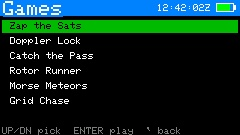

Press **`z`** on the About screen to open a menu of six small games — something to do while
waiting on a pass, most of them a light nod to real satellite operating. Use **`;`/`.`** (or
up/down) to move through the list and **ENTER** to launch the highlighted game; **`` ` ``**
returns to About. Several of the games can use the **IMU tilt** as well as the keyboard.
Game sounds follow the speaker-volume setting and can be silenced with **Game sound: off**
in Settings.

**Zap the Sats** — a Space-Invaders homage where the "invaders" are satellites and your
"gun" is a ham operator holding an arrow antenna that fires signals upward. **`T`**/**`U`**
move left/right (`,`/`/` also work, as does tilt), **space** fires, **ENTER** starts a game (and advances a wave or retries after
one ends). Clearing a wave speeds the formation up; letting it reach you costs a life.

**Doppler Lock** — hold your marker on a frequency that drifts along a Doppler-like S-curve,
as if tuning a linear transponder through a pass. Nudge left/right with `,`/`/` (or `a`/`l`,
or tilt); your score accrues while the cursor stays within the passband around the target.

**Catch the Pass** — a satellite arcs across a sky dome; press **space** while it's inside the
workable elevation window to "log" a QSO. Mistime it and you miss; the windows get tighter as
your score climbs. Five misses ends the game.

**Rotor Runner** — a genuine two-axis game: a satellite drifts around the sky and you slew an
antenna crosshair to keep it centered, either by **tilting** the Cardputer (pitch + roll) or
with the **arrow keys** (`a`/`l` and up/down). Score accrues while you're on target.

**Morse Meteors** — letters fall and you clear each by keying its Morse code. Key with two
keys: **`t`** (or `.`/`,`) for a dot and **`u`** (or `/`/space) for a dash — a real CW
sidetone sounds, with the dash three times the dot length. (T/U are used rather than F/H
because `h` is the global Help key; the **Morse swap** setting flips which is dot/dash.)

**Grid Chase** — a Maidenhead grid-square trainer: a location hint is shown and you pick the
correct grid from four options against a countdown. Use `;`/`.` (or up/down) then **ENTER**,
or press **`1`–`4`** to answer directly.

### License & credits

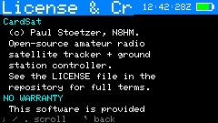

- **Purpose** — license pointer and no-warranty/hardware disclaimer, credit for the
  outside data sources (Celestrak/SpaceTrack, NOAA SWPC, Open-Meteo, hams.at,
  SatNOGS/AMSAT), acknowledgements, and a recommendation to support AMSAT.
- **Reached from** — `l` on the About screen.
- **Keys** — `;`/`.` scroll; `` ` `` back to About.

### Edit (text/number entry)

- **Purpose** — the shared on-screen editor used by every field that needs typed
  input (frequencies, SSID/password, grid, callsign, host/port, clock, etc.).
- **Reached from** — automatically, whenever a field is opened for editing.
- **Shows** — the field title, the current buffer, and the entry footer. Certain
  fields default to **uppercase** (callsign, grid, SSID and similar) — hold shift
  for lowercase.
- **Keys** — type to enter; **DEL** backspace; **ENTER** accept; `` ` `` cancel.

---

## 22. Key reference (cheat sheet)

> A **printable version** of this reference is included as
> `CardSat_CheatCard_4x6.pdf` — a **4×6** landscape index card, front and back
> (two pages). Print at actual size; the front covers operating and the back
> covers setup and tools. Regenerate it with `python3 tools_make_cheatcard.py`.

**Global:** `;` up · `.` down · `,` left · `/` right · ENTER select · `` ` ``/DEL back · `{`/`}` page · `b` screenshot · `h` help · **`Fn`+back (`` ` ``/DEL) = emergency stop** (disengages all radio + rotator control from any screen).

| Screen | Keys |
|---|---|
| **Satellites** | `f` favorite · `v` favorites-only · `n` new GP sat · `x` delete manual sat (2-press) · `e` EQX table (OSCARLOCATOR) · `k` OSCARLOCATOR · `3` 3D globe · `2` sat-to-sat visibility · `o` orbital analysis · `y` simulation · `t` transponder database · `d` 10-day overview · `i` illumination · ENTER passes · right-edge AMSAT mark: filled dot = heard, filled square = telemetry only, ring = not heard, none = no reports · colored down-arrow = decaying orbit (yellow watch / orange decaying / red imminent) |
| **Orbital analysis** | `,`/`/` page (Info / Live / Next pass / Ground track / Doppler / Nodal / Sun-Beta / Pass outlook / Orbit position / Phys) · Info: footprint diameter now/apogee/perigee (= longest possible QSO) + decay estimate & solar-bracket range · Live: az/el/range/Doppler, mean anomaly/phase, sunlit/eclipse + **eclipse depth** (deg; >0 = in shadow) · Next pass: slant ranges + path delay + peak eclipse depth · Doppler: `f` set beacon freq, peak shift + max range-rate · Nodal: J2 node/perigee drift, sun-sync, LTAN, repeat track, longest pass · Sun/Beta: solar beta angle, full-sun vs eclipsed, eclipse %/orbit, next transition · Pass outlook: 7-day pass count/>30° count/longest/avg gap + the best upcoming pass (elevation, when, duration) · Orbit position: mean/true anomaly, argument of latitude, time to perigee/apogee, RAAN, rev number · Phys: orbital velocity now + apo/peri spread, launch year/number + years in orbit (from the COSPAR ID) · `r` recompute · **`p` print report** · `` ` `` back |
| **Simulation** | `,`/`/` step time · `;`/`.` step size · `m` world-map view (sub-point + footprint at the simulated time) · `x` reset to now · `` ` `` back |
| **Next Passes** | ENTER track · `m` world map · `r` refresh · `z` deep-sleep until AOS |
| **Passes** | `;`/`.` select · `d` detail · `t`/ENTER track · `n` add TX · `r` recompute · `x` mutual · `v` 10-day · `i` illum · `g` workable grids (this pass) · `w` workable US states (this pass) · `e` workable DXCC (this pass) |
| **Pass detail** | `p` polar of this pass · `` ` ``/ENTER back |
| **Pass polar** | `p` back to curve · `` ` ``/ENTER passes |
| **Track** | `m` TUNE/CAL · `d` cycle tune mode (FULL/DL/UL/hold) · `t` next TX · `n` jump to beacon · `N` per-sat operating note · `k` CW both legs (linear) · `c` CTCSS tone · `r` radio on/off · `o` rotator on/off · `p` polar · `z` large-font readout · `y` tilt tuning on/off (if IMU) · `f` Manual mode · `l` log QSO · `v` voice memo (SD card; also drops a **log stub** to finish after LOS) · after LOS: `q` (60 s window) deep-sleeps until the next favorite pass · `i`×2 report Heard to AMSAT (mode-aware) · `g` workable grids now · `w` workable US states now · `e` workable DXCC now (radio/rotator keep running) · ENTER save cal |
| **Large-font readout** (`z` from Track) | big RX/TX + az/el + tune mode · `,`/`/` tune · `s`/`x` step/center · `m` TUNE/CAL · `d` mode · `t` next TX · `n` beacon · `k` CW (linear) · `r` radio · `o` rotator · `y` tilt · `l` log · `v` voice memo · `z`/`` ` `` back to Track |
| **Manual large-font** (`z` from Manual) | HOLD/TUNE legs in big digits · `u` swap leg · `,`/`/` tune · `s`/`x` · `m` CAL · `t` next TX · `z`/`` ` `` back to Manual |
| **Manual mode** (`f` from Track) | no-radio frequency calculator · `u` toggle which leg is fixed (HOLD vs TUNE>) · `,`/`/` move fixed freq in passband (linear) · `s` step · `x` center · `m` CAL · `t` next TX · `l` log · `p` polar · `g` grids (all return here) · ENTER save cal · `` ` ``/`f` back to Track |
| **Workable grids** | 4-char Maidenhead grids under the footprint (per-pass union or live, refreshing ~3 s; uncapped, works to high orbits) · count shown on a cyan line above the list · `;`/`.` and `{`/`}` scroll · `` ` `` back |
| **Track · TUNE** | `,`/`/` tune ∓ · `s` step (100/1k/5k) · `x` recenter |
| **Track · CAL** | `,`/`/` downlink ∓ · `;`/`.` uplink ∓ · `s` step (10/100/1k) · `x` zero |
| **Polar** | `l` log QSO · `v` voice memo (SD card) · `p`/ENTER/`` ` `` back to track |
| **Log (menu)** | `;`/`.` select · ENTER → new QSO / browse / export ADIF / voice memos / LoTW upload / notes |
| **Log · list** | `;`/`.` scroll · ENTER edit entry · `` ` `` back |
| **Log · entry** | `;`/`.` field · ENTER edit · `s` save · `x`×2 delete · `` ` `` back |
| **Notes (browser)** | `;`/`.` select · ENTER open · `n` new · `d`+ENTER delete · `` ` `` back · list shows last-saved date/time (UTC), newest first |
| **Notes (editor)** | type freely (ENTER = newline, DEL = backspace) · **Fn+`,`/`/`** cursor L/R · **Fn+`;`/`.`** cursor up/down · **Fn+`s`** save (names it the first time) · `` ` `` exit (auto-saves) |
| **Mutual** | `;`/`.` scroll · `` ` ``/ENTER back to passes |
| **10-day** | `;`/`.` scroll ∓1 day (forward indefinitely, oldest day off the top; not before today) · `r` recompute · **`p` print report** · `` ` ``/ENTER back |
| **Illum** | `,`/`/` scroll ∓1 day (forward indefinitely; not before today) · `r` recompute · **`p` print report** · `` ` ``/ENTER back |
| **Location** | `e`/`o`/`a` lat/lon/alt · `g` grid · `p` GPS on/off · `s` GPS source · `c` set clock · `v` live GPS position · ENTER GPS sky plot |
| **Live GPS position** | DMS + decimal lat/lon, altitude, grid, speed, course · `` ` `` back |
| **GPS sky plot** | live GNSS az/el colored by signal · `` ` `` back |
| **Messages** | LoRa CardSat-to-CardSat chat · `n` write/send · `;`/`.` scroll · `r` retry radio · `` ` `` back |
| **World map** | `f` cycle highlighted favorite · `c` recenter on QTH / 0° (sun terminator drawn automatically) · `` ` `` back |
| **Rotator (manual)** | `,`/`/` az · `;`/`.` el · `s` step · `x` stop · *(Yaesu direct only)* `1`/`2`/`3`/`4` capture ADC at az 0 / az full / el 0 / el full · `` ` `` back |
| **Home menu** | `;`/`.` move · ENTER open · any letter jumps to the next matching item (repeat cycles) |
| **Help** | `;`/`.` scroll · `g` glossary · `m` guide · `s` sat history · `t` tech help · `l` learn · `o` orbit animations · `f` band plan / frequencies · `` ` `` back |
| **Update** | `k`/ENTER GP (+clock/AMSAT/space-wx/weather) · `f` fast (GP + AMSAT + fav TX) · `a` cache all TX · `w` WiFi only |
| **Settings** | `,`/`/` change · ENTER edit/toggle · `s` scan WiFi (on SSID row) · (Reset = type ERASE) |
| **GP source** | pick **AMSAT** / any **CelesTrak** JSON-PP category (Amateur Radio first) / **Custom URL** · `;`/`.` move · `{`/`}` page · ENTER select |
| **Sun / Moon** | graphical sky-dome view (Sun/Moon glyphs on a polar dome) · `g` toggle graphic/data list · `;`/`.` pick Sun/Moon · `o` rotor track on/off (takes the rotator from sat tracking) · `s` sky sources (radio sources/planets) · `t` Sun/Moon transit finder · `e` EME / moonbounce · auto-parks while the body is below the horizon · header shows SUN/MOON tag on other screens · `x` stop · `` ` `` back |
| **Space Wx** (main menu) | solar 10.7 cm flux + planetary Kp + running A index, each labeled & color-coded, with a plain-language HF/satellite operating outlook and a data-freshness note · shows cache then auto-fetches on entry (if on WiFi) with an "Updating Space Wx" bar + result · also refreshes with Update · `p` HF/6m propagation guide · `r` refresh · `` ` `` back |
| **Weather** (main menu) | terrestrial current conditions + multi-day forecast for the operating site from Open-Meteo · current temp/sky/wind/humidity then per-day hi/lo & precip chance · shows cache then auto-fetches on entry (if on WiFi) with an "Updating Weather" bar + result · also refreshes with Update · `r` refresh · cached offline · `` ` `` back |
| **QRZ Lookup** (main menu) | callsign lookup via QRZ.com XML (needs a QRZ XML subscription + credentials in Settings → Network) · ENTER type a callsign · shows name/address/country/grid/class · WiFi required · `` ` `` back |
| **EME / moonbounce** (Sun/Moon → `e`) | self-echo Doppler per band (50/144/432/1296/10368, topocentric) · range + rate · degradation vs perigee · galactic sky-noise flag · red SUN flag <10° · `p` 30-day plan (dec + degr, `;`/`.` scroll) · `m` mutual-Moon window vs DX grid (`g` grid, `;`/`.` select) · `o` point rotator at Moon · `x` stop · `` ` `` back |
| **Grid dist/bearing** (main menu) | great-circle distance + heading to a Maidenhead grid (short/long path, km/mi) · `g` grid · `q` QRZ→grid lookup · `o` point rotator at bearing (el 0) · `x` stop · `` ` `` back |
| **QRZ → grid** (Grid dist/bearing → `q`) | resolve a callsign to its grid · `c` callsign · ENTER use grid in the calculator · `` ` `` back |
| **HF/6m propagation** (Space Wx → `p`) | band guidance from solar flux + Kp: HF conditions, 10/15/20 m open/marg/shut, geomagnetic, auroral VHF, absorption · rule-of-thumb (6 m Es seasonal) · `r` refetch · `` ` `` back |
| **Transponder DB** (Satellites → `t`) | scrollable list of the selected satellite's transponder/beacon entries (description; **D** downlink + mode; **U** uplink + tone/inv/lin flags) · `;`/`.` scroll · `` ` `` back |
| **Edit** | type · DEL backspace · ENTER ok · `` ` `` cancel |
| **About** | build/version, IP, free heap and diagnostics (read-only) · `r` station readiness checklist · `l` license · `z` games |
| **Printing** (contextual) | `p` prints the current screen's report on the printable screens (Passes day-sheet, Mutual, DX Doppler, EQX, Target-search, Pass detail/polar, **Orbital analysis, Illumination, 10-day passes, 6-hour timeline**) · `P` prints all-favorite passes from the schedule · `Fn`+`p` prints the note in the note editor · About → `p` opens a Print submenu listing **every** report; About → `a` Support-AMSAT card; About → `c` operator contact card |

---

## 23. Glossary

- **AOS / LOS** — Acquisition / Loss of Signal: when the satellite rises above and
  sets below your horizon.
- **TCA** — Time of Closest Approach (maximum elevation).
- **Azimuth / Elevation** — compass bearing (0°=N, clockwise) and angle above the
  horizon to the satellite.
- **Range / range-rate** — slant distance to the satellite and how fast it's
  changing (drives Doppler; +ve = receding).
- **Doppler shift** — the frequency change caused by relative motion.
- **Downlink / uplink** — the satellite's transmit frequency (you receive) and
  receive frequency (you transmit).
- **Linear transponder** — relays a band of frequencies (SSB/CW), as opposed to a
  single FM channel. May be **inverting** (flips the spectrum) or non-inverting.
- **Passband** — the range of frequencies a linear transponder relays.
- **GP / OMM** — General Perturbations data / Orbit Mean-elements Message: the
  orbital element set (distributed as JSON) that SGP4 propagates. Replaces the
  legacy **TLE** (Two-Line Element) text encoding, which CardSat still rebuilds
  internally to feed the propagator.
- **SGP4** — the standard model that turns an element set into position/velocity over time.
- **Maidenhead grid** — the locator system (e.g. `FM18`) for your station position.
- **Eclipse / sunlit** — whether the satellite is in Earth's shadow or illuminated.
- **CAT** — Computer Aided Transceiver control: the generic term for computer
  control of a radio. CardSat speaks three CAT dialects — Icom **CI-V**, Yaesu, and
  Kenwood — behind one abstract rig interface, over a wired serial bus or (for the
  **IC-9700**) the **Icom LAN** RS-BA1 protocol.
- **CI-V** — Icom's Communications Interface-V serial control bus (Icom's CAT dialect).
- **MAIN / SUB** — the two VFOs/bands of a satellite-capable radio; by default
  CardSat uses MAIN for uplink and SUB for downlink (the **VFO Type** setting swaps
  them).
- **One True Rule** — KB5MU's principle: tune so the frequency *at the satellite*
  stays constant; the computer corrects both legs for Doppler.

---

## 24. Supporting AMSAT

CardSat exists because of the work **AMSAT** and its volunteers do — building and
keeping amateur satellites flying, publishing the orbital data this app depends on,
and advocating for amateur radio in space. **If you find CardSat useful, please
consider joining and/or donating to AMSAT at [www.amsat.org](https://www.amsat.org/).**
Membership and donations directly fund the next generation of satellites you'll
track and work with this very tool.

---

## 25. License

CardSat is released under the **MIT License**.

> Copyright (c) 2026 Paul Stoetzer (N8HM)
>
> Permission is hereby granted, free of charge, to any person obtaining a copy of
> this software and associated documentation files (the "Software"), to deal in the
> Software without restriction, including without limitation the rights to use, copy,
> modify, merge, publish, distribute, sublicense, and/or sell copies of the Software,
> and to permit persons to whom the Software is furnished to do so, subject to the
> following conditions:
>
> The above copyright notice and this permission notice shall be included in all
> copies or substantial portions of the Software.
>
> THE SOFTWARE IS PROVIDED "AS IS", WITHOUT WARRANTY OF ANY KIND, EXPRESS OR IMPLIED,
> INCLUDING BUT NOT LIMITED TO THE WARRANTIES OF MERCHANTABILITY, FITNESS FOR A
> PARTICULAR PURPOSE AND NONINFRINGEMENT. IN NO EVENT SHALL THE AUTHORS OR COPYRIGHT
> HOLDERS BE LIABLE FOR ANY CLAIM, DAMAGES OR OTHER LIABILITY, WHETHER IN AN ACTION OF
> CONTRACT, TORT OR OTHERWISE, ARISING FROM, OUT OF OR IN CONNECTION WITH THE SOFTWARE
> OR THE USE OR OTHER DEALINGS IN THE SOFTWARE.

Third-party components keep their own licenses: SGP4 propagation
([Hopperpop/Sgp4-Library](https://github.com/Hopperpop/Sgp4-Library)), GP data from
AMSAT, and transponder data from SatNOGS.

---

*CardSat is amateur-radio software. Operate within your license privileges and
local band plans. Built on SGP4 (Hopperpop), GP data from AMSAT, and transponder data
from SatNOGS.*
