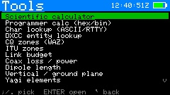
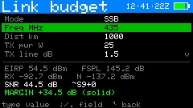
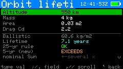
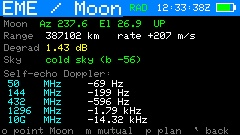
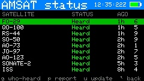
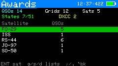

# CardSat — Cardputer ADV satellite tracker + multi-radio CAT Doppler control

A self-contained, offline-first amateur-radio satellite tracker for the
**M5Stack Cardputer ADV** (ESP32-S3). It downloads GP (orbital element) data — from
**AMSAT** by default, any **CelesTrak** group, or a custom URL — plus
transponder data over WiFi, predicts passes with SGP4, and drives an Icom, Yaesu, or
Kenwood radio over CAT with real-time Doppler correction — using the AMSAT
**"One True Rule"** (constant frequency *at the satellite*), per-satellite
calibration, an all-favorites pass schedule, an AOS alarm, visual-pass and Sun/Moon
transit prediction, sun/eclipse status, and more.

> **Status: running on hardware; most CAT control still being verified on the air.**
> CardSat runs on the Cardputer ADV, and every feature has been exercised on the
> device. Pass prediction, the polar and pass-detail plots, mutual-window search, GPS,
> the AOS alarm, deep sleep, and the offline GP/transponder caches are all confirmed.
> **Single-pin CI-V is confirmed working on an IC-821** (full bidirectional exchange
> over one wire). The other per-protocol CAT encoders (separate-pin CI-V, Yaesu,
> Kenwood), the **Icom LAN (RS-BA1)** backend, and the rotator backends are host-tested
> but not yet confirmed against that specific hardware — verify those on the air.
> **CAT over USB is confirmed on an IC-821 + FTDI**; running a radio and a rotator on USB
> *at the same time* is built and guarded but has never been tested with two adapters. See
> **[docs/THINGS_TO_VERIFY.md](docs/THINGS_TO_VERIFY.md)**. What stands between here and a
> 1.0 release — deferred work, security decisions, and the hardware-verification gap — is
> tracked in **[docs/ROADMAP_TO_1.0.md](docs/ROADMAP_TO_1.0.md)**.

> **New in v0.9.64:** **USB control that lets go.** Turning a USB CAT radio or USB rotator off
> now actually frees the ~12 KB it was holding (thanks to a library upgrade), rather than only
> on reboot — and every "off" path, on every screen, releases the device. Radio and rotator can
> both run over USB on two adapters, in either engage order. Both the radio model list and the
> rotator type selector gained an explicit **None**, so CardSat runs cleanly as a pure
> tracker/rotator controller. The Dual-Rig setup screen was redrawn to fit the display without
> overlapping text.
> See the **[release notes](docs/releases/RELEASE_NOTES_0.9.64.md)**.

> **New in v0.9.63:** **BASIC that behaves, and a lighter, steadier device.** The on-device
> Tiny BASIC gets a round of hardware-tested fixes: graphics programs hold their frame until
> you press a key, a `SATSEL` catalog scan no longer overflows the stack or aborts on a
> decayed satellite, and there's a **file browser** (Fn+l) for loading programs. Under the
> hood, a systematic memory campaign returns about **17.9 KB** of permanent RAM by allocating
> screen-scoped buffers on demand, and the drawing canvas moves out of the heap so the free
> block stays steady through LoTW / Cloudlog uploads instead of collapsing — both of which
> matter on the no-PSRAM ESP32-S3.
> See the **[release notes](docs/releases/RELEASE_NOTES_0.9.63.md)**.

> **New in v0.9.62:** **the microwave bands, and two radios working as one.** Frequencies
> and Doppler are now **64-bit** — the old 4.29 GHz ceiling is gone, so C/X/Ku downlinks and
> 10 GHz QO-100-style birds track and display correctly — and new **transverter LO** offsets
> let a 1.2 GHz rig work 2.4/10 GHz through an up/down-converter. A **dual-radio** path lands:
> the **CardSatDualRig** companion (M5StickS3) turns two half-duplex/RX radios into one
> full-duplex station over a Hamlib `rigctld` server; CardSat drives it over **rigctl (net)**
> or the new **rigctl (Grove)** cable transport and configures it from an on-device **Dual-Rig
> setup** screen that shows the Stick's live USB enumeration; and a mirror **`<FULLu>`**
> tune mode follows the **uplink** knob for setups where that's the radio with the dial. Plus
> **calendar (.ics) export**, a documented **`/api/status`** JSON contract, and a
> gyro/accelerometer **hand-pointing aid**.
>
> ⚠️ **Two areas ship untested on hardware:** the **transverter/microwave** path and the whole
> **dual-radio** path (companion, Grove rigctl, Dual-Rig screen, `<FULLu>`). Both compile
> clean and are verified against the code and specs, but need the hardware they're for (a
> transverter; two live radios on a Grove-tethered Stick) to confirm — treat first use as
> verification. Everything else runs on the Cardputer as before.
> See the **[release notes](docs/releases/RELEASE_NOTES_0.9.62.md)**.

> **New in v0.9.61:** **space weather that reads like an operating picture — and a station
> that works the terrestrial bands too.** Solar flux and Kp grow into a full suite: **GOES
> X-ray flares**, **real-time solar wind (Bz + speed)**, **sunspot number**, a **band-by-band
> HF outlook** with a **MUF estimate**, a **VHF sporadic-E flag**, today's **radio-blackout
> forecast**, and the **3-day Kp** — all of it printable and readable from BASIC. A family of
> **VHF/UHF/microwave path tools** (radio horizon, Fresnel clearance, tropo ducting, rain
> fade, terrestrial path budget, terrain profile) lands for terrestrial weak-signal work,
> and the **EME** suite gains dedicated-software analysis quantities and a **90-day planner**.
> The **Weather** screen grows an outdoor **field-conditions page** — feels-like, gusts,
> pressure trend, UV, sun times — with **independently selectable units** and a printable
> report. The sixty offline **Tools** are reorganized into **six navigable categories**.
> See the **[release notes](docs/releases/RELEASE_NOTES_0.9.61.md)**.

> **New in v0.9.60:** **a game you can play over the air, a sky full of stars, and a device that's
> harder to fragment.** **KESSLER** — the two-player GORILLAS.BAS-style artillery duel added this
> cycle — now plays **head-to-head over LoRa**: one Cardputer hosts, another joins, and a
> deterministic-lockstep design (shared seed, three tiny frames) keeps both screens in sync with
> nothing streamed. The **Sky sources dome grows a live star field** — 1,018 stars to magnitude
> 4.6, constellation lines, and the sixteen brightest named, all recomputed from the clock (`c`
> cycles layers; ~9 KB of flash from d3-celestial's BSD-3 data). **Five named QTH presets** (`q` on
> the Location screen) recall a station instantly and turn GPS off. A real fix lands for **high-orbit
> pass length**: the 60-minute ceiling was in the finder, not just the formatter — the Schedule
> scan is now adaptive, so a Molniya reads its true multi-hour length and a GEO reads `24h`. **Voice
> memos now work alongside USB CAT**, gated on live heap headroom rather than refused outright.
> Every selection list **wraps** top-to-bottom, the **Tools/Home/Settings menus were reordered**
> for logical grouping, and two rounds of **RAM-fragmentation hardening** convert the hottest
> String buffers (LAN CAT/rotator/HTTP line assembly, the CAT monitor) to fixed storage. Both 4×6
> reference cards and the full manual PDF are refreshed.
> See the **[release notes](docs/releases/RELEASE_NOTES_0.9.60.md)**.

> **New in v0.9.59:** **a satellite workbench, BASIC that reaches everything, honest higher-orbit
> passes, and a device that's a better citizen.** **Twenty new tools** join the Tools menu — a full
> satellite & construction bench (conjunction screener, orbital neighborhood, debris-group screen,
> link-margin curve, thermal, cascade NF, and more), every form tool now **prints** with `p` (one
> refactor, all 34), and the four new screens print contextual reports. **Search all of CelesTrak**
> from the satellite list (`/`, by name or catalog number) and anything you add becomes an
> **auto-updating favorite** — with built-in courtesy throttles (2 h per source, persisted across
> reboots) on both the extras *and* the primary catalog fetch. **Tiny BASIC** gains `MOD`,
> `AND/OR/NOT`, a `DIM @(n)` array, `DATA/READ/RESTORE`, `ON…GOTO`, and a system bridge:
> `SATSEL i` re-runs SGP4 for *any* catalog satellite (host-verified `lookFor`, ≤0.0003° vs the
> live path), `TXSEL`, pass lookahead `PASSAOS/LOS/MAX(k)`, GPS/device names — plus canvas
> **graphics** (`CLS…SHOW`, the frame holds after the run), `LPRINT` through the report sinks, and
> Settings-gated file logging. Still **no `INPUT`**, by design. The calculators become instruments:
> ~25 new functions (two-argument `atan2/ncr/fspl/dop…`), and the grapher gains Y2, a trace cursor
> with dy/dx, zero/intersection finding, Simpson ∫ between marks, a table view, and a flat-RAM
> **CSV plot mode**. **Pass prediction now covers Molniya/GTO/GEO**: a scan-and-bisect finder for
> periods over ~225 min, Skyfield-verified (crossings ≤0.04°; a bird parked in view reports one
> honest horizon-long pass). **USB CAT is on by default**; USB device strings lead with **`#N`** so
> two identical adapters are tellable apart. AMSAT status, **hams.at** (favorites tint green), and
> **LoTW** (CelesTrak-named QSOs auto-resolve) share one source-independent name bridge. Under the
> hood: an orbital-math audit (zero defects), a RAM/heap audit with fixes (JSON-churn eliminated,
> streamed rewrites, `SatEntry` repacked 144→136 B), and a compiled-image audit. Two 4×6 cards now
> ship: the **key reference** and a new **hardware/data/calc/BASIC reference card**.
> See the **[release notes](docs/releases/RELEASE_NOTES_0.9.59.md)**.

> **New in v0.9.58:** **CAT over USB, rotators on any wire, and logs that outlive the console.**
> A fourth CAT transport — a **USB↔serial adapter** on the USB-C port, no level shifter — works for
> every protocol and every radio, and is **bench-proven on an IC-821** through engage, disengage and
> re-engage. The three serial **rotator** protocols (GS-232, Easycomm I/II/III, SPID) now run over
> the **I2C bridge, the Grove port, or a USB adapter**, chosen as a separate setting from the
> protocol; CardSat enforces the one-Grove-port rule in both directions. Radio **and** rotator can
> share the USB host, each bound to an explicitly chosen adapter — *experimental, untested with two
> adapters*. Engaging USB claims the S3's one USB PHY and the console does not come back, so the
> diagnostics moved: **`/CardSat/Logs`** holds a capped USB trace, and **Console to file** (Settings
> → Station / logging, default off) mirrors the whole serial console to disk — retrievable from the web files
> portal, on SD or bare flash. Plus **~23 KB more free heap** (`.bss` 145,904 → 122,336), a
> **rotator setting that stopped silently reverting to GS-232 on every boot**, and a task-watchdog
> reset during LoTW uploads, removed.
> See the **[release notes](docs/releases/RELEASE_NOTES_0.9.58.md)**.

> **New in v0.9.57:** **BASIC that can see the sky, and a lot more that prints.** Tiny BASIC
> programs can now read the system's own data as bare names — `SATAZ`, `SATEL`, `AOSIN`, `SFI`,
> `KP`, `MOONEL`, `MYLAT`, UTC and more — so a five-line program can tell you where to point and
> how long you've got. It costs **zero permanent RAM**: the values are snapshotted once per run
> into the interpreter's own state and freed with it, and missing data **halts with an error**
> rather than handing a program a plausible-looking zero. **Nine more reports print**, including
> **EME / moonbounce**, which had none — self-echo Doppler per band, path degradation, the 30-day
> plan, and the mutual-Moon window against a DX grid — plus QRZ results, station readiness,
> awards, the visible-pass list, and the **workable states/DXCC entity lists** (the counts already
> printed; *which* entities never did). The on-device **Help** was audited against the actual key
> handlers and corrected — it had been naming the wrong key on the Satellites screen — and gained
> the printing and EME topics it never had. Fixes: a runaway BASIC program no longer holds 6 KB
> for the rest of the session (which could starve a LoTW upload), `h` and `b` no longer get stolen
> on screens where you type, **every** screen can now take a screenshot, and the orbit report
> includes **LTAN**.
> See the **[release notes](docs/releases/RELEASE_NOTES_0.9.57.md)**.

> **New in v0.9.56:** **a pocket workbench — and reports that look like the screen.** Tools
> gains a **Tiny BASIC** interpreter with an on-device editor (line-numbered BASIC, 4 KB programs,
> `Fn`+`R` to run — bounded so a runaway loop can't hang the radio), a **graphing calculator**
> that plots `y = f(x)` with the scientific calculator's own parser, and a **location converter**
> showing one position as Maidenhead, decimal, DMS, DDM, **Plus Code**, **UTM**, **MGRS**, and
> **USNG** (every projection validated byte-for-byte against reference implementations). The
> Tools menu is regrouped **compute-first**, and the tools **print** — listings, output,
> conversions, calculator results. Four printable reports join the roster (**orbital analysis**,
> **illumination**, **10-day passes**, **6-hour timeline**), the visual ones carrying **ASCII
> renderings of their screens**; orbital analysis is now a **permanent record** of an element
> set's characteristics rather than a snapshot of live values. A global **Fn+Back emergency
> stop** halts all radio/rotator control from any screen, and **memory diagnostics** (`mem`,
> `memtrace`) land for measuring the heap.
> See the **[release notes](docs/releases/RELEASE_NOTES_0.9.56.md)**.

> **New in v0.9.55:** **CardSat prints — everything, three ways.** Turn any of **nineteen
> reports** into paper on a network **ESC/POS** printer (TCP 9100; reference targets are Epson's
> battery **TM-P20II Wi-Fi** and the 80 mm **GZM8022**), copy them out of the **USB serial console**
> with no printer at all, or save an 80-column **/CardSat/Reports/*.txt** to the SD card — any combination.
> Reports print **contextually** (`p` on the screen that shows the data — passes, mutual windows, DX
> Doppler, EQX, target search, a pass's **ASCII sky-track** map, notes), with an **About → Print**
> submenu listing every report that doesn't depend on a tool's transient state. Two are made for outreach: a **Support AMSAT** page and an **operator
> contact card** that explains ham radio and satellites to the public. **Paper width** is a setting
> (58 mm / 80 mm / Font B). Streamed line-by-line — zero resident memory. Eight page-description
> languages are supported, from ESC/POS receipt to **on-device PWG/URF raster** — so besides the
> field receipt printer it targets, CardSat can also print to the driverless / **AirPrint** printers
> that make up most home and club printers (believed to be a first among Cardputer projects).
> Bluetooth isn't supported (the ESP32-S3 has no Bluetooth Classic). The full technical write-up is
> in **[docs/design/PRINTING_IMPLEMENTATION.md](docs/design/PRINTING_IMPLEMENTATION.md)**; the design
> story is in `docs/design/PRINTING_SCOPE.md`. See the
> **[release notes](docs/releases/RELEASE_NOTES_0.9.55.md)**.

> **Earlier releases** — one line each; full stories in [docs/releases/](docs/releases/):
> **0.9.54** big satellite lists handled honestly (favorites-first loading, preflighted
> downloads), serial console, CubeSatSim C2C reference, Learn corner ·
> **0.9.53** memory & reliability — LoTW/Cloudlog upload fixes, 4-bpp display, on-demand audio, multi-file web download ·
> **0.9.52** workable-horizon & target-search planners + the 130-page manual ·
> **0.9.51** rove pass-planner + state-vector→GP tool · **0.9.50** mode-aware AMSAT status
> reporting, ordered transponder lists · **0.9.49** SD-persistence fix (LoRa-absent units) ·
> **0.9.48** Tools hub grows to twenty (calculators, DXCC/zone databases, mission-planning) ·
> **0.9.47** two-keypress AMSAT status reporting, Tools hub debut · **0.9.46** VHF/UHF/microwave
> & EME release · **0.9.45** web control panel for working a pass · **0.9.44** LoRa station
> roster · **0.9.43** HTTPS moved to BearSSL (network reliability) · **0.9.42** large
> LoTW/Cloudlog uploads via automatic batching.
>
> **In v0.9.40:** an **out-of-passband warning** — tuning a linear transponder's knob
> past either edge of the passband now flashes a warning while CardSat pulls you back —
> plus **received LoRa messages wrap** to a second line instead of being cut off. Logging
> gains a fix: **editing a QSO re-arms its upload** (the corrected record is re-sent to LoTW
> and Cloudlog), and the Edit QSO screen now has **LoTW/Cloudlog flag rows** you can toggle to
> override that. The on-device **Help** screen also gains five built-in references — a
> **Glossary & math**, a **User guide**, a **Ham satellite history**, a **Tech help** guide
> (antennas, feedline, pointing, working a pass, and the interfaces), and a **Learn** screen
> (radio + orbital theory) — and **About** gains a **License & credits** screen. New
> operating aids: a **point-here arrow** for hand-aiming (`a` on Track), a **"what's overhead
> now"** screen, **sked reminders** set from the activations feed, an **aurora-likelihood**
> line on Space Wx, and **rise directions** in the visible-pass list. There's also a guide to
> **curating your own GP data** for offline/SD-card use instead of the online update. See the
> **[release notes](docs/releases/RELEASE_NOTES_0.9.40.md)**.
>
> **In v0.9.39:** **LoRa messaging is hardware-verified.** Two-way LoRa text messaging
> between CardSat and a LilyGo T-LoRa unit running the companion CardSat Pager firmware is
> confirmed working — this release fixes a bug where a sent message could echo back to you
> (a transmit-complete interrupt was being mistaken for an incoming packet). See the
> **[release notes](docs/releases/RELEASE_NOTES_0.9.39.md)**.
>
> **In v0.9.38:** **logging polish + an upload failsafe for LoTW.** When you log a
> QSO from a live tracking screen, the **Call** field is now pre-selected so you can type
> the callsign right away, and the **QSO log lists newest-first**. The automatic
> **reboot-to-upload** failsafe (confirm with ENTER, cancel with `` ` ``) now covers
> **LoTW** as well as Cloudlog — for the rare post-long-session "connection refused" — and
> the upload screen now updates the moment an upload finishes. The **Space Wx**,
> **Weather**, and **Activations** screens now refresh the same way — show cached data
> immediately, fetch in the background with an "Updating…" bar, then a brief result. See
> the **[release notes](docs/releases/RELEASE_NOTES_0.9.38.md)**.
>
> **In v0.9.37:** **worldwide LoTW locations and an easier certificate setup.**
> The LoTW station fields now cover **non-US entities** — Settings has a DXCC-aware
> **subdivision picker** (Canadian province, Russian oblast, Japanese prefecture,
> Chinese province, Australian state, Finnish kunta) plus an **IOTA** field, all signed
> into the upload at the exact field/order LoTW expects. (US state + county are
> unchanged.) Getting your certificate onto the card is simpler too: a **browser-based
> converter** (`tools/lotw_cert_converter.html`) turns the `.p12` you export from TQSL
> into the two `.pem` files CardSat needs — entirely in your browser, offline, with your
> private key never leaving your computer (no more `openssl` command line). Plus: the
> **upcoming-activations** list (hams.at) is now **cached to the card** so it shows the
> last-known roster with no WiFi, and the **Update** screen's `k` now **pulls activations
> alongside the GP update**. See the
> **[release notes](docs/releases/RELEASE_NOTES_0.9.37.md)**.
>
> **In v0.9.36:** **upload to Cloudlog / Wavelog.** CardSat can now send your
> satellite QSOs straight to a self-hosted **Cloudlog** (or **Wavelog**) online logbook
> over WiFi — set your instance URL, a read-write API key, and your station profile ID in
> Settings, then **Log → Upload to Cloudlog**. Because Cloudlog can forward to LoTW
> itself, it's an alternative to the on-device LoTW upload; the two are tracked separately
> so nothing is double-counted. This release also makes the **LoTW upload work end to
> end** — a CardSat-built satellite QSO now signs, uploads, and **posts to a real LoTW
> account** (the `.tq8` station/contact field names, US county value, and date/time format
> are now exactly what LoTW's processor expects, and an accepted upload is reported
> correctly). Plus: **API keys and passwords are kept out of the USB serial log**, the
> orbital-analysis **altitude no longer reads above apogee**, and **uploads are more
> robust when memory is tight**. See the
> **[release notes](docs/releases/RELEASE_NOTES_0.9.36.md)**.
>
> **In v0.9.35:** a built-in **Notes** editor on the **Log** menu — a free-form,
> multi-page text editor with a file browser, for sked details, grids you still need,
> antenna settings, or any operating reminder. Notes are plain `.txt` files under
> `/CardSat/notes/` (SD card or internal flash), listed newest-first with a saved
> date/time. The editor's commands use the **Fn** modifier so the `;` `.` `,` `/`
> keys stay typeable. This release also fixes a memory bug that could make **LoTW
> uploads fail** on the no-PSRAM Cardputer. See the
> **[release notes](docs/releases/RELEASE_NOTES_0.9.35.md)** and **§8 → Notes** in
> the manual.
>
> **In v0.9.34:** **direct Logbook of the World (LoTW) upload.** CardSat can
> sign your satellite QSOs and send them straight to ARRL's LoTW over WiFi — no PC,
> no TQSL, no separate upload step. It builds the same cryptographically-signed
> `.tq8` TQSL would and posts it to LoTW's self-authenticating service. It needs a
> **microSD card** and your existing LoTW certificate exported to the card (a
> one-time `openssl pkcs12` step); **your private key lives on the SD card**, so use
> a card you control. New **Sign & upload to LoTW** action on the Log menu, plus
> **LoTW DXCC / CQ zone / ITU zone** fields in Settings. Sent QSOs are flagged so
> they're never uploaded twice. Also: an **Activations** screen on the main menu
> that downloads the **hams.at** upcoming-activations feed (roves, grid activations,
> special ops) and lists them with times, mode, frequency and comments.

---

## What it does

- **Constant-frequency-at-the-satellite Doppler** (KB5MU's *One True Rule*) on both
  legs, so your signal never walks through the passband. Tune with the device keys
  **or the radio's own knob** — let go and nothing drifts.
- **Three CAT families, ten radios** behind one rig interface: Icom **CI-V**
  (IC-820/821/910/970/9100/9700), Yaesu (**FT-847**, **FT-736R**), Kenwood
  (**TS-790**, **TS-2000**) — plus native **Icom LAN (RS-BA1)** control of the
  **IC-9700** over WiFi with no wiring.
- **Linear-transponder passband tracking** with correct inversion and automatic
  sideband, and **automatic PL/CTCSS** on FM uplinks.
- **Prediction & planning** — an all-favorites **Next Passes** schedule, **pass-detail**
  and **polar** plots, the **OSCARLOCATOR** live azimuthal board, a **world map** with
  footprints and terminator, **mutual-window** (sat-to-sat) search, a **rove pass-planner**,
  a ten-day **Workable horizon** (union of all reachable states/DXCC/grids) and a
  **Target search** (every pass a chosen place is workable), and **orbital analysis**.
- **Observe the sky** — **visual-pass flags** (sunlit bird + dark sky), **Sun/Moon
  transit** prediction, **illumination/eclipse**, and **decay/reentry** watch flags.
- **Operating aids** — **jump-to-beacon**, per-satellite **calibration** and
  **operating notes**, an **AOS alarm**, **deep sleep until the next pass**, a built-in
  **logbook** (ADIF/LoTW) with DXCC/grid/state tracking, a free-form **Notes** editor,
  **LoRa messaging**, voice memos, and an optional IR-LED pass beacon.
- **Offline-first** — GP elements, transponders, and DXCC data are cached to microSD
  (or internal flash) for full operation with no network.

The complete, detailed feature list is in **[docs/FEATURES.md](docs/FEATURES.md)**.

## Screenshots

*(The captures below were taken on v0.9.49 and show CardSat's core screens, which are
unchanged since. Several features added since — rove planner, workable horizon, target
search, on-device printing, the Files page's multi-select — are not pictured yet; a
screenshot refresh is planned. The current firmware is v0.9.64.)*

A few of CardSat's screens (240×135 native captures). The full set is in the
[manual](MANUAL.md#22-screen-by-screen-reference).

<table>
<tr>
<td align="center"> <b>Track</b> — live Doppler &amp; CAT read-back</td>
<td align="center"> <b>Satellites</b> — the catalog with activity marks</td>
<td align="center"> <b>Next Passes</b> — unified favorites schedule</td>
</tr>
<tr>
<td align="center"> <b>Pass polar</b> — sky track for the next pass</td>
<td align="center"> <b>World map</b> — footprints, sun terminator</td>
<td align="center"> <b>Orbital analysis</b> — nine pages of detail</td>
</tr>
<tr>
<td align="center"> <b>Space Wx</b> — solar flux, Kp, operating outlook</td>
<td align="center"> <b>Illumination</b> — sunlit/eclipse over the orbit</td>
<td align="center"> <b>Home</b> — every screen is one hop away</td>
</tr>
<tr>
<td align="center"> <b>Tools</b> — 35 offline bench &amp; mission tools</td>
<td align="center"> <b>Link budget</b> — EIRP, path loss, SNR, margin</td>
<td align="center"> <b>Orbit lifetime</b> — drag decay vs disposal rules</td>
</tr>
<tr>
<td align="center"> <b>EME / Moon</b> — moonbounce geometry &amp; degradation</td>
<td align="center"> <b>AMSAT status</b> — who's been heard, and report it</td>
<td align="center"> <b>Awards</b> — grids, states, DXCC worked via satellite</td>
</tr>
</table>

## Hardware

- **M5Stack Cardputer ADV** (StampS3A = ESP32-S3FN8, 8 MB flash, **no PSRAM**,
  240×135 IPS LCD, 56-key keyboard, microSD, speaker, Grove port, 2×7 header).
- A **CAT interface appropriate to your radio**, between its control jack and the
  3.3 V GPIO signals. The Grove **power** pin is 5 V and the ESP32-S3 GPIOs are
  **not** 5 V tolerant — never wire CAT direct. Icom = a 3.3 V-safe single-wire CI-V
  interface; Kenwood = a MAX3232 RS-232 level shifter; Yaesu = a serial CAT interface
  (verify TTL vs RS-232).
- *(Optional)* a GPS source (Grove port or an M5Stack Cap LoRa GNSS), and an
  *(optional)* **antenna rotator** — GS-232A/B, Easycomm, or SPID serial over an
  SC16IS750 I²C→UART bridge + MAX3232, the Grove port, or a USB↔serial adapter;
  or a direct-Yaesu I²C interface; or rotctld / PstRotator over the network.

Full pin-by-pin wiring is in **[docs/WIRING.md](docs/WIRING.md)**.

## Install & upgrade

Two prebuilt binaries ship with each release — no toolchain required:

| File | Use with | Notes |
|---|---|---|
| `CardSat-app.bin` | **[Launcher](https://github.com/bmorcelli/Launcher)** | App-only image; Launcher writes the partition table/bootloader. **Preserves saved data** on upgrade. |
| `CardSat-merged.bin` | **M5Burner** / direct flash (esptool / web flasher) at `0x0` | Complete standalone image; carries an empty filesystem. |

Both binaries include **USB CAT** — *USB serial* is in the CAT type row out of the
box (and USB CAT is on by default in source builds too, since 0.9.59).

**Your settings live on the microSD card when one is inserted** (CardSat prefers SD,
under `/CardSat`, and falls back to internal flash otherwise). Flashing never touches
the SD card — so with a card in, your configuration **survives any flash**, including a
full merged flash. Without a card, use **Launcher** (`CardSat-app.bin`) to keep your
internal data across an upgrade; a full `CardSat-merged.bin` flash erases it.

Building from source (Arduino IDE single-file `CardSat.ino`, or PlatformIO) and the
complete flashing/upgrade detail are in **[docs/BUILD_AND_FLASH.md](docs/BUILD_AND_FLASH.md)**
(and the step-by-step **[docs/guides/ARDUINO_SETUP.md](docs/guides/ARDUINO_SETUP.md)**).

> **This testing release ships a prebuilt binary** in **[`firmware/`](firmware/)** —
> `CardSat-merged.bin` (flash at `0x0`) plus the individual bootloader/partition/app
> images and a flashing guide with exact offsets and checksums. See
> [`firmware/README.md`](firmware/README.md). The companion Stick firmware has its own
> prebuilt binary under [`companion/CardSatDualRig/firmware/`](companion/CardSatDualRig/firmware/).

## Quick start

Navigation uses the legends printed on the Cardputer keys:
`;` up · `.` down · `,` left · `/` right · **ENTER** select · `` ` `` or **DEL** back.

1. **Settings** — WiFi (press `s` on the SSID row to scan), radio model, **CAT baud**
   (and CI-V address for Icom), minimum pass elevation, AOS alarm. Once a network is
   saved, CardSat auto-connects and NTP-syncs the clock at every boot.
2. **Location** — set your grid or lat/lon, or enable GPS; set the UTC clock if you
   have no network/GPS.
3. **Update** — download GP data (and NTP time-sync); optionally cache *all*
   transponders for full offline use.
4. **Satellites** — pick a bird (`f` to favorite); transponders load from cache or
   SatNOGS.
5. **Next Passes** — what's coming up across all favorites.
6. **Passes → Track** — live az/el and Doppler; `m` switches TUNE/CAL, `d` cycles
   the tune mode (FULL / DL / UL / hold).

See **[MANUAL.md](MANUAL.md)** for the complete guide.

## Documentation

| Document | What's in it |
|---|---|
| **[MANUAL.md](MANUAL.md)** | The complete user guide — every screen, setting, and workflow. |
| **[docs/FEATURES.md](docs/FEATURES.md)** | Full, detailed feature list. |
| **[docs/BUILD_AND_FLASH.md](docs/BUILD_AND_FLASH.md)** | Prebuilt binaries, upgrading, building from source. |
| **[docs/WIRING.md](docs/WIRING.md)** | CAT, GPS, and rotator wiring. |
| **[docs/interfaces/ROTATOR_TRANSPORTS.md](docs/interfaces/ROTATOR_TRANSPORTS.md)** | Rotator over I2C bridge, Grove G1/G2 or USB: which wires conflict, and the radio+rotator-on-USB guardrails. |
| **[docs/RADIOS.md](docs/RADIOS.md)** | Per-radio behavior: bands, sat mode, read-back. |
| **[docs/THINGS_TO_VERIFY.md](docs/THINGS_TO_VERIFY.md)** | What's confirmed on hardware vs still to test on the air. |
| **[docs/ROADMAP_TO_1.0.md](docs/ROADMAP_TO_1.0.md)** | What stands between here and 1.0: blockers, deferred work, and the decisions behind them. |
| **[docs/interfaces/](docs/interfaces/)** | Electrical/protocol interface specs: CI-V, single-pin CI-V (+ level-shifter build guide), Icom LAN, rotator, RS-232, radio settings chart. |
| **[docs/guides/ARDUINO_SETUP.md](docs/guides/ARDUINO_SETUP.md)** | From-scratch Arduino IDE setup. |
| **[docs/guides/PORTING.md](docs/guides/PORTING.md)** | Porting CardSat (or a subset) to other ESP32 boards or non-ESP32 platforms. |
| **[docs/guides/CODE_REFERENCE.md](docs/guides/CODE_REFERENCE.md)** | File-by-file annotated code reference (interfaces, key functions, data flows). |
| **[docs/guides/CODEBASE_OVERVIEW.md](docs/guides/CODEBASE_OVERVIEW.md)** | Plain-language tour of the codebase for non-developers (what each file does, key concepts). |
| **[docs/DEVELOPMENT_METHOD.md](docs/DEVELOPMENT_METHOD.md)** | How CardSat was built (AI-assisted, hardware-verified) and why that fits the amateur-radio tradition. |
| **[docs/design/](docs/design/)** | Design/scope notes for current and proposed features. |
| **[docs/releases/](docs/releases/)** | Per-version release notes. |
| **[CardSat_CheatCard_4x6.pdf](CardSat_CheatCard_4x6.pdf)** | Printable 4×6 key-reference card (front: operating, back: setup). |
| **[CardSat_RefCard_4x6.pdf](CardSat_RefCard_4x6.pdf)** | Printable 4×6 reference card — radio & rotator support, data sources & courtesy limits, the file map, all calculator functions, the full BASIC language & system names. |
| **[CardSat_Manual.pdf](CardSat_Manual.pdf)** | PDF build of the manual. |

## Data sources

AMSAT publishes **GP (OMM) element sets as JSON**; CardSat reads
`https://newark192.amsat.org/gpdata/current/daily-bulletin.json` (configurable in
**Settings → GP URL**), streams it straight to flash, and parses one element set at a
time so the full catalog loads on the no-PSRAM S3. Transponders come from the
**SatNOGS DB** (`db.satnogs.org`). Up to **150 satellites** in RAM and **64
transponders** per active satellite. The **Workable DXCC** entity list is derived from
**cty.dat** (AD1C, country-files.com), bundled in flash. Optional screens pull live,
cached data: **space weather** from **NOAA SWPC**, **terrestrial weather** from
**Open-Meteo** (CC BY 4.0), and **callsign lookup** from **QRZ.com** (your own XML
subscription).

## Supporting AMSAT

CardSat runs on data and infrastructure that **[AMSAT](https://www.amsat.org/)**
provides, and on the satellites AMSAT volunteers help keep flying. **If you find
CardSat useful, please consider joining and/or donating to AMSAT at
[www.amsat.org](https://www.amsat.org/).**

## Credits & license

- SGP4 propagation: [Hopperpop/Sgp4-Library](https://github.com/Hopperpop/Sgp4-Library).
- GP data: [AMSAT](https://www.amsat.org/). Transponders: [SatNOGS DB](https://db.satnogs.org/).
- "One True Rule" Doppler tuning: Paul Williamson **KB5MU**,
  [AMSAT](https://www.amsat.org/the-one-true-rule-for-doppler-tuning/).

Released under the **MIT License** (see [MANUAL.md](MANUAL.md) §26 for the full text).
Built for amateur-radio use; respect your local licensing and band plans.
